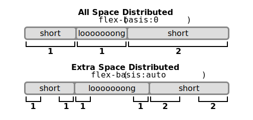
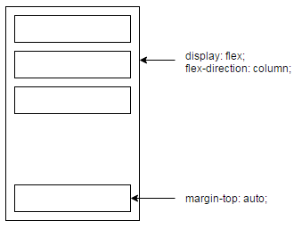

# Flex-Box Layout

The __Flexbox Layout__ (Flexible Box) module (currently a W3C Last Call Working Draft) aims at providing a more efficient way to lay out, align and distribute space among items in a container, even when their size is unknown and/or dynamic (thus the word "flex").

The main idea behind the flex layout is to give the container the ability to alter its items' width/height (and order) to best fill the available space (mostly to accommodate to all kind of display devices and screen sizes).

> __Note__: Flexbox layout is most appropriate to the components of an application, and small-scale layouts, while the Grid layout is intended for larger scale layouts.

If regular layout is based on both block and inline flow directions, the flex layout is based on "flex-flow directions".


Basically, items will be laid out following either the main axis (from main-start to main-end) or the cross axis (from cross-start to cross-end).


# Properties for the Parent (flex container)

* ### display
    It enables a flex context for all its direct children.

    Note that CSS columns have no effect on a flex container.

    ```css
    .container {
        display: flex | inline-flex;
    }
    ```

* ### flex-direction
    This establishes the main-axis, thus defining the direction flex items are placed in the flex container. Flexbox is (aside from optional wrapping) a single-direction layout concept.

    ```css
    .container {
        flex-direction: row | row-reverse | column | column-reverse;
    }
    ```

    

* ### flex-wrap
    By default, flex items will all try to fit onto one line. You can change that and allow the items to wrap as needed with this property.
    
    ```css
    .container{
        flex-wrap: nowrap | wrap | wrap-reverse;
    }
    ```

    * __nowrap__ (_default_): all flex items will be on one line
    * __wrap__: flex items will wrap onto multiple lines, from top to bottom.
    * __wrap-reverse__: flex items will wrap onto multiple lines from bottom to top.

        
    
* ### flex-flow
    This is a shorthand __flex-direction__ and __flex-wrap__ properties, which together define the flex container's main and cross axes. Default is __row nowrap__.

    ```css
    flex-flow: <‘flex-direction’> || <‘flex-wrap’>
    ```

* ### justify-content
    This defines the alignment along the main axis. It helps distribute extra free space left over when either all the flex items on a line are inflexible, or are flexible but have reached their maximum size. It also exerts some control over the alignment of items when they overflow the line.

    ```css
    .container {
        justify-content: flex-start | flex-end | center | space-between | space-around | space-evenly;
    }
    ```

    * __space-around__: items are evenly distributed in the line with equal space around them. Note that visually the spaces aren't equal, since all the items have equal space on both sides. The first item will have one unit of space against the container edge, but two units of space between the next item because that next item has its own spacing that applies.
    * __space-evenly__: items are distributed so that the spacing between any two items (and the space to the edges) is equal.
    
        

* ### align-items
    Defines the default behaviour for how flex items are laid out along the cross axis on the current line. Think of it as the justify-content version for the cross-axis (perpendicular to the main-axis).

    ```css
    .container {
        align-items: flex-start | flex-end | center | baseline | stretch;
    }
    ```

    

* ### align-content
    This aligns a flex container's lines within when there is extra space in the cross-axis, similar to how justify-content aligns individual items within the main-axis.

    > Note: this property has no effect when there is only one line of flex items.

    ```css
    .container {
        align-content: flex-start | flex-end | center | space-between | space-around | stretch;
    }
    ```

    


# Properties for the Children (flex items)

* ### order
    By default, flex items are laid out in the source order. However, the order property controls the order in which they appear in the flex container.

    ```css
    .item {
        order: <integer>; /* default is 0 */
    }
    ```

    
    
* ### flex-grow
    This defines the ability for a flex item to grow if necessary. It accepts a unitless value that serves as a proportion. It dictates what amount of the available space inside the flex container the item should take up.

    When `flex-grow` is a positive number, it makes the component flexible and it will be sized proportional to its flex value. So a component with `flex-grow` set to `2` will take twice the space as a component with `flex-grow` set to `1`.

    When `flex-grow` is `0`, the component is sized according to `width` and `height` and it is inflexible.

    When `flex-grow` is `-1`, the component is normally sized according `width` and `height`. However, if there's not enough space, the component will shrink to its `minWidth` and `minHeight`.

    ```css
    .item {
        flex-grow: <number>; /* default 0 */
    }
    ```

    

    > __flex-grow__ disables __space-around__ and __space-between__ alignments. Using __margins__ with __flex-grow__ gives the same result.
    
* ### flex-shrink
    This defines the ability for a flex item to shrink _(сжиматься)_ if necessary.

    ```css
    .item {
        flex-shrink: <number>; /* default 1 */
    }
    ```

* ### flex-basis
    This defines the default size of an element before the remaining space is distributed. When omitted, it defaults to __'0'__. It can be a length (e.g. 20%, 5rem, etc.) or a keyword.

    If set to __0__, the extra space around content isn't factored in. If set to __auto__, the extra space is distributed based on its __flex-grow__ value.
    
    The __auto__ keyword means "look at my _width_ or _height_ property".
    
    The __content__ keyword means "size it based on the item's content" - this keyword isn't well supported yet, so it's hard to test and harder to know what its brethren __max-content__, __min-content__, and __fit-content__ do.

    > Note: This value was not present in the initial release of Flexible Box Layout, and thus some older implementations will not support it. The equivalent effect can be achieved by using auto together with a main size (width or height) of auto.

    ```css
    .item {
        flex-basis: <length> | auto | content; /* default auto */
    }
    ```

    In the picture below, the three items have flex factors of 1, 1, and 2.
     

* ### flex
    This is the shorthand for __flex-grow__, __flex-shrink__ and __flex-basis__ combined. The second and third parameters (__flex-shrink__ and __flex-basis__) are optional. Default is __0 1 auto__.

    ```css
    .item {
        flex: none | [ <'flex-grow'> <'flex-shrink'>? || <'flex-basis'> ]
    }
    ```

* ### align-self
    This allows the default alignment (or the one specified by align-items) to be overridden for individual flex items.

    ```css
    .item {
        align-self: auto | flex-start | flex-end | center | baseline | stretch;
    }
    ```

    > Note that __float__, __clear__ and __vertical-align__ have no effect on a flex item.

    
    
* ### Margins
* Margins didn't collapse inside of flexbox in neither directions. Unlike regalarly blocked-level elements, whose margins vertically collapse.
* Margins included into the size of flex item, when doing alignment or justification. __space-around, space between__ alignments ignore any margins.
* __margin-*: auto__ - equals to all free space avaialable toward the spcified direction. If _margin-left: auto_, then after positioting, all available space will be on the left side of the element.
    
    
    


