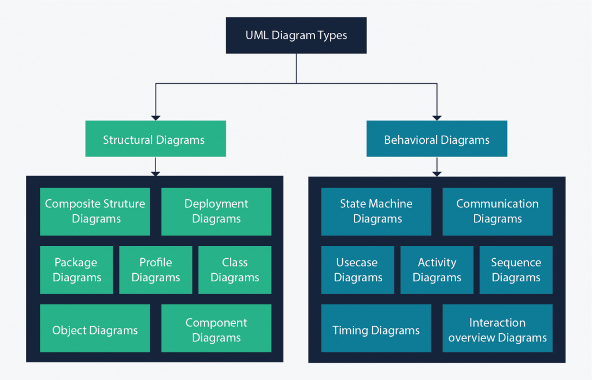

## Unified Modeling Language (UML)
UML stands for Unified Modeling Language. It’s a rich language to model software solutions, application structures, system behavior and business processes. There are 14 UML diagram types to help you model these behaviors.

There are two main categories; _structure diagrams_ and _behavioral diagrams_:

### Class Diagram
Class diagrams are the main building block of any object-oriented solution. It shows the classes in a system, attributes, and operations of each class and the relationship between each class. Different relationships between classes are shown by different types of arrows.

### Component Diagram
A component diagram displays the structural relationship of components of a software system. These are mostly used when working with complex systems with many components. Components communicate with each other using interfaces. The interfaces are linked using connectors.

### Deployment Diagram
A deployment diagram shows the hardware of your system and the software in that hardware. Deployment diagrams are useful when your software solution is deployed across multiple machines with each having a unique configuration.

### Object Diagram
Like class diagrams, they also show the relationship between objects but they use real-world examples. Shows how a system will look like at a given time. Because there is data available in the objects, they are used to explain complex relationships between objects.

### Package Diagram
Shows the dependencies between different packages in a system.

### Profile Diagram
Profiles are defined using stereotypes, tagged value definitions, and constraints which are applied to specific model elements, like Classes, Attributes, Operations, and Activities. A Profile is a collection of such extensions that collectively customize UML for a particular domain (e.g., aerospace, healthcare, financial) or platform (J2EE, .NET).

#### [Read More](https://www.visual-paradigm.com/guide/uml-unified-modeling-language/what-is-profile-diagram/)

### Composite Structure Diagram
Composite structure diagrams are used to show the internal structure of a class.

### Use Case Diagram
As the most known diagram type of the behavioral UML types, Use case diagrams give a graphic overview of the actors involved in a system, different functions needed by those actors and how these different functions interact.

### Activity Diagram
Activity diagrams represent workflows in a graphical way. They can be used to describe the business workflow or the operational workflow of any component in a system. Sometimes activity diagrams are used as an alternative to State machine diagrams.

### State Machine
A __state machine__ is a concept used in designing computer programs or digital logic. There are two types of state machines: _finite_ and _infinite_ state machines.

A __finite-state machine__ (`FSM`) is an abstract machine that can be in exactly one of a finite number of states at any given time.

The `FSM` can change from one state to another in response to some external inputs; the change from one state to another is called a transition.

An `FSM` is defined by a list of its states, its initial state, and the conditions for each transition.

Finite state machines are of two types - __deterministic finite state machines__ and __non-deterministic finite state machines__. A deterministic finite-state machine can be constructed equivalent to any non-deterministic one.

The finite state machine has less computational power than some other models of computation such as the Turing machine. The computational power distinction means there are computational tasks that a [Turing machine](https://en.wikipedia.org/wiki/Turing_machine) can do but a `FSM` cannot. This is because a `FSM`'s memory is limited by the number of states it has. `FSM`s are studied in the more general field of [automata theory](https://en.wikipedia.org/wiki/Automata_theory).

#### [Read More](https://en.wikipedia.org/wiki/Finite-state_machine)

### Sequence Diagram
Sequence diagrams in UML show how objects interact with each other and the order those interactions occur. It’s important to note that they show the interactions for a particular scenario. The processes are represented vertically and interactions are shown as arrows.

### Communication Diagram
Communication diagrams are similar to sequence diagrams, but the focus is on messages passed between objects. The same information can be represented using a sequence diagram and different objects.

### Interaction Overview Diagram
Interaction overview diagrams are very similar to activity diagrams. While activity diagrams show a sequence of processes, Interaction overview diagrams show a sequence of interaction diagrams. They are a collection of interaction diagrams and the order they happen.

### Timing Diagram
Timing diagrams are very similar to sequence diagrams. They represent the behavior of objects in a given time frame. If it’s only one object, the diagram is straightforward. But, if there is more than one object is involved, a Timing diagram is used to show interactions between objects during that time frame.

___

#### [Read more about UML](https://creately.com/blog/diagrams/uml-diagram-types-examples/)

#### [Drawing Tool](https://creately.com/Draw-UML-and-Class-Diagrams-Online)
