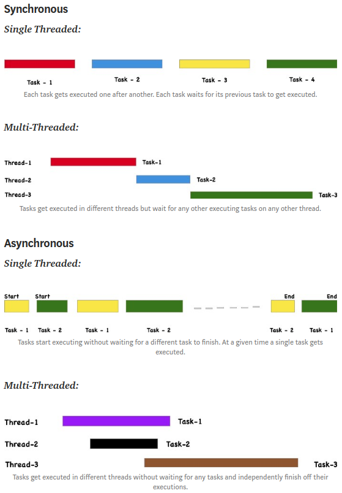

## Concurrency & Parallelism
### Concurrency
__Concurrency__ means executing multiple tasks at the same time but not necessarily simultaneously. In a concurrent application, two tasks can start, run, and complete in overlapping time periods i.e Task-2 can start even before Task-1 gets completed.

In the computer science world, the way how concurrency is achieved in various processors is different. In a single core environment (i.e your processor is having a single core), concurrency is achieved via a process called __context-switching__. If its a multi-core environment, concurrency can be achieved through parallelism.

A __context switch__ (also sometimes referred to as a process switch or a task switch) is the switching of the CPU (central processing unit) from one process or thread to another.

### Parallelism
Parallelism means performing two or more tasks simultaneously. Parallel computing in computer science refers to the process of performing multiple calculations simultaneously.

#### How is concurrency related to parallelism?
* Concurrency and Parallelism refer to computer architectures which focus on how our tasks or computations are performed.
* In a single core environment, concurrency happens with tasks executing over same time period via context switching i.e at a particular time period, only a single task gets executed.
* In a multi-core environment, concurrency can be achieved via parallelism in which multiple tasks are executed simultaneously.

## Threads & Processes
### Threads
__Threads__ are a sequence of execution of code which can be executed independently of one another. It is the smallest unit of tasks that can be executed by an OS. A program can be single threaded or multi-threaded.

### Process
A __process__ is an instance of a running program. A program can have multiple processes. A process usually starts with a single thread i.e a primary thread but later down the line of execution it can create multiple threads.

## Synchronous and Asynchronous
### Synchronous
In a synchronous programming model, tasks are executed one after another. Each task waits for any previous task to complete and then gets executed.

### Asynchronous
In an asynchronous programming model, when one task gets executed, you could switch to a different task without waiting for the previous to get completed.

### Synchronous and Asynchronous in a single and multi-threaded environment

### What is the role of synchronous and asynchronous programming in concurrency and parallelism?
* Asynchronous programming model helps us to achieve concurrency.
* Asynchronous programming model in a multi-threaded environment is a way to achieve parallelism.
