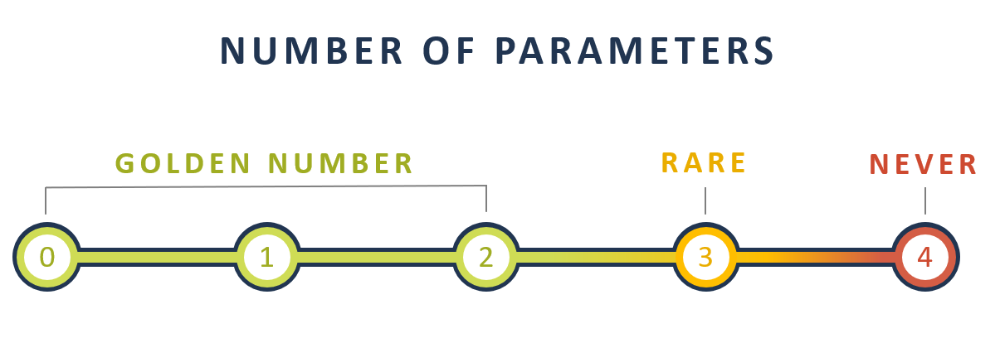

## Clean Code
There are several criteria that code must meet to be considered “clean.”
1. Clean Code is __Focused__

  In a piece of cleanly written code, each class, method, and function are separate and undisturbed by one another. Every object fulfills a single purpose that is entirely encapsulated in its class and all services are narrowly aligned with that purpose.

2. Clean Code is __Nonredundant__

  Clean code complies with the _DRY_ rule (Don’t Repeat Yourself). When the DRY rule is successfully applied throughout a piece of code, modifications of single elements are simple and do not require changes to logically unrelated items.

3. Clean Code is __Pleasant__

  Looking through clean code is like reading a well authored reference book—it’s easy to follow and simple to find what you’re looking for. This ease comes from following popular programming principles like _KISS_ (Keep It Simple, Stupid) and _YAGNI_ (You Ain’t Gonna Need It).

4. Clean Code is __Easily Extended__

  Clean code is written with other developers in mind. The programmer knows that they might not be the maintainer, so they ensure the code is an easy map to follow for future developers.

5. Clean Code has __Minimal Dependencies__

  The minimal dependencies in clean code make it easier to maintain. Classes and methods are short and the code itself is well divided. Clear divisions make reading the code straightforward and simple.

6. Clean Code has __Tests__

  Clean code is tested to ensure it complies with requirements. Being tested means that the code can be maintained and extended without the fear of breaking it.

7. Clean Code is __Expressive__

  Clean code has meaningful names that are distinct and express their intentions. This expressiveness makes the code itself a document, which makes the need for separate documentation less important.

8. Clean Code is __Well Thought Out__

  There are no confusing workarounds in clean code. Developers spend time finding good solutions that keep the language simple and easy to follow.

### Naming
The name of a variable, function, or class should tell you three things:
1. Why it exists
2. What it does
3. How it is used

If a name requires a comment, then the name does not reveal its intent.

[JS Naming Exercise](https://codingstories.io/story/https:%2F%2Fgitlab.com%2Fcodingstories%2Fgarage-service-story-js)

### Function
* Functions should hardly ever be 20 lines long.
* Functions Should Only Do One Thing
* Functions Should Have One Level of Abstraction

  This means essential concepts will not be mixed with lower-level details. If you’re writing detailed code right beside high-level code, you’re not following this rule and it’s going to be confusing for other readers of your code.

* Functions Should Be a Command or a Query—Not Both

  __Command-Query Separation__ is a principle that states functions should either “do” something, a command, or “answer” something, a query. If your function is changing the state of an object and returning information about that object—that can be confusing.

  The solution is to separate the command from the query, by creating two functions from the original function.

* Functions Should Have Descriptive Names
* Functions Should Not Have Side Effects

  A function should perform the action indicated by its name and that’s it. A side effect is when a function goes beyond the named action and makes other, hidden changes as well.

  Side effects aren’t all bad, though. They can serve an important purpose in your code. Without side effects, your code wouldn’t be able to make changes to databases or write to external files. The key is to use side effects only when they are necessary and eliminate them elsewhere.

* FUNCTIONS SHOULD USE EXCEPTIONS, NOT ERROR CODES
* The ideal number of parameters is zero

  When that’s not possible, it’s important to limit your parameters to a reasonable number because a function with too many parameters is unreadable. The “golden number” is between zero and two parameters. There are rare cases when you may need three, but that should not be the norm.

  

* Do Not Use Boolean Flags as a Parameter

  The issue is that Boolean parameters are not expressive. If a parameter is not expressive, it can’t be read. Instead of using Boolean parameters, create two functions.

* Do Not Pass Nulls as Parameters

  The real problem is that the parameter can be null, and if the parameter can be null, you must check each function and each parameter every time. This is messy coding and it should be avoided whenever possible.

* Do Not Return Nulls

  Returning null is the same as passing null. If a function can return null, that means some other function can accept it.

  Instead of returning null, it is a best practice to create an exception. This will help to keep your code clean and readable.

* Avoid Output Parameters

  Parameters are most commonly used as input for functions, so when an output parameter is used it can cause confusion for the reader.

### Structured Programming
Structured programming is a programming paradigm composed of structures blocks or functions with a single entrance and exit. Structured programming is a programming language that restricts the use of the “GoTo” statement. Code created with this restriction is easier to follow, maintain, and understand. The structured programming paradigm is so important that modern program languages, like Java and Python, don’t include GoTo statements at all.

### Comments
> #### Good code is self-documenting.

> Remember: Comments should only be used for cases when it is impossible to express ourselves without them.

> #### The only good comment is the comment you found a way not to write!

The Good Comments:
* Legal Comments
* Informative Comments
* Explanation of Intent
* TODO Comments
* Improving the Code

The Bad Comments:
* Irrelevant Comments
* Bad Code
* Redundant Comments
* Commented Out Code
* Journaling Comments
* Noise Comments
* Closing Brace Comments

### How to achieve:
* DRY
* SOLID
* Follow design patterns and its associated terms
* Follow __law of demeter__ to enable less coupling and more cohesion.
* Follow the TDD, and keep your test code as clean as production code.
* A _Function_ should do one thing only and do it really well.

    Certain tips for writing effective functions:
    * Avoid passing boolean into a function, this is a hint that func has an `if` statement within which causes it to do more than one thing.
    * Functions should either do something or answer something, but not both. This ensures a function does not have hidden side effects. e.g a func named `isPresent()` should only return a bool and not do any other operations
    * Prefer Exceptions to Returning Error Codes and extract error handling `try catch` into their own function.
    * Avoid output arguments. Function if it has to, should change state of its owning object
    * Code should always be separated with blank line to club logical blocks together. Think of different lines of code as thoughts and then always think of organizing similar thoughts together
    * Each function should read like a newspaper, every functions implementation following its call and having less vertical density
    * Don’t return null

* Object and data structures:
    * Variables should be private so that we can change their type or implementation when required. There is no need to add getters/setter to each variable to expose them as public.
    * Hiding implementation is not just a matter of putting a layer of functions between the variables. Hiding implementation is about abstractions! We do not want to expose details of data but rather express data as abstract terms

* Exception handling:
    * Try and extract `try catch` blocks into separate well named functions. Having them mixed with other code just confuses the structure of the program. This is inline with “Function should do one thing”, Well error handling is one thing.
    * Prefer returning Exceptions instead of Error Codes.
    * Each exception that you throw should provide enough context to determine the source and location of an error.

* Comments
    * The only truly good comment is the comment you found a way not to write.
    * Don’t Use a Comment When You Can Use a well named Function or a Variable
    * Any comment which forces you to look into another module for meaning has failed miserably in communicating and is not worth it at all.
    * Don’t comment bad code, Rewrite it.

* Boundaries

    Always wrap third party code/API to minimize your dependency on it and allow the freedom to move to a different one in future without changing the consuming code.

* Code organization and Design
    * Nearly all code is read left to right and top to bottom. Each line represents an expression or a clause, and each group of lines represents a _complete thought_. Those thoughts should be separated from each other with blank lines
    * Local variables should be declared as close to their usage as possible.
    * Instance variables should be declared at top of the class since in a well defined class they would be used by multiple functions
    * If one function calls another, they should be vertically close, and the caller should be above the callee, if at all possible. This gives the program a natural flow.
    * Try to follow the _“The Principle of Least Surprise”_ any function or class should implement the behaviors that another programmer could reasonably expect.
    * It is NOT necessary to do a _Big Design Up Front (BDUF)_. In fact, BDUF is even harmful because it inhibits adapting to change, due to the psychological resistance to discarding prior effort and because of the way architecture choices influence subsequent thinking about the design.

* Tests

    Clean tests should follow F.I.R.S.T principles
