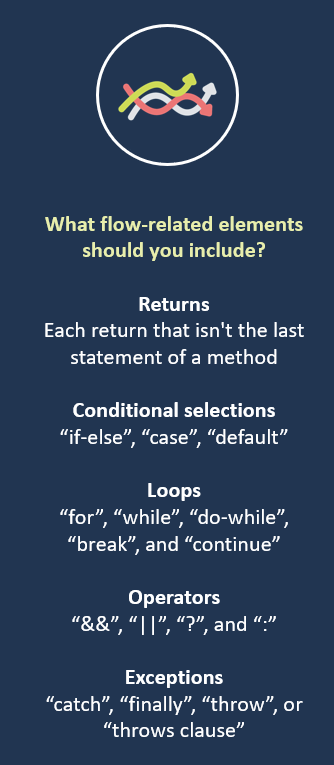

## Code Quality
Code quality is a group of different attributes and requirements, determined and prioritized by your business. Here are the main attributes that can be used to determine it:
* __Simplicity__: Means you don’t do in ten lines what you can do in five. It means you make extra effort to be concise, but not to the point of obfuscation.
* __Clarity__: Easy to read and oversee for anyone who isn’t the creator of the code. If it’s easy to understand, it’s much easier to maintain and extend the code. Not just computers, but also humans need to understand it.
* __Maintainable__: A high-quality code isn’t overcomplicated. Anyone working with the code has to understand the whole context of the code if they want to make any changes.
* __Documented__: The best thing is when the code is self-explaining, but it’s always recommended to add comments to the code to explain its role and functions. It makes it much easier for anyone who didn’t take part in writing the code to understand and maintain it.
* __Refactored__: Code formatting needs to be consistent and follow the language’s coding conventions. Some [code refactoring tips here](https://apiumhub.com/tech-blog-barcelona/code-refactoring-techniques/).
* __Well-tested__: The less bugs the code has the higher its quality. Thorough testing filters out critical bugs ensuring that the software works the way it’s intended.
* __Extendible__: The code you receive has to be extendible. It’s not really great when you have to throw it away after a few weeks.
* __Efficiency__: High-quality code doesn’t use unnecessary resources to perform a desired action.
* __Readability__: Make the code more readable and easier to comprehend for everyone working on the project. It’s much harder to read and understand a bad quality code than to write it.
* __Lower technical debt__: Good quality code can speed up long-term software development since it can be reused and developers don’t have to spend that much time fixing old bugs and polishing code. It also makes it easier for new project members to join the project.
* __Modularity__
* __Efficiency__: Means your program is fast and economical.
* __Elegance__: Is like beauty: hard to describe but easy to recognize. Elegance combines simplicity, efficiency, and brilliance, and produces a feeling of pride.
* __Security__

### How improve
* Style guide. For code style consistency.
* Linter. Provide hints/advices how to iprove code quality.
* Refactor legacy code.
* Follow best practices.
* Code review.
* Functional tests. It shows if your code actually works or not.
* Static code analysis tools

### Clean code principles:
* If it isn’t tested, it’s broken
* Choose meaningful names. This is what makes code self-documenting.
* Classes and functions should be small and obey the Single Responsibility Principle (SRP)
* Catch and handle exceptions, even if you don’t think you need to. Better to be safe than sorry.
* Logs, logs, logs

#### Use CI
Here is the process:
* Continuous integration platform will run the linters on the code. If it fails, the process will stop here and the developer have to fix the style-related issues.
* It will run the functional test and move to the next step if the code runs according to plan.
* Then it starts calculating test coverage. If it doesn’t meet the predefined threshold, it will fail.

### How to measure
Use _Static Code Analysis Tools — Sonar_. Below there’s a small list of some of the cool things a tool of this sort can offer. It also provides the code quality metrics, which are:
* #### Complexity

    It is the __Cyclomatic Complexity__ calculated based on the number of paths through the code.

    You can calculate the complexity of code by starting with a count of one for the method and add one for each flow-related element that is found in the method.

    

    Alternatively, if you have a graph of your code, you can calculate Complexity(`M`) for the method by subtracting the number of nodes(`N`) from the number of edges(`E`) and adding the number of connected components(`P`). This gives you the equation `E – N + P = M`

    > The goal is to keep complexity under 10.

    How do you deal with high complexity? Simplify it by refactoring, or reducing complex methods into two highly cohesive, well named, methods.

* #### Cognitive Complexity

    How hard it is to understand the code's control flow.

* #### Reliability

    The analyzer detects possible failure points and points them out to us. These types of issues are important and should be resolved first since they expose points of failure. That means that our code is not simply low quality, but potentially broken.

* #### Technical Debt

    Technical Debt is the cost associated with maintaining and enhancing a platform where shortcuts were taken in the design and/or implementation phases. Nonstrategic debt is when there are gaps created without stakeholder approval and strategic objectives aren’t properly considered.

    How do you deal with nonstrategic debt? Enforcing standards and conventions in code writing, avoiding shortcuts taken to meet time constraints, and identifying and defining debt in order to manage it are all ways to combat nonstrategic debt.

* #### Code Smell

* #### Lack of Cohesion in Methods

    Measuring the consistency of a class, Lack of Cohesion in Methods, or LOCM, is an object-oriented metric. It measures the connection between methods and local instance variables of a class. High cohesion indicates good class subdivision.

    LOCM is calculated as the proportion of methods that don’t access a specific data field averaged over all data fields in the class. Here’s how the calculation works. For each field in the class, count the methods that reference it, and then add them across all fields (`X`). You then divide by the count of methods (`a`) times the count of fields (`b`) and subtract the result from one: `1 – (X) / (a * b) = LOCM`

    LOCM for a class will range between 0 and 1, with 0 being totally cohesive and 1 being totally non-cohesive. This makes sense since a low “lack of cohesion” score would mean high cohesion.

    How do you deal with low cohesion? Subdivide the classes into two or more subclasses that have increased cohesion.

* #### Coupling Between Objects

    Coupling Between Objects, or CBO, represents the number of classes coupled to a given class. High coupling equates to low cohesion, and vice versa. Low coupling supports the general goals of high readability and maintainability.

    How do you deal with high coupling? Create a well-structured computer system with good design, and high cohesion.

* #### Code Style Consistency (following style guides)

* #### Following Best Practices

* #### Security

* #### Performance

* #### Unit Test Success Percentage

    Unit test success percentage is the number of unit tests that ran successfully during a given Unit Test execution. Get as close to 100% as you can. If one or more tests fail, the build is considered unstable.

    How do you deal with a failed unit test? Fixing the code to pass the unit tests, fixing the unit test if the failed unit test is related to a change in the requirements and muting, or removing, the unit test if it’s no longer relevant, and adding new tests are all viable options depending on the need.

* #### Code Coverage

    Code coverage is a metric for finding untested parts of a codebase. Use this metric to determine whether you are testing enough. Low coverage numbers—typically below half—are a sign there is not enough testing. Coverage should be used more as a metric to identify the areas of code which are not being covered by tests.

    How do you deal with coverage? Write enough tests. Along with having high code coverage, make sure to implement effective assertions and multiple test cases with varied input data.

* #### Duplications

    When you change the same code in several places for a system, the chance of missing changes is high. Duplicate code percentage is the percentage of identical code structures identified in more than one instance.

    How do you deal with duplicate code? Use the DRY Principles to make every piece of code have a single, unambiguous, authoritative representation within a system.

* #### Comments

    Percentage of comments, or comment density, calculates the number of comment lines in code. Density is calculated against the total lines of code in the codebase.

    How do you deal with code comments? Following effective clean code practices, the code will be readable without needing any unnecessary comments.

