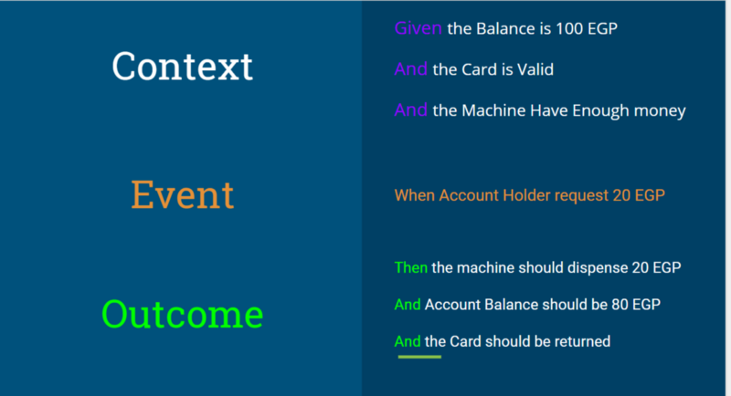
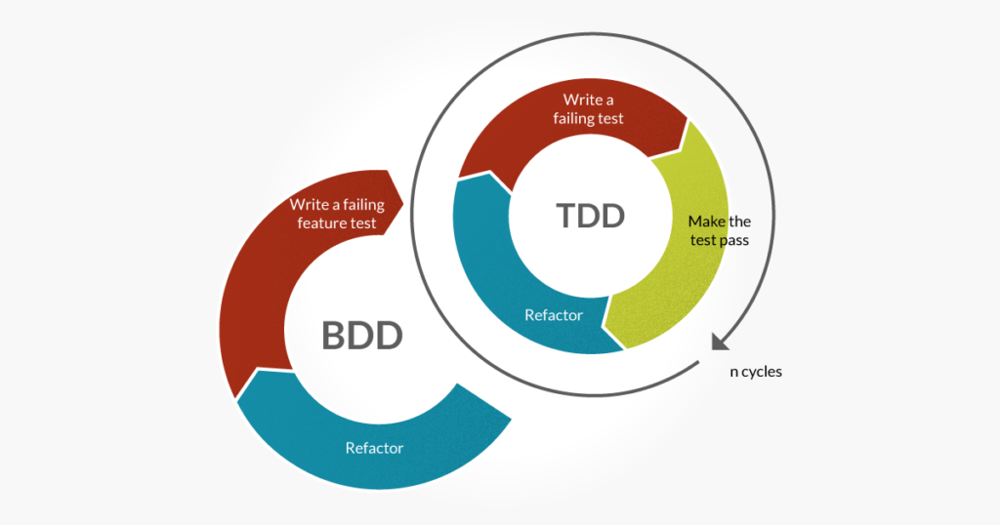
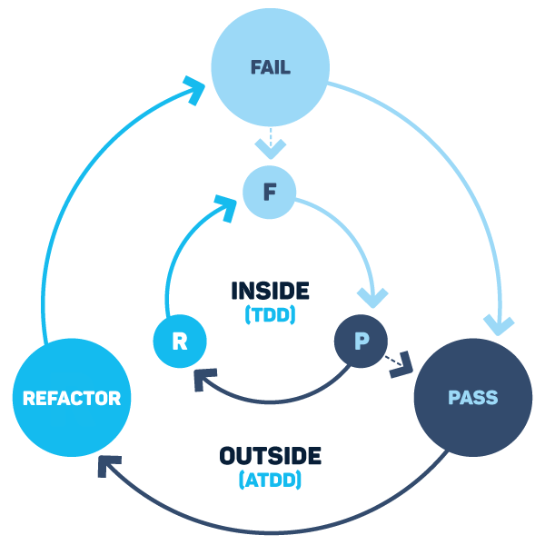

# Software Development Approaches
## Test Driven Development (TDD)
TDD, is an evolutionary approach where we write the test before a single line of implementation code is written.

That test will serve as a guideline what to build and to make sure we don’t break anything in the future that prevents the regular flow from working.

### Pros:
* TDD also forces good architecture.

    In order to make your code unit-testable, it must be properly modularized. Writing the tests first, various architectural problems tend to surface earlier.

* Documents your code better than documentation.
* Makes code easier to maintain and refactor.
* Helps prevents defects

    Well, at least it helps you find design or requirement issues right at the beginning.

* It helps to clarify requirements

    As you have to figure out concretely what inputs you have to feed and what outputs you expect.

### Cons:
* The tests may be hard to write, especialy before implementing unit itself.
* Initially, it slows down development.
* Hard to apply to existing legacy code.

## Behaviour Driven Development (BDD)
BDD is a methodology and a philosophy of test first software development, Like TTD.

Like in TDD, in BDD also we write tests first and then add application code. The major difference that we get to see here are:
* Tests are written in plain descriptive English type grammar
* Tests are explained as behavior of application and are more user focused
* Using examples to clarify requirements

BDD is a software development approach that has emerged from TDD but differs by being written in a shared language, which improves communication between tech and non-tech teams and stakeholders.

In Traditional Development Process:
1. Stakeholders Tell Product Owner what business needs.
2. Product Owner will write requirements
3. Testers or Developers will take requirements from Product Owner and translate it to code

But in BDD Development Process:
1. Stakeholders & The Product Owner Talk about what business needs.
2. The product owner talks with the team and starts explaining what are they developing here and gives examples
3. Team and Product Owner Write Scenarios in form of “Given When Then”

BDD tools: [Cucumber](https://cucumber.io/docs/guides/browser-automation/)

#### [More](https://www.youtube.com/watch?v=4QFYTQy47yA)

## TDD vs BDD
Both approaches start with writing a failing test and then picking it up from there.

In BDD, a test is written that can satisfy both the developer and customer, but in TDD you write a test that will only satisfy a developer and the code they write.

BDD works over TDD, which will make TDD implementation a better approach. So you can never say that BDD and TDD are entirely two different things.

The main difference between TDD and BDD is that −
* TDD describes how the software works.
* On the other hand, BDD:
    * Describes how the end user uses the software.
    * Fosters collaboration and communication.
    * Emphasizes on examples of behavior of the System.
    * Aims at the executable specifications derived from the examples.

## Acceptance Test Driven Development (ATDD)
ATDD involves team members with different perspectives (customer, development, testing) collaborating to write _acceptance tests_ in advance of implementing the corresponding functionality.

[Read More](https://www.hindsightsoftware.com/blog/tdd-vs-bdd)

## Data-driven Developmment
Data driven progamming is a programming model where the data itself controls the flow of the program and not the program logic. It is a model where you control the flow by offering different data sets to the program where the program logic is some generic form of flow or of state-changes.

## Event-driven Development
Event-driven programming is a programming paradigm in which the flow of program execution is determined by events - for example a user action such as a mouse click, key press, or a message from the operating system or another program. An event-driven application is designed to detect events as they occur, and then deal with them using an appropriate event-handling procedure. The idea is an extension of interrupt-driven programming of the kind found in early command-line environments such as DOS, and in embedded systems (where the application is implemented as firmware).

## Timeboxing
Timeboxing is the approach for completing the project incrementally by breaking it down into splitting the project in portions, each with a fixed budget and a delivery date. For each portion a number of requirements are prioritised and selected. Because time and budget are fixed, the only remaining variables are the requirements.

## Big Design Up Front (BDUF)
Big Design Up Front is an approach where a website, app, or software design is completed and perfected up-front, before its implementation is started.

It necessitates a waterfall process, and relies on prediction.

#### Pros
* If you know exactly what you want, this is the most efficient way to get there.
* Since all design is done at once, there’s ample opportunity for zooming out, integrating often, and designing holistically.
* User experience is designed and refined by designers, and that design documentation dictates the functionality for engineers to develop. Each role plays to their strengths.
* Easy to cost and schedule design, as it’s a known quantity from the start.

#### Cons:
* Not easily adaptable to changes in scope, or pivots in purpose. You may have to swim back up the waterfall to start again if goals or requirements move.
* Design is not as easily tested and validated, because no part of it is fully functional until near the end of the linear process.
* Doesn’t take advantage of new learnings or better solutions that may arise during later stages of the waterfall process.

