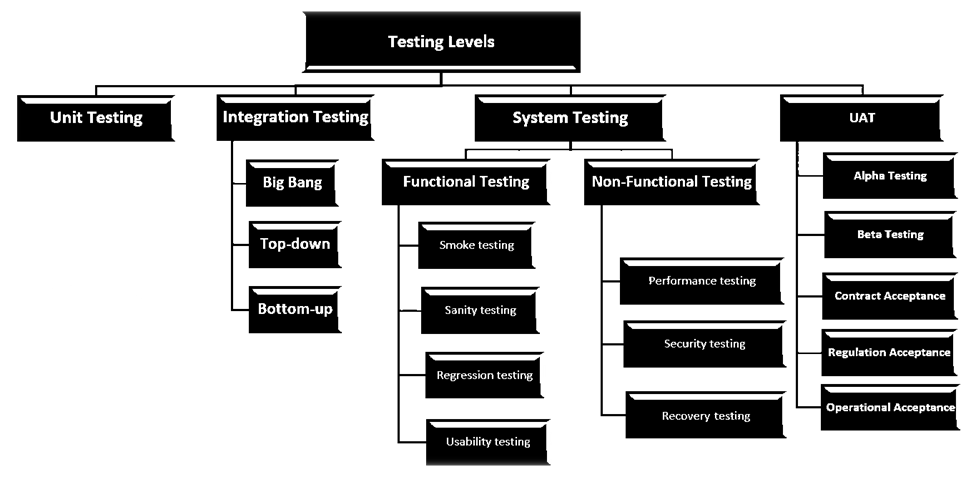
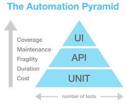
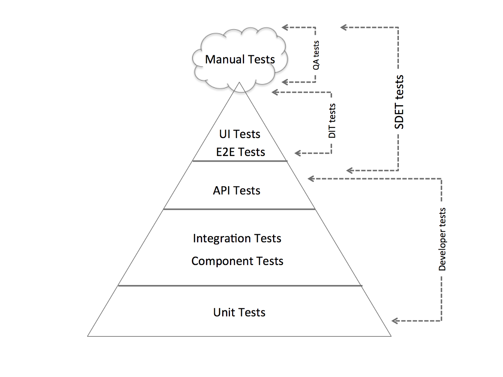

## Testing
Software testing is a process of executing a program or application with the intent of finding the errors

### General Testing Terms
__Bug__ is the result of a coding error.

__Defect__ is the difference between expected and actual result in the context of testing.

__Error__ means to change the functionality of the program.

__Fault__ is a wrong or mistaken step, process or Data definition in a computed program which causes the program to perform in an unintended or unanticipated manner.

__Failure__ is the inability of a software system or component to perform its required functions within specified performance requirements.

> Difference between a _defect_ and a _failure_ -
When a defect reaches the end customer it is called a failure and if the defect is detected internally and resolved it’s called a defect.

### Test Levels, Type and Approaches

Where:
* __Unit Tests__

    These should count for the majority of tests you have for your codebase. They tests the smallest unit of code possible. Normally, only test a single method each.

* __Integration Tests__

    The tests designed to verify the integration of different parts of separate components/modules of a software system together.

    * __Big Bang__: In the big bang approach, All components or modules are integrated together to complete a software system. After that, integration testing is performed.
    * __Top-down__: In this method, the process is carried out from the highest level modules to the lower level ones. This method requires Test stubs, Stub is a module which will temporarily substitute for submodules if they are not available for integration during the early phases.
    * __Bottom-up__: Bottom-up testing is a method where the lowest level components are tested first, and then progressively higher level components are tested. Drivers are required in this method to simulate the main modules which are not available in the early phases.
    * __Sandwich__: Sandwich testing (or Hybrid approach) is a type of integration testing which is the combination of Top-down and Bottom-up testing.

* __End-to-End Tests__

    The tests that verifies the end to end workflows of your codebase. They tests the system from the user-action entry point right to the end of the system down to the database level. However, these are typically black-box tests.

* __Component Tests__

    At the same level as Integration Tests you may have what is called Component Tests along side it. These are tests which tests the different components of a software system.

* __API Tests__

    Sitting in its own level and in-between the top 2 levels is API tests which are by the name of it tests the API endpoints of your system. Assuming you have APIs of any sort, be it RESTful or non-RESTful.

* __UI Tests__

    Perhaps not so well known until recent years are these tests which tests the ‘UI’ aspect of your system (if your system has an UI).

* __System Test__

    Basically test the compatibility of the application with the system.

    * __Functional Testing__

        This is a type of black-box testing that is based on the specifications of the software that is to be tested.

        * __Smoke Testing__: Is a wide approach where all areas of the software application are tested without getting into too deep. Smoke testing is done to ensure whether the main functions of the software application are working or not.
        * __Sanity software testing__: Is a narrow regression testing with a focus on one or a small set of areas of functionality of the software application.Sanity test is generally without test scripts or test cases.
        * __Usability Testing__: Focuses on the user’s ease to operate and use and checks that the user interface is user-friendly.
        * __Regression Testing__: Is performed to verify that a fixed bug hasn’t resulted in another functionality or business rule violation.

    * __Non-Functional Testing__

        Involves testing a software from the requirements which are nonfunctional in nature but important such as performance, security, user interface, etc.

        * __Recovery Testing__: to test that how well a system recovers from crashes, hardware failures, or other catastrophic problems.
        * __Security Testing__: To test that the system is secured enough to protect it from unintended users.
        * __Performance Testing__: Performance testing is a type of testing that is performed to determine how fast and stable the system performs under a particular workload.
        * __Load Testing__: Load Testing is necessary to know that a software solution will perform under real-life loads.
        * __Compatibility Testing__: Is a type of Software testing to check whether your software is capable of running on different hardware, operating systems, applications , network environments or Mobile devices
        * __Stress testing__: Includes testing the behavior of a software under abnormal conditions Load Testing
        * __Portability testing__: Includes testing a software with the aim to ensure its reusability and that it can be moved from another software as well.

* __User Acceptance Testing (UAT)__

    During UAT, actual software users test the software to make sure it can handle required tasks in real-world scenarios, according to specifications.

    * __Alpha & Beta Testing__: aim to validate the fitness-for-use of the system by the business user. The user acceptance test is performed by the users and application managers.
    * __Contract Acceptance Testing__: a developed software is tested against certain criteria and specifications which are predefined and agreed upon in a contract. The project team defines the relevant criteria and specifications for acceptance at the same time when the team agrees on the contract itself.
    * __Regulation Acceptance Testing__: also known as Compliance Acceptance Testing, examines whether the software complies with the regulations. This includes governmental and legal regulations.
    * __Operational Acceptance Testing__: also known as Operational Readiness Testing or Production Acceptance Testing, these test cases ensure there are workflows in place to allow the software or system to be used. This should include workflows for backup plans, user training, and various maintenance processes and security checks.

* __Black Box Testing__

    The technique of testing without having any knowledge of the interior workings of the application is called black-box testing. The tester is oblivious to the system architecture and does not have access to the source code.

* __White-box testing__

    The detailed investigation of internal logic and structure of the code. White-box testing is also called glass testing or open-box testing

* __Grey-box testing__

    Is a technique to test the application with having a limited knowledge of the internal workings of an application.

* __Manual Tests__

### Testing Pyramid
For a software project to succeed you need a successful strategy to testing. One way of doing this is to use the __Testing Pyramid__.

A testing pyramid is a pyramid of where all the different types of tests fits.

### Who should implement these test

Where:
* DIT - automation test people
* SDET = QA + DIT
