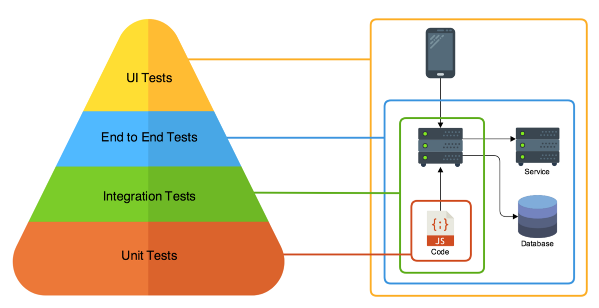

## Testing
Software testing is a process of executing a program or application with the intent of finding the errors

### General Testing Terms
__Bug__ is the result of a coding error.

__Defect__ is the difference between expected and actual result in the context of testing.

__Error__ means to change the functionality of the program.

__Fault__ is a wrong or mistaken step, process or Data definition in a computed program which causes the program to perform in an unintended or unanticipated manner.

__Failure__ is the inability of a software system or component to perform its required functions within specified performance requirements.

> Difference between a _defect_ and a _failure_ -
When a defect reaches the end customer it is called a failure and if the defect is detected internally and resolved it’s called a defect.

### Test Levels, Type and Approaches

Where:
* __Unit Tests__

    These should count for the majority of tests you have for your codebase. They tests the smallest unit of code possible. Normally, only test a single method each.

    Pros:
    * FACILITATES CHANGES & SIMPLIFIES INTEGRATION

        When you add more and more features to a software, you sometimes need to change old design and code. But changing already tested code is both risky and costly. If we have unit tests in place, then we can proceed for refactoring confidently.

    * QUALITY OF CODE
    * FIND SOFTWARE BUGS EARLY
    * PROVIDES DOCUMENTATION
    * DEBUGGING PROCESS

        If a test fails then only latest changes made in code needs to be debugged.

    * DESIGN

        Writing the test first forces you to think through your design and what it must accomplish before you write the code.

    * REDUCE THE COSTS

        Since the bugs are found early in unit testing, it helps in reducing the cost of bug fixes.

    Cons:
    * Takes time to implement.

* __Functional testing__
    
    Is a type of software testing whereby the system is tested against the functional requirements/specifications.

    This type of testing is not concerned with how processing occurs, but rather, with the results of processing. It simulates actual system usage but does not make any system structure assumptions.

    During functional testing, Black Box Testing technique is used in which the internal logic of the system being tested is not known to the tester.

* __Integration Tests__

    The idea is: _Integrate/combine the unit tested module one by one and test the behavior as a combined unit._

    > The main function or goal of this testing is to test the interfaces between the units/modules, integrated links, data transfer between the modules as modules/components that are already unit tested.

    

    * __Big Bang__: In the big bang approach, All components or modules are integrated together to complete a software system. After that, integration testing is performed.

        Pros:
        * It is a good approach for small systems.

        Cons:
        * It is difficult to detect the module which is causing an issue.
        * Big Bang approach requires all the modules all together for testing, which in turn, leads to less time for testing as designing, development, Integration would take most of the time.
        * Testing takes place at once only which thereby leaves no time for critical module testing in isolation.

    * __Bottom-up__: Bottom-up testing is a method where the lowest level components are tested first, and then progressively higher level components are tested. Drivers are required in this method to simulate the main modules which are not available in the early phases.

        In this case, modules B1C1, B1C2 & B2C1, B2C2 are the lowest module which is unit tested. Module B1 & B2 are not yet developed. The functionality of Module B1 and B2 is that it calls the modules B1C1, B1C2 & B2C1, B2C2. Since B1 and B2 are not yet developed, we would need some program or a “stimulator” which will call the B1C1, B1C2 & B2C1, B2C2 modules. These stimulator programs are called __DRIVERS__.

        DRIVERS are the dummy programs which are used to call the functions of the lowest module in a case when the calling function does not exist.

        Pros:
        * If a major fault exists at the lowest unit of the program, it is easier to detect it, and corrective measures can be taken.

        Cons:
        * The main program actually does not exist until the last module is integrated and tested. As a result, the higher level design flaws will be detected only at the end.

    * __Top-down__: In this method, the process is carried out from the highest level modules to the lower level ones. This method requires Test stubs, Stub is a module which will temporarily substitute for submodules if they are not available for integration during the early phases.

        In the context of our figure, testing starts from Module A, and lower modules B1 and B2 are integrated one by one. Now here the lower modules B1 and B2 are not actually available for integration. So in order to test the topmost modules A, we develop __STUBS__.

        “Stubs” can be referred to as a dummy code which accepts the inputs/requests from the top module and returns the results/ response.

    * __Sandwich__: Is the combination of Top-down and Bottom-up testing.

        The test starts with the middle layer and moves simultaneously towards up and down. In case of our figure, our testing will start from B1 and B2, where one arm will test the upper module A and another arm will test the lower modules B1C1, B1C2 & B2C1, B2C2.

        > Since both the approach starts simultaneously, this technique is a bit complex and requires more people along with specific skill sets and thus adds to the cost.

    Toosl: _Protractor_

    Why it is important:
    * Easy to integrate with daily builds and easy to test in development environment.
    * Tests run faster compared to end to end tests.
    * Tests are more reliable and easy to isolate the failures.
    * Majorly helps to build real-time use cases during the end to end testing.
    * Integration tests catch system-level issues, such as a broken database schema, mistaken cache integration, and so on.

* __Component Tests__

    Tests the system without other third-party code and services. Thus, it verifies and validates the functionality and performance of a particular component. This testing is limited to that particular component only.

    The basic difference between the two is that in unit testing, all the methods of other classes and modules are mocked. On the other hand, for component testing, all stubs and simulators are replaced with the real objects for all the classes (units) of that component, and mocking is used for classes of other components.

* __API Tests__

    Sitting in its own level and in-between the top 2 levels is API tests which are by the name of it tests the API endpoints of your system. Assuming you have APIs of any sort, be it RESTful or non-RESTful.

* __End-to-End Tests__

    The tests that verifies the end to end workflows of your codebase. They tests the system from the user-action entry point right to the end of the system down to the database level. However, these are typically black-box tests.

    The biggest difference between E2E and Functional testing is that an E2E test requires the test to setup the system components as they are in production. Real database, services, queues, etc. But the only thing the Functional test cares about is that a feature works as expected.

* __UI Tests__

    Perhaps not so well known until recent years are these tests which tests the ‘UI’ aspect of your system (if your system has an UI).
    
    It checks only the UI (color, vorder, position ...) and the begaviour (toggle, hidden, disable ...) of the UI elements, but don't require to setup the system components/units.

* __System Test__

    Basically test the compatibility of the application with the system.

    * __Functional Testing__

        This is a type of black-box testing that is based on the specifications of the software that is to be tested.

        * __Smoke Testing__: Is a wide approach where all areas of the software application are tested without getting into too deep. Smoke testing is done to ensure whether the main functions of the software application are working or not.
        * __Sanity software testing__: Is a narrow regression testing with a focus on one or a small set of areas of functionality of the software application.Sanity test is generally without test scripts or test cases.
        * __Usability Testing__: Focuses on the user’s ease to operate and use and checks that the user interface is user-friendly.
        * __Regression Testing__: Is performed to verify that a fixed bug hasn’t resulted in another functionality or business rule violation.

    * __Non-Functional Testing__

        Involves testing a software from the requirements which are nonfunctional in nature but important such as performance, security, user interface, etc.

        * __Recovery Testing__: to test that how well a system recovers from crashes, hardware failures, or other catastrophic problems.
        * __Security Testing__: To test that the system is secured enough to protect it from unintended users.
        * __Performance Testing__: Performance testing is a type of testing that is performed to determine how fast and stable the system performs under a particular workload.

            Types:
            * __Load Testing__ checks the application's ability to perform under real-life loads. Objective: Measure the max operating capacity.
            * __Endurance testing__ checks how an application handles load over time. Objective: Find memory leaks issue.
            * __Stress testing__ includes testing the behavior of a software under abnormal conditions (no internet, no services ...). Objective: Measure softwre stability. 

        * __Compatibility Testing__: Is a type of Software testing to check whether your software is capable of running on different hardware, operating systems, applications , network environments or Mobile devices
        * __Portability testing__: Includes testing a software with the aim to ensure its reusability and that it can be moved from another software as well.

* __User Acceptance Testing (UAT)__

    During UAT, actual software users test the software to make sure it can handle required tasks in real-world scenarios, according to specifications.

    * __Alpha & Beta Testing__: aim to validate the fitness-for-use of the system by the business user. The user acceptance test is performed by the users and application managers.
    * __Contract Acceptance Testing__: a developed software is tested against certain criteria and specifications which are predefined and agreed upon in a contract. The project team defines the relevant criteria and specifications for acceptance at the same time when the team agrees on the contract itself.
    * __Regulation Acceptance Testing__: also known as Compliance Acceptance Testing, examines whether the software complies with the regulations. This includes governmental and legal regulations.
    * __Operational Acceptance Testing__: also known as Operational Readiness Testing or Production Acceptance Testing, these test cases ensure there are workflows in place to allow the software or system to be used. This should include workflows for backup plans, user training, and various maintenance processes and security checks.

* __Black Box Testing__

    The technique of testing without having any knowledge of the interior workings of the application is called black-box testing. The tester is oblivious to the system architecture and does not have access to the source code.

* __White-box testing__

    The detailed investigation of internal logic and structure of the code. White-box testing is also called glass testing or open-box testing

* __Grey-box testing__

    Is a technique to test the application with having a limited knowledge of the internal workings of an application.

* __Manual Tests__

### Testing Models
#### Testing Pyramid
For a software project to succeed you need a successful strategy to testing. One way of doing this is to use the __Testing Pyramid__.

A testing pyramid is a pyramid of where all the different types of tests fits.

Who should implement these test

Where:
* DIT - automation test people
* SDET = QA + DIT

#### Box Testing
* Black-box testing

    Includes: Manual Testing, UI testing, E2E testing, Performance Testing

    Responsible: Manual testers, QA Engineers.

* White-box testing

    Includes: Unit testing, System testing.

    Responsible: Software Engineers.

* Grey-box testing

    Includes: Integration testing, Component testing

    Responsible: QA Engineers, Software Engineers.

___

[Why Integration Testing is Important](https://code.likeagirl.io/why-is-integration-testing-important-in-software-testing-life-cycle-b3c7e586c8ba)
