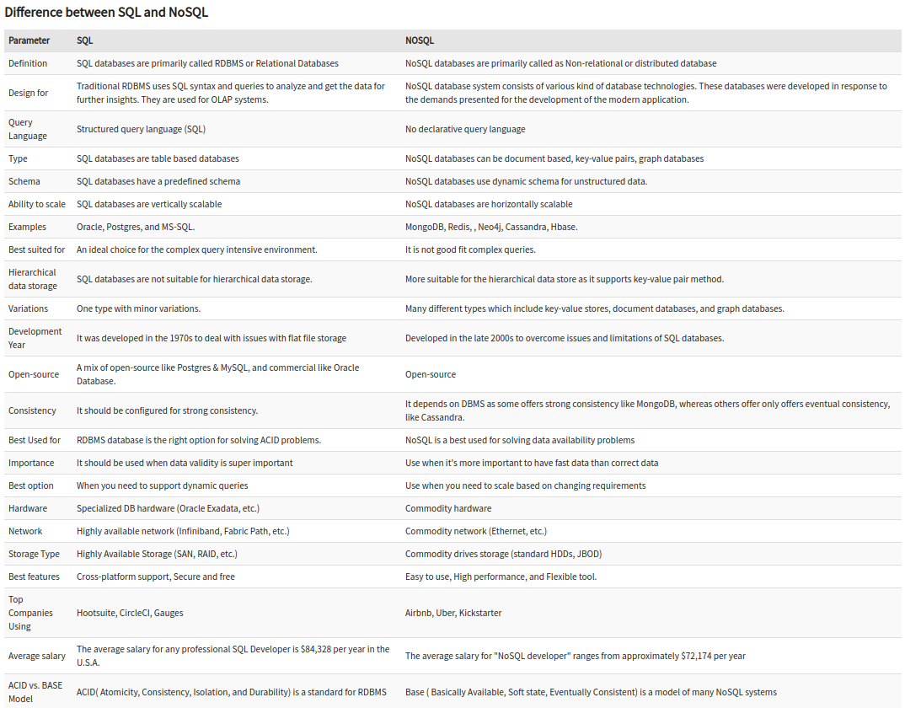

## No SQL
NoSQL is a non-relational DMS, that does not require a fixed schema, avoids joins, and is easy to scale.

NoSQL database is used for distributed data stores with humongous data storage needs.

NoSQL is used for Big data and real-time web apps.

### Types
* #### Document databases

    A document database stores data in JSON, BSON , or XML documents (not Word documents or Google docs, of course). In a document database, documents can be nested. Particular elements can be indexed for faster querying.

    Documents can be stored and retrieved in a form that is much closer to the data objects used in applications, which means less translation is required to use the data in an application. SQL data must often be assembled and disassembled when moving back and forth between applications and storage.

    Document databases are popular with developers because they have the flexibility to rework their document structures as needed to suit their application, shaping their data structures as their application requirements change over time. This flexibility speeds development because in effect data becomes like code and is under the control of developers. In SQL databases, intervention by database administrators may be required to change the structure of a database.

    The most widely adopted document databases are usually implemented with a scale-out architecture, providing a clear path to scalability of both data volumes and traffic.

    Use cases include ecommerce platforms, trading platforms, and mobile app development across industries.

* #### Key-value stores

    The simplest type of NoSQL database is a key-value store . Every data element in the database is stored as a key value pair consisting of an attribute name (or "key") and a value. In a sense, a key-value store is like a relational database with only two columns: the key or attribute name (such as state) and the value (such as Alaska).

    Use cases include shopping carts, user preferences, and user profiles.

* #### Column-oriented databases

    While a relational database stores data in rows and reads data row by row, a column store is organized as a set of columns. This means that when you want to run analytics on a small number of columns, you can read those columns directly without consuming memory with the unwanted data. Columns are often of the same type and benefit from more efficient compression, making reads even faster. Columnar databases can quickly aggregate the value of a given column (adding up the total sales for the year, for example). Use cases include analytics.

    Unfortunately there is no free lunch, which means that while columnar databases are great for analytics, the way in which they write data makes it very difficult for them to be strongly consistent as writes of all the columns require multiple write events on disk. Relational databases don't suffer from this problem as row data is written contiguously to disk.

* #### Graph databases

    A graph database focuses on the relationship between data elements. Each element is stored as a node (such as a person in a social media graph). The connections between elements are called links or relationships. In a graph database, connections are first-class elements of the database, stored directly. In relational databases, links are implied, using data to express the relationships.

    A graph database is optimized to capture and search the connections between data elements, overcoming the overhead associated with JOINing multiple tables in SQL.

    Very few real-world business systems can survive solely on graph queries. As a result graph databases are usually run alongside other more traditional databases.

    Use cases include fraud detection, social networks, and knowledge graphs.

### When to use
* When ACID support is not needed
* When Traditional RDBMS model is not enough
* Data which need a flexible schema
* Constraints and validations logic not required to be implemented in database
* Logging data from distributed sources
* It should be used to store temporary data like shopping carts, wish list and session data

### Pros
* Flexible data models

    NoSQL databases typically have very flexible schemas. A flexible schema allows you to easily make changes to your database as requirements change. You can iterate quickly and continuously integrate new application features to provide value to your users faster.

* Horizontal scaling

    Most SQL databases require you to scale-up vertically (migrate to a larger, more expensive server) when you exceed the capacity requirements of your current server. Conversely, most NoSQL databases allow you to scale-out horizontally, meaning you can add cheaper, commodity servers whenever you need to.

* Fast queries

    Queries in NoSQL databases can be faster than SQL databases. Why? Data in SQL databases is typically normalized, so queries for a single object or entity require you to join data from multiple tables. As your tables grow in size, the joins can become expensive. However, data in NoSQL databases is typically stored in a way that is optimized for queries. The rule of thumb when you use MongoDB is Data is that is accessed together should be stored together. Queries typically do not require joins, so the queries are very fast.

* Easy for developers

    Some NoSQL databases like MongoDB map their data structures to those of popular programming languages. This mapping allows developers to store their data in the same way that they use it in their application code. While it may seem like a trivial advantage, this mapping can allow developers to write less code, leading to faster development time and fewer bugs.

### Cons
One of the most frequently cited drawbacks of NoSQL databases is that they don’t support ACID (atomicity, consistency, isolation, durability) transactions across multiple documents. With appropriate schema design, single record atomicity is acceptable for lots of applications. However, there are still many applications that require ACID across multiple records.

To address these use cases MongoDB added support for multi-document ACID transactions in the 4.0 release, and extended them in 4.2 to span sharded clusters.

## SQL vs NoSQL
### SQL databases
SQL databases use structured query language (SQL) for defining and manipulating data. On one hand, this is extremely powerful: SQL is one of the most versatile and widely-used options available, making it a safe choice and especially great for complex queries. On the other hand, it can be restrictive. SQL requires that you use predefined schemas to determine the structure of your data before you work with it. In addition, all of your data must follow the same structure.

### NoSQL databases
NoSQL databases, on the other hand, have dynamic schemas for unstructured data, and data is stored in many ways: They can be column-oriented, document-oriented, graph-based or organized as a KeyValue store. This flexibility means that:
* You can create documents without having to first define their structure
* Each document can have its own unique structure
* The syntax can vary from database to database, and
* You can add fields as you go.

### Difference
* SQL is primarily called Relational Databases whereas NoSQL is a Non-relational or Distributed Database.
* SQL databases are table based databases whereas NoSQL databases can be document based, key-value pairs, graph databases.
* SQL databases are vertically scalable while NoSQL databases are horizontally scalable.

    In most situations, SQL databases are vertically scalable, which means that you can increase the load on a single server by increasing things like CPU, RAM or SSD. NoSQL databases, on the other hand, are horizontally scalable. This means that you handle more traffic by sharding, or adding more servers in your NoSQL database. It’s like adding more floors to the same building versus adding more buildings to the neighborhood. The latter can ultimately become larger and more powerful, making NoSQL databases the preferred choice for large or ever-changing data sets.

* SQL databases have a predefined schema whereas NoSQL databases use dynamic schema for unstructured data.
* SQL requires specialized DB hardware for better performance while NoSQL uses commodity hardware.

