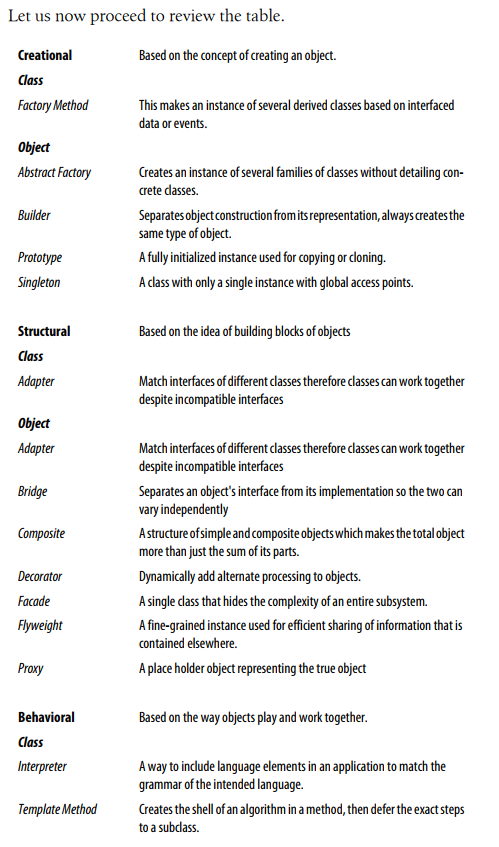
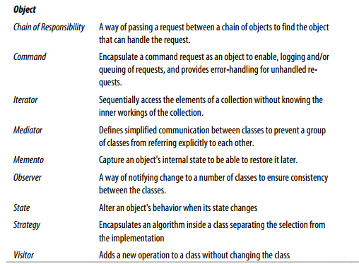

# JAVASCRIPT DESIGN PATTERNS

**Definition:**
A PATTERN is a reusable solution that can be applied to commonly occurring problems in software design.
Patterns are not an exact solution. It’s important that we remember the role of a pattern
    is merely to provide us with a solution scheme.

**Benefits:**
1. Patterns are proven solutions:
    They provide solid approaches to solving issues in software development using proven solutions that
    reflect the experience and insights the developers that helped define and improve them bring to the pattern.
2. Patterns can be easily reused:
    A pattern usually reflects an out of the box solution that can be adapted to suit your own needs.
    This feature makes them quite robust.
3. Patterns can be expressive:
    When you look at a pattern there’s generally a set structure and ‘vocabulary’ to the solution
    presented that can help express rather large solutions quite elegantly.

**Advantages:**
* Reusing patterns assists in preventing minor issues that can cause major
    problems in the application development process:
    What this means is when code is built on proven patterns, we can afford to spend less time worrying
    about the structure of our code and more time focusing on the quality of our overall
    solution. This is because patterns can encourage us to code in a more structured
    and organized fashion avoiding the need to refactor it for cleanliness purposes in the future.
* Patterns can provide generalized solutions which are documented in a fashion
    that doesn't require them to be tied to a specific problem:
    This generalized approach means that regardless of the application
    (and in many cases the pro-gramming language) you are working with,
    design patterns can be applied to improve the structure of your code.
* Certain patterns can actually decrease the overall file-size footprint of your
    code by avoiding repetition:
    By encouraging developers to look more closely at
    their solutions for areas where instant reductions in repetition can be made, e.g.
    reducing the number of functions performing similar processes in favor of a single
    generalized function, the overall size of your codebase can be decreased.
* Patterns add to a developers vocabulary, which makes communication faster.
* Patterns that are frequently used can be improved over time by harnessing
    the collective experiences other developers using those patterns contribute
    back to the design pattern community:
    In some cases this leads to the creation of entirely new design patterns whilst
    in others it can lead to the provision of improved guidelines on how specific
    patterns can be best used. This can ensure that pattern-based solutions continue
    to become more robust than ad-hoc solutions may be.

**ANTI-PATTERN** is a bad design that is worthy of documenting. Examples of anti-patterns in JavaScript are the following:
* Polluting the global namespace by defining a large number of variables in the global context
* Passing strings rather than functions to either `setTimeout` or `setInterval` as this triggers the use of `eval()` internally.
* Modifying the Object class prototype (this is a particularly bad anti-pattern)
* Using JavaScript in an inline form as this is inflexible
* The use of `document.write` where native DOM alternatives such as `document.createElement`
    are more appropriate. `document.write` has been grossly misused over
    the years and has quite a few disadvantages including that if it's executed after the
    page has been loaded it can actually overwrite the page you're on, whilst `document.createElement`
    does not. You can see here for a live example of this in action.
    It also doesn't work with XHTML which is another reason opting for more DOMfriendly
    methods such as `document.createElement` is favorable.

**Categories of Design Patterns:**
* `Creational Design Pattern` -  focus on handling object creation mechanisms where objects
    are created in a manner suitable for the situation you are working in. The basic approach
    to object creation might otherwise lead to added complexity in a project whilst these
    patterns aim to solve this problem by controllingthe creation process.
    [ `Constructor`, `Factory`, `Abstract`, `Prototype`, `Singleton`, `Builder` ]
* `Structural Design Patterns` - are concerned with object composition and typically identify simple
    ways to realize relationships between different objects. They help ensure that when one
    part of a system changes, the entire structure of the system doesn't need to do the same.
    They also assist in recasting parts of the system which don't fit a particular purpose
    into those that do.
    [  `Decorator`, `Facade`, `Flyweight`, `Adapter`, `Proxy` ]
* `Behavioral Design Patterns` - focus on improving or streamlining the communication between
    disparate objects in a system.
    [ `Iterator`, `Mediator`, `Observer`, `Visitor` ]

## Design Pattern List:

### [Great Resource about Design Patterns](https://sourcemaking.com/design_patterns)