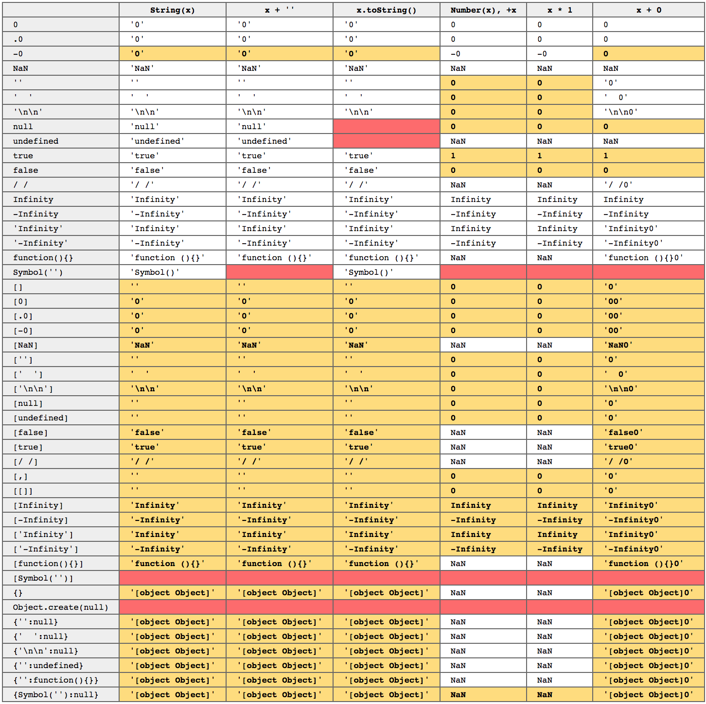

# Primitive Types
> __Note__: Not everything in JS is object.

* __undefined__ - empty value
* __string__
* __number__
* __boolean__
* __object__
* _function_ - Function is a callable object. It subtype of object type (that is why it is italic).
* _null_ - empty object value. But it doesn't behave as an object (that is why it is italic and its type is 'object'). 

> __Advice__: Don't distinguish _null_ and _undefined_.


## __typeof__
* returns one of there values: _undefined | string | number | boolean| object | function_
*  __typeof__ doesn't distinguis between _undeclared_ and _undefined_ variable.
* __typeof__ actually tells the type of the value which contains the variable.

```javascript
typeof foo;         // 'undefined' because it is not decalred yet
typeof 'foo';                   // 'string'
typeof 123;                     // 'number'
typeof true;                    // 'boolean'
typeof { a: 1 };                // 'object'
typeof function() {...};        // 'function'

typeof null;                    // 'object' - this is bug of JS
typeof NaN;                     // 'number'
```

 > __! Important:__ JS doesn't have variable types, it has value types. JS variables do not have types. Because you can put any value you want into a variable.


 ## Specail Values
* __NaN__ (Not a Number) - it is invalid number. NaN is not equal to anything, including itself.
    ```javascript
    var a = 'a' / 2;

    a;              // Nan
    typeof a;       // 'number'
    isNaN(a);       // true

    isNaN('foo');   // true - this is bug of JS

    // Use Number.isNaN instead
    if (!Number.isNaN) {
        Number.isNaN = function(num) {
            return (
                typeof num === 'number'
                && window.isNaN(num)
            );
            // or -> return num !== num;
        }
    }
    ```
* __Infinity, -Infinity__ - resilt od devision to zero and bit overflow (when you operate with big numbers, you can ron out of bit)
* __null__ - value of type _null_
* __undefined__ - value of type _undefined_
* __+0, -0__ - Used to encode some value. For example 0 will be speed and the sign is the direction.
    ```javascript
    var foo = 0 / -3;
    foo === -0;             // true
    foo === 0;              // true
    0 === -0;               // true
    (0/-3) === (0/3);       // true
    foo;                    // 0

    // use isNeg0 to identify the -0
    function isNeg0(x) {
        return x === 0 && (1/x) === -Infinity
    }

    isNeg0(0/-3);       // true
    isNeg0(0/3);        // false    
    ```

> __! Important:__ Browser's console is not standartized, it doesn't follow the official specification. So it can log -0 in the last line instead.


## Object.is
Is ES6 feature. _Object.is_ is like a triple equal operator (_===_), nut it doesn't lie to you about _NaN_ and _-0_
```javascript
// The best option for working with NaN and -0
Object.is('foo', NaN);              // false
Object.is(NaN, NaN);                // true

Object.is(0, -0);                   // false
Object.is(-0, -0);                  // true
```

## Test
```javascript
var baz = 2;
typeof baz;                 // 'number'

/* there is no such thing as redeclaring in the runtime.
Variable declared only once in the scope. */
var baz;
typeof baz;                 // 'number'

baz = 1 / 0;                // Infinity
typeof baz;                 // 'number'
```


# Coersion

## Natives
Natives are subtypes of _object_ type. They are, in fact, _functions_, in addittion to _objects_. The main purpose of natives are do type coersion for you.
* __String__
* __Number__ - + operator cast value to number
* __Boolean__ - !! operator cast vale to boolean
* __Function__
* __Object__ - {...} (initialization)
* __Array__ - [...] (initialization)
* __RegExp__ - /.../g (initialization)
* __Date__
* __Error__

```javascript
var foo = new String('foo');
typeof foo;                         // 'object'

foo instanceof String;              // true
foo instanceof string; // ReferenceError: string is not defined

foo = String('foo');
typeof foo;                         // 'string'

foo = Number('18');
typeof foo;                         // 'number'
```

### toString
```javascript
toString(null) === 'null';
toString(undefined) === 'undefined';
toString(true) === 'true';
toString(3.14) === '3.14';
toString(0) === '0';

// Bugs
toString(-0) === '0';
toString([]) === '';
toString([1,2,3]) === '1,2,3';
toString([null, undefined]) === ',';
toString([[[],[],[]],[]]) === ',,,';
toString([,,,,]) === ',,,'; // trailing coma is ignored
toString({}) === '[object Object]';
toString({a: 2}) === '[object Object]';
toString(function a() {}) === 'function a() {}';
```

### toNumber
toNumber() works like this:
* run __valueOf()__ if value is primitives.
* run __toString()__ if value is non-primitive

```javascript
toNumber('') === 0; // evil
toNumber('0') === 0;
toNumber('-0') === -0;
toNumber('  009') === 9;
toNumber('3.14') === 3.14;
toNumber('0.') === 0;
toNumber('.0') === 0;
toNumber('.') === NaN;
toNumber('0xaf') === 175;

toNumber(false) === 0;
toNumber(true) === 1;
toNumber(null) === 0;
toNumber(undefined) === NaN;

// because of toString() 
toNumber(['']]) === 0;
toNumber(['0']]) === 0;
toNumber(['-0']]) === -0;
toNumber([null]]) === 0;
toNumber([undefined]]) === 0;
toNumber([1,2,3]]) === NaN;
toNumber([[[[]]]]]]) === 0;
```

### toBoolean
```javascript
toBoolean('') === false;
toBoolean(0, -0, +0) === false;
toBoolean(null) === false;
toBoolean(undefined) === false;
toBoolean(false) === false;
toBoolean(NaN) === false;
// everything else is truthy
```

# Implicit & Explicit Coersion

### Explicit
```javascript
+new Date(); // returns now in seconds
// Date.now() - only in ES5

// ~N = -(N+1)
~2 === -3;
```

### Implicit
```javascript
// string
'123' - 0 === 123;
'123' - '0' === 123; // because '-' defined only for numbers
'123' / 1 === 123; // the same situation

// number
456 + '' === '456';
456 - '' === 456; // because '-' only for numbers and '' coersed into 0

// boolean
if ('123') // -> true
if (0) // -> false

'123' || 'foo' === 'foo'
//      ||
// is the same as
//      \/
'123' ? '123' : 'foo'

'123' && 'foo' === '123'
//      ||
// is the same as
//      \/
'123' ? 'foo' : '123'
```

### Double-equal operator (==)
__==__ operator tries to bring them to the same type and only then compare them.
> Don't ever use __==__ operator. Especially with __true__ and __false__.
```javascript
'123' == true   // -> false, because '123'->123, true->1 and 123 != 1
if([])          // -> true, becaue [] is truthy value
[] == false     // -> true, because []->''->0, false->0 and 0 === 0
0 == false      // -> true, because 'false' coersed to '0' => 0 == 0
[] == ![];      // -> true, because before comparison ![]->false
'42' == 42              // true
'foo' == [ 'foo' ]      // true

// Edge cases
'0' == null;            // false
'0' == undefined;       // false
'0' == false;           // true --> BUG
'0' == NaN;             // false
'0' == 0;               // true
'0' == '';              // false

0 == null;              // false
0 == undefined;         // false
0 == NaN;               // false
0 == [];                // true --> BUG
0 == {};                // false

false == null;          // false
false == undefined;     // false
false == NaN;           // false
false == 0;             // true --> BUG
false == '';            // true --> BUG
false == [];            // true --> BUG
false == {};            // false

'' == null;             // false
'' == undefined;        // false
'' == NaN;              // false
'' == 0;                // true --> BUG
'' == [];               // true --> BUG
'' == {};               // false
```

### Triple-equal opeartor (===)
__===__ doesn't coerse values unlike __==__ operator, it jist compare them without coersion. __===__ and __==__ has exactly the same algorithm when value's types match. __===__ works faster than __==__, because it doesn't perform coersion.

```javascript
Number('') === 0
Number(false) === 0
Number(true) === 1
Number(null) === 0

String([]) === ''
String([null]) === ''
String([undefined]) === ''
```
[JavaScript Coercions Grid](http://getify.github.io/coercions-grid/)



### Other bugs
```javascript
parseInt(1/0, 19) === 18; /* true
because it calculates 1/0=Infinity, and tries to parse 'Infinity'
word on 19 based system.
*/

String('abc') instanceof String; /* false
because String() converts to string, not declares the inctance
of String ocject as there is no 'new' keyword.
*/

(new String('abc')) instanceof String; /* true
because we create instance of String object with 'new' keyword
*/

String('abs') == (new String('abc')); /* true
because of coersion. But, this is useful stuff.
*/
```