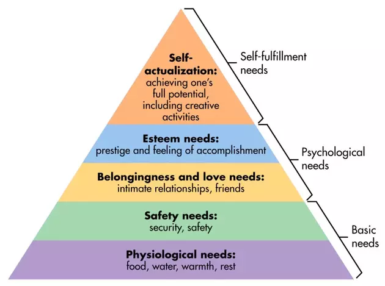
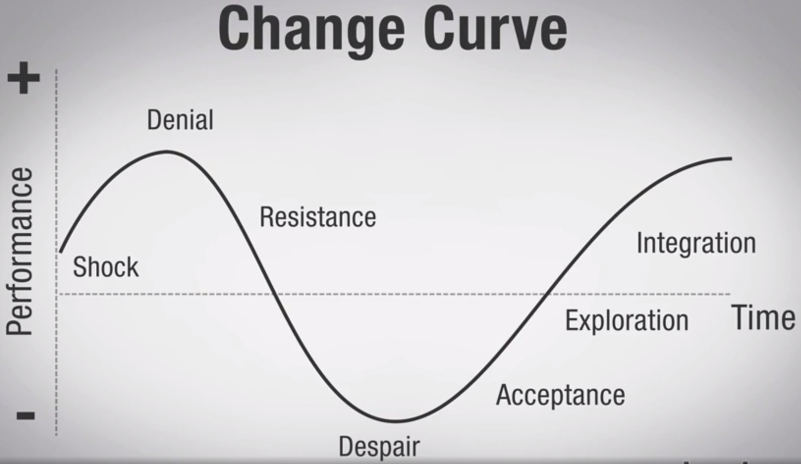

## Leadersip
Leadership is a process not a position. Leadership is a use of key skills and practices, correctly applied at the right time to help the team to reach the highest potential.

There is a range of key leadership skills and practices but they fall mainly into four clusters of competencies:
* Self-awareness

    Includes:
    * Which is knowing yourself. Your sterngth, weaknesses, and how others perceive you.

        Knowing all aspects of self including emotions, values, personality, and recognizing their impact; using “gut instincts” to guide actions

    * Acurate self-assessment

        Accurately perceiving strengths and weaknesses, and role in interactions in ways that line up with others’ views

    * Self-confidence

        Strong self of one’s self worth and capabilities

    * Emotional self control

        Managing impulsive or distressing feelings so that they don’t impact others negatively

    * Achievement drive

        Striving to meet a standard of excellence; ability to set and achieve goals; persistence and sustainability

    * Adaptability

        Demonstrating flexibility in adapting to changing situations or overcoming obstacles; resilience

    * Learning orientation

        Commitment to continual learning and improvement; actively identifying new areas for growth and taking advantage of opportunities to learn and practice

* Building relationship

    The ability to build positive and effective relationship with others within and outside the organization.

    Includedes:
    * Reading people

    * Empathy/compassion

        Accurately sensing and understanding others’ emotions; taking active interest in their needs and concerns

    * Communication skills

        Hearing and listening to others; sending and receiving messages accurately

    * Developing others

        Sensing others’ developmental needs; enhancing others’ abilities through feedback and coaching

    * Maximizing team performance

        Creating group synergy in pursuing collective goals through collaboration and cooperation

    * Managing conflict

        Negotiating and resolving disagreements; facilitating others to move through conflict

    * Appreciating differences

        Valuing the contributions of a wide range of people; understanding the influences of various factors including race, gender, economic background, nationality, etc.

    * Building influence

        Identifying and nurturing instrumental relationships; effectively persuading others

    * Service orientation

        Anticipating and meeting the needs of others (followers, employees, customers); contributing to the common good

* Business acumen

    The ability to perform functions and attain goals with min guidance.

    Includes:
    * Functional or technical skills

        Knowledge and effective use of specific skills, practices and tactics specific to position and function

    * Adherence to culture

        Ability to adhere to culture and values (both stated and implied) of organization; adherence to policies and procedures

    * Planning and organizing

        Ability to orchestrate multiple activities and establish courses of action to ensure that work is completed efficiently

    * Decision making

        Ability to identify and analyze information, draw conclusions, identify appropriate solutions, and choose a course of action

    * Initiative and innovation

        Ability and willingness to identify solutions and act on opportunities; comfort with novel ideas and approaches

    * Managing work

        Effectively manages time and resources of self and others; clearly assigns responsibility for tasks, sets clear objectives, monitors progress, and provides feedback

    * Knowledge of industry

        Ability to scan various sources about current trends, drawing accurate connections and conclusions

    * Organizational acumen

        Accuracy and keenness of judgment or insight around all aspects of organization including current and future policies, trends, technology, information, and people

* Organizational strategy

    The ability to set the vision and direction for he long-term success of the organization.

    Includes:
    * Industry analysis

        Ability to analyze various sources about potential developments, pressures and opportunities, drawing accurate connections and conclusions

    * Political acumen

        Accuracy and keenness of judgment or insight around formal and informal influences that shape decision making in the organization

    * Global awareness

        Ability to analyze various sources about current and potential developments in the economic, political, social, and natural aspects of regions around the world, drawing accurate connections and conclusions

    * Vision and purpose

        Articulating an inspiring and compelling vision for the future of the organization; motivates and mobilizes others through passion and clear communication

    * Stategic direction

        Identifying and designing a long-range plan to maximize the success of the organization after effective analysis of a wide range of relevant factors

    * Dealing with compexity

        Comfort with ambiguity and paradox; able to understand and effectively respond to multiple and conflicting pressures

    * Catalyzing change

        Initiating, designing and facilitating change and new directions

    * Inspirational leadership

        Guiding and motivating others through a compelling vision; aligning the goals and strategies of the organization

Integrity is your most precious asset. Because in order to move to higher levels of leadership, you must become known as a person who's trustworthy.

> Integrity means acting and speaking in consistent with your values.

> In leadership, reputation is everything.

### Balance between leadership and management
1. Be clear with yoursef as to wich you are doing and why.

    Are you trying to genenrate change or create more stability.

2. Be clear with your team

    Asking about current projects and deadlines is about being _tactical_.

    Help them develop their short and long term professional development plans is _strategic_.

3. Tend to both leading and managing.

    You can schedule what week days you are going to be leader and what week day be leader.

### Leadership levels
1. Individual contributor

    Focuses on: Self leadership, Produce work for which you are hired, Get along with others.

2. Expert/Manager

    Exepert is the best at what he does and works on more complex projects. Wants to further develops his craft, innovates (вводить новшества), and demonstrates readiness. 

    Managers lead others. Maximazes the talent of your team, think strategic about how your team contributes to the organization's goals.

3. Leader of Leaders

4. Leader of Functions/Divisons

    Maximizes the contribution of all groups within the function.

    Strategizethe development of the function for the future of the whole organization.

5. Leader of Organization

    Manage all functional leaders, and set vision and strategy.

As you move to a new Leader Level, 3 key things shift:
1. Scope
2. Stakes (ставки)
3. Proportion of management & leadership

> Rule: Share your view with those below you.

#### What qualities are people looking for in their leaders
1. Lead from teir values
2. Share an inspiring visin of the future

### Emotional inteligence (EI)
EI is essentially how smart you are in reading and working with emotions, both your own and others.

Both self-awareness and Building relationship is a part of EI.

### Motivation
Maslow's hierarchy of needs is a _motivational theory_ in psychology comprising a five-tier model of human needs

Needs lower down in the hierarchy must be satisfied before individuals can attend to needs higher up.

Organizations are also most successful when their people can be focused on the top level, achieving their full potential. This not only uleashes the highest levels of their skills and intelligence, but also supports an ever growing and improving workforce, because we're innately drwan toward self-improvement.

__Engagement__ - is the level of positive attachement employees feel toward their job and organization.

Causes of disengagement:
* Feeling invisible
* Efforts are not measured or recognized
* Work seems irrelevant
* The job or workplace is not as expected
* The job doesn't match talents or interests
* Little to no feedback or coaching
* No access to professional developement programs
* No viable career path
* Overworked or stressed
* Lack of trust or confidence in senior leaders

How to improve engagement:
* Hiring people into the irght position
* Job description match real work expectations
* Providing training and developement
* Accurate performance review systems

But the true spirit of engaging employees lives in the relationship that leaders build with their people.

#### Strategies for bulding a culture of employee engagement through individual relationship:
1. Get to know your people individually

    Focus on the whole person, not just their work life. Remember whose daughter is leaving for college, whose beloved pet just passed away ... This show you genuinely care about them.

2. Use 1:1 meetings to support professional development

    Make sure their interest and ultimate career goals are regular part of your check-ins.

3. Regularly provide coaching and training

4. Look for growth opportunities

When employees feel respected and empowered they can face challenges with a collaborative spirit and positive attitude.

#### Strategies for engaging a group or a team:
1. Be clear about events and goals
2. Always share the business case for why things are happening

    When you give the group the bigger picture, you first demonstrate trust and you also harness their intelligence and talent to solve the problem.

3. Express your fith in the team

    By allowing them to generate their own solutions to the problem.

4. Identify what support they need and deliver that

5. Celebrate successes

> People are most motivated when they are moving toward something and have a sense of their progress.

### Developing people
Discover 6 core components of each person:
1. Employee's strength and weaknesses
2. The factos that motivate and engage your emloyees
3. Learning style (How best the person learns?)
4. How well do they manag their tiggers

    It is helpful to have an open and honest discussion about it.

5. Emplyee's wrk/life balance needs
6. Employee's long-range career dreams

### Increase team performance
To be a team, group must have the following 4 qualities:
1. A common purpose
2. Efforts must be interdependent
3. Share responsibility for success of failure
4. Belief: Better together than alone

#### Reasons team fail:
1. Unclear purpose or goals
2. Lack of clear plan or commitment to plan
3. Inability to deal with conflict
4. Lack of shared responsibility for result
5. Insufficient resources
6. Lack of trust

#### How to avoid fail
Create a team gudelines by making clear the following:
1. Understand and agree on the goal

    * Purpose
    * Scope
    * Quality
    * Timeline

2. Discuss work preferences

    * Work style
    * Expectations
    * Challenges
    * Peeves

3. Agree on sared practices

    * How evaulate ideas
    * Make decisions
    * Appropriate behaviour
    * Communication

4. Identify the roles

5. Create a plan for dealing with conflct
6. Discuss needed resources
7. Discuss the responsibility

    Descibe how you will verify that they are meeting their milestones and that the result align with the goal.

As a leader, you need to:
* Help them buld trust
* Help through conflct
* Coach them when needed
* Value their worth
* Praise efforts and successes

If challenges arise:
* Identify problem
* Create solutions
* Implement solutions

### Facilitate changes
People focus mainly on the change, and forget to address the transition.

Transition is the psychological process that involves the human thoughts and feelings that accompany any change.

#### Strategy
1. Empower people n the change process

    Instead of pushing people to change, which triggers resistance. You genuinely involve them in designing and implementing tha change.

    Bring the people who will experience the change into the decision making process early, and have them co-create the change. This will yield far more effective ideas.

2. Build and maintain trust

    * Clarify the organization's intentions with a change.
    * Being reliable, by matching your words to your actions
    * Being trustworthy, by honoring your ageements.

3. Tend to the power of habit

    Intentinally shift the old behaviours

    Example: If you are moving people to the new office, have some kind of symbolic closure of the old.

> 70% of change initiatives fail due to poor leadership

### Developing political acumen
The ability to accurately perceive (ощущать) and judge (оценивать) the formal and informal influences that shape decision making.

It is about correctly reading your context and being able to make sound decisions based on what is really going on.

Transparent organizations have a higher match between what is said and what is done, while others are a complex web of invisible factors.

As a leader you should do two things:
1. Finds out who holds what kind of power in the organization. Not just in paper, but in reality.

    Types of power:
    * Legitimate power - holds a formal position of authority.
    * Reward power - ability to offer rewards.
    * Coercive power - ability to punish.
    * Referent power - respected and admired.
    * Expert power - expertise and competency.

2. Find out priorities of the organization

    You will know the real priorities by looking for where the organization invest its resources.

#### Strategy
1. Identify and understand the power and priorities
2. Demonstrate understanding through your wrds and actions
3. Find a mentor who is politically savvy (смекалка).
4. Utilize our analysis to inform your decision making and actions.
5. Frequently review all of the organization's publicity materials.
6. Review the internal communication often housed in employee portal.
7. Listen for comments about pressures, challanges, and opportunities.
8. Engage in discussion about current and future developement.

### How to build relationship
1. Demonstrate open and trustworthy
2. Demostrate genuine care and interest in others

    Open body language, Good eye contact.

3. Learn about whole person

    Interests, values, goals, passions.

4. Tune in to verbal and non-verbal cues (сигнал).

### Create organization culture
An organization's culture becomes the driving force that shapes the attitude and behaviour of everyone in the organization.

It includes:
* The shared beliefs
* Values
* Behaviours

It is the most effective way to improve productivity, engagement, and other key measures of success.

Great cultures have 4 key factors in common:
1. Hight level of trust between employees and management
2. Pride in work or organization
3. People genuinely like colleagues
4. Learning and development is encouraged

These ideas and practices must come from the top and be infused into every aspect of the organization. Inclding:
* Company values
* Hiring practices
* Performance measurement system
* Training and develoopment
* Policies and procedures

[www.greatplacetowork.com](https://www.greatplacetowork.com/)

### Practicing sustainability
Sustainability - keeping yourself in good shape so that you can meet and respond to the daily challenges over time.

#### Strategy
1. Keep yourself physicaly and emotionally strong.
2. Nutrition (питание)

    * Keeps immune system strong, so you could fight stress.

3. Meditative activities

    Provides:
    * Stress reduction
    * Clarity and inspiration
    * Good ideas

4. Sleep

    The rule of thumb: When you wake up naturally without the need of an alarm clock, that is how many hours you need.

    * Reduce the use of media at least 1 hour before bedtime.
    * Play

### Developing resilience
The ability to recover quickly from adversity (неблагоприятная обстановка).

Resilience is a 2 phase process:
1. Self protection

    With the person assessing and reducing potential sources of adversity.

    * Using emotional intelligence
    * Developing key relationship
    * Scanning your industry
    * Facilitating the change process.

2. Promote well being

    Focus on promoting well being to effectively bounce back from the effects of adversity when it does happen.

#### Strategy
1. Practice sustainability by taking care of yourself
2. Spend time with a supportive social netwoek
3. Express feelings

    Researche has shon that feelings need to be outwardly expressed either through talking or writing in order to be truly processed and shifted.

4. Practice gratitude daily    

    As you go to bed, identify 3 things that you are grateful for. The goal is to find 3 new tings and only repeating after you have gone 15 days.

5. Keep your sense of humor

### What steps do you take to motivate your team?
Two ways:
1. If you tend towards being friendly, approachable, and being seen as “one of the team”.

    Building a close working relationship between all team members will result in a natural increase in motivation – for example, organising team events, encouraging socialisation together outside of work, showing flexibility in working hours in return for extra hard work during busy times, and rewards for the entire team together.

2. If you feel like that method is too imprecise or too unprofessional, you can opt for a more serious and structured method of motivation

    At the most basic level, direct praise for a job well done is a powerful motivator, and done openly in front of other team members it will motivate everybody, not just the person already doing a good job.

    Bonuses, intangible but coveted rewards like “Employee of the Month” status, and the promise of promotion or further opportunities are all structured and distinct methods of driving improvement.

    Negative feedback is also extremely important in this style of management. Letting someone know when the work they have done is not good enough can be the push they need to do better, but it needs to be carefully balanced with praise to avoid demoralizing them.

### Resources:
* https://career.guru99.com/top-50-leadership-interview-questions/
* https://content.wisestep.com/top-team-leader-interview-questions-answers/

### How to motivate a team member

