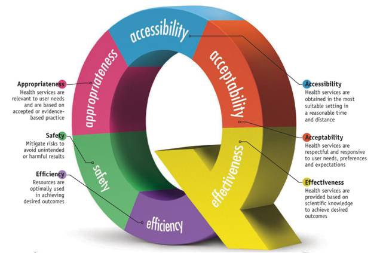

## Quality Management
Quality is a measurable quantity.

There are six different dimensions quality measurement lies on



Quality management is a method for ensuring that all the activities necessary to design, develop and implement a product are effective and efficient with respect to the system and its performance.

As a result, quality management is method of supplying products or services that satisfies customers’ requirements. The main purpose of the quality management is achieving customer satisfaction.

### Measure the quality of a product
Software quality measures whether software satisfies its requirements. Software requirements are classified as either functional or non-functional.
* __Functional requirements__ specify what the software should do.

    Functional requirements could be calculations, technical details, data manipulation and processing, or any other specific function that defines what an application is meant to accomplish.

* __Non-functional requirements__ specify how the system should work.

    Also known as “quality attributes” non-functional requirements include things like: _disaster recovery, portability, privacy, security, supportability, and usability._

[The Consortium for IT Software Quality](https://www.it-cisq.org/standards/) (__CISQ__) software quality model defines four important indicators of software quality:
* __Reliability__ is the risk of software failure and the stability of a program when exposed to unexpected conditions.
* __Performance__ refers to an application’s use of resources and how that affects its scalability, customer satisfaction, and response times.
* __Security__ assesses how well an application protects information against the risk of software breaches.
* __Maintainability__ is the ability of the system to support changes. Is the ease with which you can modify software, adapt it for other purposes, or transfer it from one development team to another.

> Software with more lines of code is harder to maintain, meaning changes are more likely to lead to errors.

The CISQ model provides a good platform for understanding software quality, but you can consider other aspects alongside CISQ to get a more holistic view of quality.
* __Rate of Delivery__ means how often new versions of software are shipped to customers.
* __Testability__ - how well the system allows performing tests, quality of documentation.
* __Usability__

    The user interface is the only part of the software visible to users, so it’s vital to have a good UI. Simplicity and task execution speed are two factors that lead to a better UI.

    Accessibility, Hot keys, List of suggestions, List of supported devices are also incuded.

### FURPS
FURPS is an acronym representing a model for classifying software quality attributes (functional and non-functional requirements):
* __Functionality__ - Capability (Size & Generality of Feature Set), Reusability (Compatibility, Interoperability, Portability), Security (Safety & Exploitability)

    is assessed by evaluating the feature set and capabilities of the program, the generality of the functions that are delivered, and the security of the overall system.

* __Usability__ (UX) - Human Factors, Aesthetics (эстетика), Consistency, Documentation, Responsiveness

    Is assessed by considering human factors , overall aesthetics, consistency, and documentation.

* __Reliability__ - Availability (Failure Frequency (Robustness/Durability/Resilience), Failure Extent & Time-Length (Recoverability/Survivability)), Predictability (Stability), Accuracy (Frequency/Severity of Error)

    Is evaluated by measuring the frequency and severity of failure, the accuracy of output results, the mean-time-to-failure (MTTF), the ability to recover from failure, and the predictability of the program.

* __Performance__ - Speed, Efficiency, Resource Consumption (power, ram, cache, etc.), Throughput, Capacity, Scalability

    Is measured by processing speed, response time, resource consumption, throughput, and efficiency.

* __Supportability__ (Serviceability, Maintainability, Sustainability, Repair Speed) - Testability, Flexibility (Modifiability, Configurability, Adaptability, Extensibility, Modularity), Installability, Localizability

    Is the ability of the system to provide useful information for identifying and solving problems.

### Quality Metrics
Software metrics can be classified into three categories:
* #### Product metrics

    It includes size, design, complexity, performance and other parameters that are associated with the product's quality.

* #### Process metrics

    It involves parameters like, time-duration in locating and removing defects, response time for resolving issues, etc.

* #### Project metrics

    It may include number of teams, developers involved, cost and duration for the project, etc.

__Software quality metrics__ are a subset of software metrics that focus on the quality aspects of the product, process, and project.

#### Product Quality Metrics
* Mean Time to Failure

    It is the time between failures. This metric is mostly used with safety critical systems such as the airline traffic control systems, avionics, and weapons.

* Defect Density

    `defect_density = defects / lines_of_code`

* Customer Problems

    It measures the problems that customers encounter when using the product.

    The problems metric is usually expressed in terms of __Problems per User-Month (PUM)__.

    ```
    PUM =
        Total Problems that customers reported for a time period +
        + Total number of license-months of the software during the period
    ```

    Where:
    ```
    Number of license-month of the software =
        Number of install license of the software ×
        × Number of months in the calculation period
    ```

* Customer Satisfaction

    Customer satisfaction is often measured by customer survey data

#### Process Quality Metrics
In-process quality metrics deals with the tracking of defect arrival during formal machine testing for some organizations. This metric includes:
* Defect density during machine testing
* Defect arrival pattern during machine testing
* Phase-based defect removal pattern

    In addition to testing, it tracks the defects at all phases of the development cycle, including the design reviews, code inspections, and formal verifications before testing.

    Because a large percentage of programming defects is related to design problems, conducting formal reviews, or functional verifications to enhance the defect removal capability of the process at the front-end reduces error in the software.

* Defect removal effectiveness

    `DRE = (Defect removed during development phase / Possible defects in the product) × 100%`

### How to improve
* Includes Code Quality improvements techniques.
* Test early and Test often with Automation
* Implement quality controls from the beginning.

    Define __Definition of Done (DoD)__ and __Definition of Ready (DoR)__.

* Communication is key

#### Definition of Done
The DoD is usually a short document in the form of a checklist, that defines when a product backlog item (i.e. user story) is __considered “done”__.

A typical DoD might look like this example:
* Automated nd unit tests are written and all tests are green
* Code is refactored and reviewed
* Code is integrated with master branch
* Deployed to staging environment
* Sanity check is passed.

#### Definition of Ready
It is a checklist of what needs to be done to a product backlog item __before the team can start implementing it__ in the next sprint.

A typical DoR might look like this example:
* PO and Dev Team need to have talked about the story at least once
* Story must have clear business value
* Effort needs to be estimated
* Story must be broken down enough to fit in a single sprint
* Story needs at least one acceptance criterium

> A good guideline for DoR, consider the __INVEST__ schema: A user story should be Independent, Negotiatable, Valuable, Estimatable, Small and Testable.

___

[Read More](https://www.altexsoft.com/blog/engineering/what-software-quality-really-is-and-the-metrics-you-can-use-to-measure-it/)

[FURSP](http://www.1000sourcecodes.com/2012/05/software-engineering-furps.html)

[Quality Attributes](https://medium.com/@nvashanin/quality-attributes-in-software-architecture-3844ea482732)
