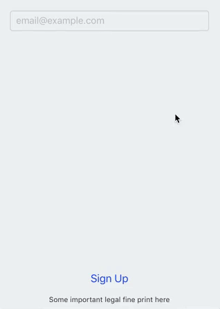
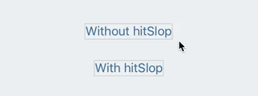
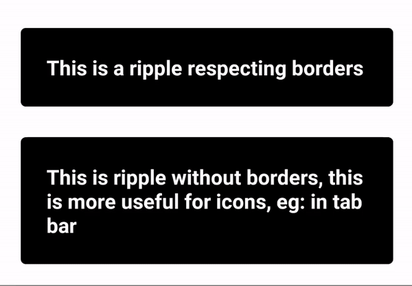

## Improving User Experience
Building apps for mobile platforms is nuanced, there are many little details that developers coming from a web background often do not consider.

### Configure text inputs
Entering text on touch phone is a challenge - small screen, software keyboard. But based on what kind of data you need, you can make it easier by properly configuring the text inputs:
* Focus the first field automatically
* Use placeholder text as an example of expected data format
* Enable or disable autocapitalization and autocorrect
* Choose keyboard type (e.g. email, numeric)
* Make sure the return button focuses the next field or submits the form

Check out [TextInput docs](http://facebook.github.io/react-native/docs/textinput.html) for more configuration options.

### Manage layout when keyboard is visible
Software keyboard takes almost half of the screen. If you have interactive elements that can get covered by the keyboard, make sure they are still accessible by using the [KeyboardAvoidingView]
(http://facebook.github.io/react-native/docs/keyboardavoidingview.html) component.

### Make tappable areas larger
On mobile phones it's hard to be very precise when pressing buttons. Make sure all interactive elements are `44x44` or larger. One way to do this is to leave enough space for the element, `padding`, `minWidth` and `minHeight` style values can be useful for that. Alternatively, you can use [hitSlop prop](http://facebook.github.io/react-native/docs/touchablewithoutfeedback.html#hitslop) to increase interactive area without affecting the layout.

### Use Android Ripple
`Android API 21+` uses the material design ripple to provide user with feedback when they touch an interactable area on the screen. React Native exposes this through the [TouchableNativeFeedback component](http://facebook.github.io/react-native/docs/touchablenativefeedback.html). Using this touchable effect instead of opacity or highlight will often make your app feel much more fitting on the platform. That said, you need to be careful when using it because it doesn't work on `iOS` or on `Android API < 21`, so you will need to fallback to using one of the other Touchable components on iOS. You can use a library like [react-native-platform-touchable](https://github.com/react-community/react-native-platform-touchable) to handle the platform differences for you.

### Screen orientation lock
Unless supporting both, it is considered good practice to lock the screen orientation to either portrait or landscape. On `iOS`, in the General tab and Deployment Info section of `Xcode` enable the Device Orientation you want to support (ensure you have selected iPhone from the Devices menu when making the changes). For `Android`, open the `AndroidManifest.xml `file and within the activity element add `'android:screenOrientation=”portrait”'` to lock to portrait or `'android:screenOrientation=”landscape”'` to lock to landscape.

### Learn more
[Material Design](https://material.io/) and [Human Interface Guidelines](https://developer.apple.com/ios/human-interface-guidelines/overview/design-principles/) are great resources for learning more about designing for mobile platforms.