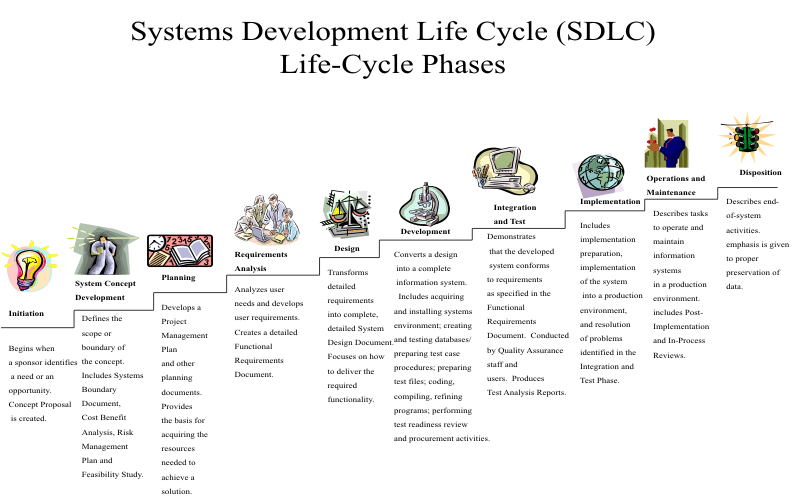
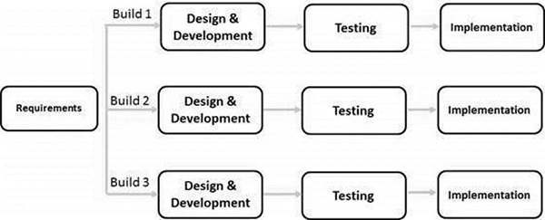
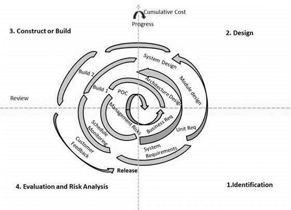
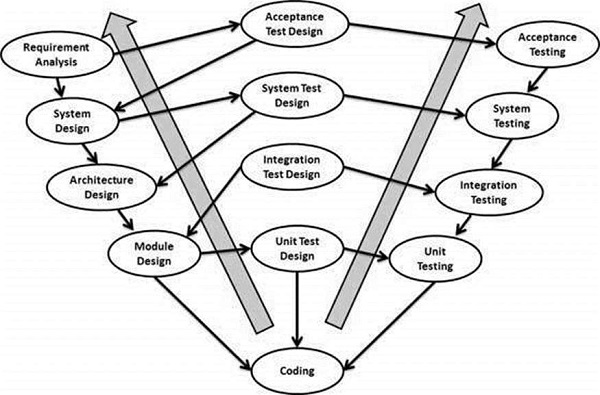
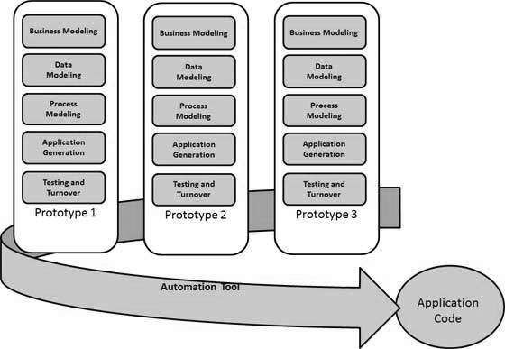

## Systems Development Life Cycle
The systems development life cycle (__SDLC__), also referred to as the application development life-cycle, is a term used in systems engineering, information systems and software engineering to describe a process for planning, creating, testing, and deploying an information system.

The SDLC is not a methodology per se, but rather a description of the phases in the life cycle of a software application. These phases (broadly speaking) are, investigation, analysis, design, build, test, implement, and maintenance and support. All software development methodologies (such as the more commonly known waterfall and scrum methodologies) follow the SDLC phases but the method of doing that varies vastly between methodologies.

1. #### Stage 1: Planning and Requirement Analysis

    Requirement analysis is the most important and fundamental stage in SDLC. It is performed by the senior members of the team with inputs from the customer, the sales department, market surveys and domain experts in the industry. This information is then used to plan the basic project approach and to conduct product feasibility study in the economical, operational and technical areas.

    Planning for the quality assurance requirements and identification of the risks associated with the project is also done in the planning stage. The outcome of the technical feasibility study is to define the various technical approaches that can be followed to implement the project successfully with minimum risks.

2. #### Stage 2: Defining Requirements

    Once the requirement analysis is done the next step is to clearly define and document the product requirements and get them approved from the customer or the market analysts. This is done through an SRS (Software Requirement Specification) document which consists of all the product requirements to be designed and developed during the project life cycle.

3. #### Stage 3: Designing the Product Architecture

    SRS is the reference for product architects to come out with the best architecture for the product to be developed. Based on the requirements specified in SRS, usually more than one design approach for the product architecture is proposed and documented in a DDS - Design Document Specification.

    This DDS is reviewed by all the important stakeholders and based on various parameters as risk assessment, product robustness, design modularity, budget and time constraints, the best design approach is selected for the product.

    A design approach clearly defines all the architectural modules of the product along with its communication and data flow representation with the external and third party modules (if any). The internal design of all the modules of the proposed architecture should be clearly defined with the minutest of the details in DDS.

4. #### Stage 4: Building or Developing the Product

    In this stage of SDLC the actual development starts and the product is built. The programming code is generated as per DDS during this stage. If the design is performed in a detailed and organized manner, code generation can be accomplished without much hassle.

    Developers must follow the coding guidelines defined by their organization and programming tools like compilers, interpreters, debuggers, etc. are used to generate the code.

5. #### Stage 5: Testing the Product

    This stage is usually a subset of all the stages as in the modern SDLC models, the testing activities are mostly involved in all the stages of SDLC. However, this stage refers to the testing only stage of the product where product defects are reported, tracked, fixed and retested, until the product reaches the quality standards defined in the SRS.

6. #### Stage 6: Deployment in the Market and Maintenance

    Once the product is tested and ready to be deployed it is released formally in the appropriate market. The product may first be released in a limited segment and tested in the real business environment (UAT- User acceptance testing).

    Then based on the feedback, the product may be released as it is or with suggested enhancements in the targeting market segment. After the product is released in the market, its maintenance is done for the existing customer base.

___

### SDLC Models
There are various software development life cycle models defined and designed which are followed during the software development process.

Following are the most important and popular SDLC models followed in the industry:

### Waterfall
Is a linear-sequential life cycle model.

In a waterfall model, each phase must be completed before the next phase can begin and there is no overlapping in the phases.

> 

#### Application
* Requirements are very well documented, clear and fixed.
* Product definition is stable.
* Technology is understood and is not dynamic.
* There are no ambiguous requirements.
* The project is short.

#### Advantages:
* Simple and easy to understand and use
* Easy to manage due to the rigidity of the model. Each phase has specific deliverables and a review process.
* Phases are processed and completed one at a time.
* Works well for smaller projects where requirements are very well understood.
* Clearly defined stages.
* Well understood milestones.
* Easy to arrange tasks.
* Process and results are well documented.

#### Disadvantages:
* No working software is produced until late during the life cycle.
* High amounts of risk and uncertainty.
* Not a good model for complex and object-oriented projects.
* Poor model for long and ongoing projects.
* Not suitable for the projects where requirements are at a moderate to high risk of changing. So, risk and uncertainty is high with this process model.
* It is difficult to measure progress within stages.
* Cannot accommodate changing requirements.
* Adjusting scope during the life cycle can end a project.
* Integration is done as a "big-bang. at the very end, which doesn't allow identifying any technological or business bottleneck or challenges early.

### Iterative Model
Iterative process starts with a simple implementation of a subset of the software requirements and iteratively enhances the evolving versions until the full system is implemented. At each iteration, design modifications are made and new functional capabilities are added. The basic idea behind this method is to develop a system through repeated cycles (iterative) and in smaller portions at a time (incremental).

In this incremental model, the whole requirement is divided into various builds. During each iteration, the development module goes through the requirements, design, implementation and testing phases. Each subsequent release of the module adds function to the previous release. The process continues till the complete system is ready as per the requirement.

#### Application
* Requirements of the complete system are clearly defined and understood.
* Major requirements must be defined; however, some functionalities or requested enhancements may evolve with time.
* There is a time to the market constraint.
* A new technology is being used and is being learnt by the development team while working on the project.
* Resources with needed skill sets are not available and are planned to be used on contract basis for specific iterations.
* There are some high-risk features and goals which may change in the future.

#### Advantages:
* Some working functionality can be developed quickly and early in the life cycle.
* Results are obtained early and periodically.
* Parallel development can be planned.
* Progress can be measured.
* Less costly to change the scope/requirements.
* Testing and debugging during smaller iteration is easy.
* Risks are identified and resolved during iteration; and each iteration is an easily managed milestone.
* Easier to manage risk - High risk part is done first.
* With every increment, operational product is delivered.
* Issues, challenges and risks identified from each increment can be utilized/applied to the next increment.
* Risk analysis is better.
* It supports changing requirements.
* Initial Operating time is less.
* Better suited for large and mission-critical projects.
* During the life cycle, software is produced early which facilitates customer evaluation and feedback.

#### Disadvantages:
* More resources may be required.
* Although cost of change is lesser, but it is not very suitable for changing requirements.
* More management attention is required.
* System architecture or design issues may arise because not all requirements are gathered in the beginning of the entire life cycle.
* Defining increments may require definition of the complete system.
* Not suitable for smaller projects.
* Management complexity is more.
* End of project may not be known which is a risk.
* Highly skilled resources are required for risk analysis.
* Projects progress is highly dependent upon the risk analysis phase.

### Spiral Model
The spiral model has four phases. A software project repeatedly passes through these phases in iterations called Spirals.
1. #### Identification

    This phase starts with gathering the business requirements in the baseline spiral. In the subsequent spirals as the product matures, identification of system requirements, subsystem requirements and unit requirements are all done in this phase.

    This phase also includes understanding the system requirements by continuous communication between the customer and the system analyst. At the end of the spiral, the product is deployed in the identified market.

2. #### Design

    The Design phase starts with the conceptual design in the baseline spiral and involves architectural design, logical design of modules, physical product design and the final design in the subsequent spirals.

3. #### Construct or Build

    The Construct phase refers to production of the actual software product at every spiral. In the baseline spiral, when the product is just thought of and the design is being developed a POC (Proof of Concept) is developed in this phase to get customer feedback.

    Then in the subsequent spirals with higher clarity on requirements and design details a working model of the software called build is produced with a version number. These builds are sent to the customer for feedback.

4. #### Evaluation and Risk Analysis

    Risk Analysis includes identifying, estimating and monitoring the technical feasibility and management risks, such as schedule slippage and cost overrun. After testing the build, at the end of first iteration, the customer evaluates the software and provides feedback.

#### Application:
* When there is a budget constraint and risk evaluation is important.
* For medium to high-risk projects.
* Long-term project commitment because of potential changes to economic priorities as the requirements change with time.
* Customer is not sure of their requirements which is usually the case.
* Requirements are complex and need evaluation to get clarity.
* New product line which should be released in phases to get enough customer feedback.
* Significant changes are expected in the product during the development cycle.

#### Advantages:
* Changing requirements can be accommodated.
* Allows extensive use of prototypes.
* Requirements can be captured more accurately.
* Users see the system early.
* Development can be divided into smaller parts and the risky parts can be developed earlier which helps in better risk management.

#### Disadvantages:
* Management is more complex.
* End of the project may not be known early.
* Not suitable for small or low risk projects and could be expensive for small projects.
* Process is complex
* Spiral may go on indefinitely.
* Large number of intermediate stages requires excessive documentation.

### V Model
The V-Model is an extension of the waterfall model and is based on the association of a testing phase for each corresponding development stage. This means that for every single phase in the development cycle, there is a directly associated testing phase.

#### Verification Phases:
* Business Requirement Analysis

    This phase involves detailed communication with the customer to understand his expectations and exact requirement.

    The acceptance test design planning is done at this stage as business requirements can be used as an input for acceptance testing.

* System Design

    The system design will have the understanding and detailing the complete hardware and communication setup for the product under development. The system test plan is developed based on the system design.

* Architectural Design

    Architectural specifications are understood and designed in this phase. Usually more than one technical approach is proposed and based on the technical and financial feasibility the final decision is taken. The system design is broken down further into modules taking up different functionality. This is also referred to as __High Level Design__ (HLD).

* Module Design

    In this phase, the detailed internal design for all the system modules is specified, referred to as Low Level Design (LLD). These unit tests can be designed at this stage based on the internal module designs.

#### Coding Phase
The actual coding of the system modules designed in the design phase is taken up in the Coding phase. The best suitable programming language is decided based on the system and architectural requirements.

The coding is performed based on the coding guidelines and standards.

#### Validation Phases
* Unit Testing

    Unit tests designed in the module design phase are executed on the code during this validation phase.

* Integration Testing

    Integration testing is associated with the architectural design phase. Integration tests are performed to test the coexistence and communication of the internal modules within the system.

* System Testing

    System testing is directly associated with the system design phase. System tests check the entire system functionality and the communication of the system under development with external systems.

* Acceptance Testing

    Acceptance testing is associated with the business requirement analysis phase and involves testing the product in user environment.

    Acceptance tests uncover the compatibility issues with the other systems available in the user environment. It also discovers the non-functional issues such as load and performance defects in the actual user environment.

#### Application:
* Requirements are well defined, clearly documented and fixed.
* Product definition is stable.
* Technology is not dynamic and is well understood by the project team.
* There are no ambiguous or undefined requirements.
* The project is short.

#### Advantages:
* This is a highly-disciplined model and Phases are completed one at a time.
* Works well for smaller projects where requirements are very well understood.
* Simple and easy to understand and use.
* Easy to manage due to the rigidity of the model. Each phase has specific deliverables and a review process.

#### Disadvantages:
* High risk and uncertainty.
* Not a good model for complex and object-oriented projects.
* Poor model for long and ongoing projects.
* Not suitable for the projects where requirements are at a moderate to high risk of changing.
* Once an application is in the testing stage, it is difficult to go back and change a functionality.
* No working software is produced until late during the life cycle.

### Big Bang Model
The Big Bang model is an SDLC model where we do not follow any specific process. The development just starts with the required money and efforts as the input, and the output is the software developed which may or may not be as per customer requirement. This Big Bang Model does not follow a process/procedure and there is a very little planning required. Even the customer is not sure about what exactly he wants and the requirements are implemented on the fly without much analysis.

#### Application
This model is ideal for small projects with one or two developers working together and is also useful for academic or practice projects. It is an ideal model for the product where requirements are not well understood and the final release date is not given.

#### Advantages
* This is a very simple model
* Little or no planning required
* Easy to manage
* Very few resources required
* Gives flexibility to developers
* It is a good learning aid for new comers or students.

#### Disadvantages
* Very High risk and uncertainty.
* Not a good model for complex and object-oriented projects.
* Poor model for long and ongoing projects.
* Can turn out to be very expensive if requirements are misunderstood.

### Agile Model
Agile model believes that every project needs to be handled differently and the existing methods need to be tailored to best suit the project requirements. In Agile, the tasks are divided to time boxes (small time frames) to deliver specific features for a release.

Iterative approach is taken and working software build is delivered after each iteration. Each build is incremental in terms of features; the final build holds all the features required by the customer.

The most populat Agile methodoly is called __SCRUM__.

#### Advantages:
* Is a very realistic approach to software development.
* Promotes teamwork and cross training.
* Functionality can be developed rapidly and demonstrated.
* Resource requirements are minimum.
* Suitable for fixed or changing requirements
* Delivers early partial working solutions.
* Good model for environments that change steadily.
* Minimal rules, documentation easily employed.
* Enables concurrent development and delivery within an overall planned context.
* Little or no planning required.
* Easy to manage.
* Gives flexibility to developers.

#### Disadvantages:
* Not suitable for handling complex dependencies.
* More risk of sustainability, maintainability and extensibility.
* An overall plan, an agile leader and agile PM practice is a must without which it will not work.
* Strict delivery management dictates the scope, functionality to be delivered, and adjustments to meet the deadlines.
* Depends heavily on customer interaction, so if customer is not clear, team can be driven in the wrong direction.
* There is a very high individual dependency, since there is minimum documentation generated.
* Transfer of technology to new team members may be quite challenging due to lack of documentation.

### RAD Model
Rapid application development is a software development methodology that uses minimal planning in favor of rapid prototyping. A prototype is a working model that is functionally equivalent to a component of the product.

RAD model enables rapid delivery as it reduces the overall development time due to the reusability of the components and parallel development. RAD works well only if high skilled engineers are available and the customer is also committed to achieve the targeted prototype in the given time frame. If there is commitment lacking on either side the model may fail.

Since there is no detailed preplanning, it makes it easier to incorporate the changes within the development process.

The most important aspect for this model to be successful is to make sure that the prototypes developed are reusable.

#### Phases of the RAD Mode
* Business Modeling

    A complete business analysis is performed to find the vital information for business, how it can be obtained, how and when is the information processed and what are the factors driving successful flow of information.

* Data Modeling

    The information gathered in the Business Modeling phase is reviewed and analyzed to form sets of data objects vital for the business. The attributes of all data sets is identified and defined. The relation between these data objects are established and defined in detail in relevance to the business model.

* Process Modeling

    The data object sets defined in the Data Modeling phase are converted to establish the business information flow needed to achieve specific business objectives as per the business model. Process descriptions for adding, deleting, retrieving or modifying a data object are given.

* Application Generation

    The actual system is built and coding is done by using automation tools to convert process and data models into actual prototypes.

* Testing and Turnover

    The overall testing time is reduced in the RAD model as the prototypes are independently tested during every iteration. However, the data flow and the interfaces between all the components need to be thoroughly tested with complete test coverage.

#### Application
RAD projects follow iterative and incremental model and have small teams comprising of developers, domain experts, customer representatives and other IT resources working progressively on their component or prototype.

RAD model can be applied successfully to the projects in which clear modularization is possible. If the project cannot be broken into modules, RAD may fail.

Scenarios where RAD can be used:
* RAD should be used only when a system can be modularized to be delivered in an incremental manner.
* It should be used if there is a high availability of designers for modeling.
* It should be used only if the budget permits use of automated code generating tools.
* RAD SDLC model should be chosen only if domain experts are available with relevant business knowledge.
* Should be used where the requirements change during the project and working prototypes are to be presented to customer in small iterations of 2-3 months.

#### Advantages:
* Changing requirements can be accommodated.
* Progress can be measured.
* Iteration time can be short with use of powerful RAD tools.
* Productivity with fewer people in a short time.
* Reduced development time.
* Increases reusability of components.
* Quick initial reviews occur.
* Encourages customer feedback.
* Integration from very beginning solves a lot of integration issues.

#### Disadvantages:
* Dependency on technically strong team members for identifying business requirements.
* Only system that can be modularized can be built using RAD.
* Requires highly skilled developers/designers.
* High dependency on modeling skills.
* Inapplicable to cheaper projects as cost of modeling and automated code generation is very high.
* Management complexity is more.
* Suitable for systems that are component based and scalable.
* Requires user involvement throughout the life cycle.
* Suitable for project requiring shorter development times.

### Software Prototype Model
The Software Prototyping refers to building software application prototypes which displays the functionality of the product under development, but may not actually hold the exact logic of the original software.

Software prototyping is becoming very popular as a software development model, as it enables to understand customer requirements at an early stage of development. It helps get valuable feedback from the customer and helps software designers and developers understand about what exactly is expected from the product under development.

Following is a stepwise approach explained to design a software prototype.
* Basic Requirement Identification

    This step involves understanding the very basics product requirements especially in terms of user interface. The more intricate details of the internal design and external aspects like performance and security can be ignored at this stage.

* Developing the initial Prototype

    The initial Prototype is developed in this stage, where the very basic requirements are showcased and user interfaces are provided. These features may not exactly work in the same manner internally in the actual software developed. While, the workarounds are used to give the same look and feel to the customer in the prototype developed.

* Review of the Prototype

    The prototype developed is then presented to the customer and the other important stakeholders in the project. The feedback is collected in an organized manner and used for further enhancements in the product under development.

* Revise and Enhance the Prototype

    The feedback and the review comments are discussed during this stage and some negotiations happen with the customer based on factors like – time and budget constraints and technical feasibility of the actual implementation. The changes accepted are again incorporated in the new Prototype developed and the cycle repeats until the customer expectations are met.

#### Software Prototyping Types:
* Throwaway/Rapid Prototyping

    Is also called as rapid or close ended prototyping. This type of prototyping uses very little efforts with minimum requirement analysis to build a prototype. Once the actual requirements are understood, the prototype is discarded and the actual system is developed with a much clear understanding of user requirements.

* Evolutionary Prototyping

    Is based on building actual functional prototypes with minimal functionality in the beginning. The prototype developed forms the heart of the future prototypes on top of which the entire system is built. By using evolutionary prototyping, the well-understood requirements are included in the prototype and the requirements are added as and when they are understood.

* Incremental Prototyping

    Refers to building multiple functional prototypes of the various sub-systems and then integrating all the available prototypes to form a complete system.

* Extreme Prototyping

    Is used in the web development domain. It consists of three sequential phases. First, a basic prototype with all the existing pages is presented in the HTML format. Then the data processing is simulated using a prototype services layer. Finally, the services are implemented and integrated to the final prototype. This process is called Extreme Prototyping used to draw attention to the second phase of the process, where a fully functional UI is developed with very little regard to the actual services.

#### Application
Software Prototyping is most useful in development of systems having high level of user interactions such as online systems. Systems which need users to fill out forms or go through various screens before data is processed. THis kind of systems can use prototyping very effectively to give the exact look and feel even before the actual software is developed.

Software that involves too much of data processing and most of the functionality is internal with very little user interface does not usually benefit from prototyping.

#### Advantages:
* Increased user involvement in the product even before its implementation.
* Since a working model of the system is displayed, the users get a better understanding of the system being developed.
* Reduces time and cost as the defects can be detected much earlier.
* Quicker user feedback is available leading to better solutions.
* Missing functionality can be identified easily.
* Confusing or difficult functions can be identified.

#### Disadvantages:
* Risk of insufficient requirement analysis owing to too much dependency on the prototype.
* Users may get confused in the prototypes and actual systems.
* Practically, this methodology may increase the complexity of the system as scope of the system may expand beyond original plans.
* Developers may try to reuse the existing prototypes to build the actual system, even when it is not technically feasible.
* The effort invested in building prototypes may be too much if it is not monitored properly.
