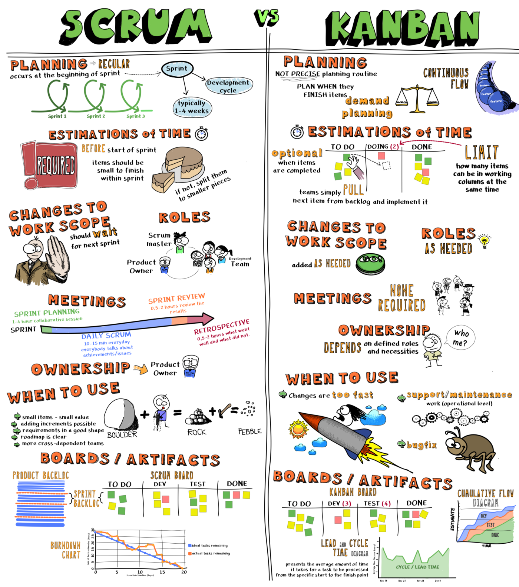
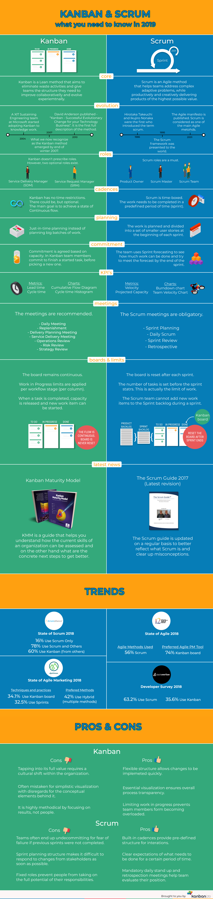
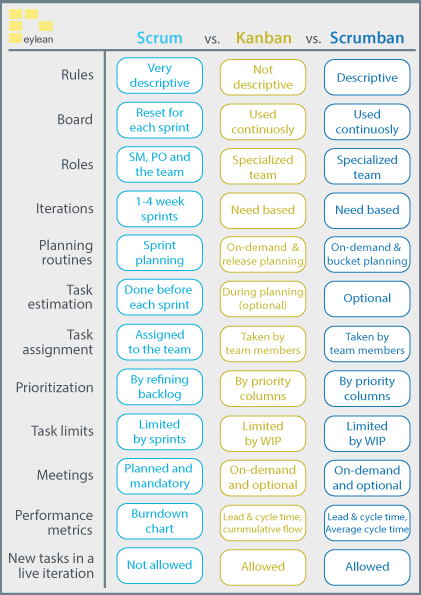

## Methodology differencies
### Scrum vs Kanban
The first step to understand this difference is to know that Kanban is not just a board. Kanban is a framework, methodology, process (call it as you prefer) and the board is just a tool.

Scrum better suits for products and development projects. Essentially, you select the work for the next sprint beforehand. You then lock the sprint, do all the work, and after a couple of sprints, your queue should be empty.

Kanban is better for production support. The limit here is not a Sprint, the limit is the size of the queues (each column of your board) called the Work in Progress (WIP) limit. It means you can change the items in the queues at any time, and that there is not end of working. It is always flowing.

|  | Scrum | Kanban |
| --- | --- | --- |
| Cadence | Regular fixed length sprints (ie, 2 weeks) | Continuous flow |
| Release methodology | At the end of each sprint | Continuous delivery |
| Roles | Product owner, scrum master, development team | No required roles |
| Key metrics | Velocity | Lead time, cycle time, WIP |
| Change philosophy | Teams should not make changes during the sprint. | Change can happen at any time |

Let’s start analysing each specific Scrum topic and the differences from Kanban:
* In Scrum, you split your organization into small, cross-functional, self-organizing teams. In Kanban, you don’t need to have cross-functional teams.
* There are specific roles in Scrum but not in Kanban.
* In Scrum, the daily stand-up meeting is the heartbeat of the project. In Kanban, it is not required.
* In Scrum, you must split your work into a list of small, concrete deliverables. In Kanban, split the work into pieces, write each item on a card and put it on the wall. They don’t need to be deliverables.
* In Scrum. you must split time into short fixed-length iterations (1–4 weeks), with potentially shippable software demonstrated after each iteration. In Kanban, it’s a continuous working, you don’t have iterations.
* In Scrum, you must sort the list of deliberables by priority and estimate the relative effort of each item. In Kanban, you don’t estimate the work.
* In Scrum, based on insights gained by inspecting the release after each iteration, optimize the release plan and update priorities in collaboration with the customer. In Kanban, this doesn’t happen.
* In Scrum, you have events fixed events like Inception, Planning, Review and Retrospective. In Kanban, not.
* In Scrum, you must optimize the process by having a retrospective after each iteration. Not in Kanban.
* In Scrum, you must have a Product Backlog and Burn-down chart. You don’t have it in Kanban

So, what’s in the Kanban? Let’s take a look in contrast with Scrum:
* Kanban focus on presenting a team workflow giving the opportunity for them to visualise it and improve it as soon as possible. Scrum has a fixed process and ceremonials.
* Kanban allows you to use any named columns in your board in order to illustrate where each item/product/service is in the workflow. Scrum is focused in the deliverables with specific columns: Backlog, Sprint Backlog, Doing and Done
* Kanban limits “Work In Progress” (WIP). In Kanban, you must assign explicit limits to how many items may be in progress at each workflow state. In Scrum, there isn’t any rule about that.
* One of most important things in Kanban is to measure the lead time (average time to complete one item, called “cycle time”). This is very important because it gives you an opportunity to optimize the process to make lead time as small and predictable as possible.
* Changes are done as needed in Kanban. In Scrum, changes can’t interrupt the Sprint

#### [Scrum vs. Kanban](https://medium.com/@thorbjorn.sigberg/scrum-vs-kanban-c73dc70e8eef)

### Scrum vs Kanban vs Scrumban

