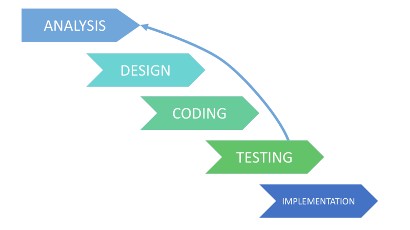

## Iterative SDLC Model
Iterative process starts with a simple implementation of a subset of the software requirements and iteratively enhances the evolving versions until the full system is implemented. At each iteration, design modifications are made and new functional capabilities are added. The basic idea behind this method is to develop a system through repeated cycles (iterative) and in smaller portions at a time (incremental).

Every iteration (which last from two to six weeks) includes the development of a separate component of the system, and after that, this component is added to the functional developed earlier.

The process of Iterative Model is cyclic, unlike the more traditional models that focus on a rigorous step-by-step precess of development. It involves the following phases:
* Planning Phase:

    This is the first stage of the iterative model, where proper planning is done by the team, which helps them in mapping out the specifications documents, establish software or hardware requirements and generally prepare for the upcoming stages of the cycle.

* Analysis and Design Phase

    Once the planning is complete for the cycle, an analysis is performed to point out the appropriate business logic, database models and to know any other requirements of this particular stage. Moreover, the design stage also occurs in this phase of iterative model, where the technical requirements are established that will be utilized in order to meet the need of analysis stage.

* Implementation Phase

    This is the third and the most important phase of the iterative model. Here, the actual implementation and coding process is executed. All planning, specification, and design documents up to this point are coded and implemented into this initial iteration of the project.

* Testing Phase

    After the current build iteration is coded and implemented, testing is initiated in the cycle to identify and locate any potential bugs or issues that may have been in the software.

* Evaluation Phase

    The final phase of the Iterative life cycle is the evaluation phase, where the entire team along with the client, examine the status of the project and validate whether it is as per the suggested requirements.

#### Application
* The requirements to the final product are strictly predefined.
* Major requirements must be defined; however, some functionalities or requested enhancements may evolve with time.
* There is a time to the market constraint.
* A new technology is being used and is being learnt by the development team while working on the project.
* Resources with needed skill sets are not available and are planned to be used on contract basis for specific iterations.
* There are some high-risk features and goals which may change in the future.
* Applied to the large-scale projects

#### Advantages:
* Some working functionality can be developed quickly and early in the life cycle.
* Results are obtained early and periodically.
* Parallel development can be planned.
* The progress is easely measurable.
* Less costly to change the scope/requirements.
* Testing and debugging during smaller iteration is easy.
* Risks are identified and resolved during iteration; and each iteration is an easily managed milestone.
* Easier to manage risk - High risk part is done first.
* With every increment, operational product is delivered.
* Issues, challenges and risks identified from each increment can be utilized/applied to the next increment.
* Risk analysis is better.
* It supports changing requirements.
* Initial Operating time is less.
* Better suited for large and mission-critical projects.
* During the life cycle, software is produced early which facilitates customer evaluation and feedback.

#### Disadvantages:
* More resources may be required.
* Although cost of change is lesser, but it is not very suitable for changing requirements.
* More management attention is required.
* System architecture or design issues may arise because not all requirements are gathered in the beginning of the entire life cycle.
* Defining increments may require definition of the complete system.
* Not suitable for smaller projects.
* Management complexity is more.
* End of project may not be known which is a risk.
* Highly skilled resources are required for risk analysis.
* Projects progress is highly dependent upon the risk analysis phase.
