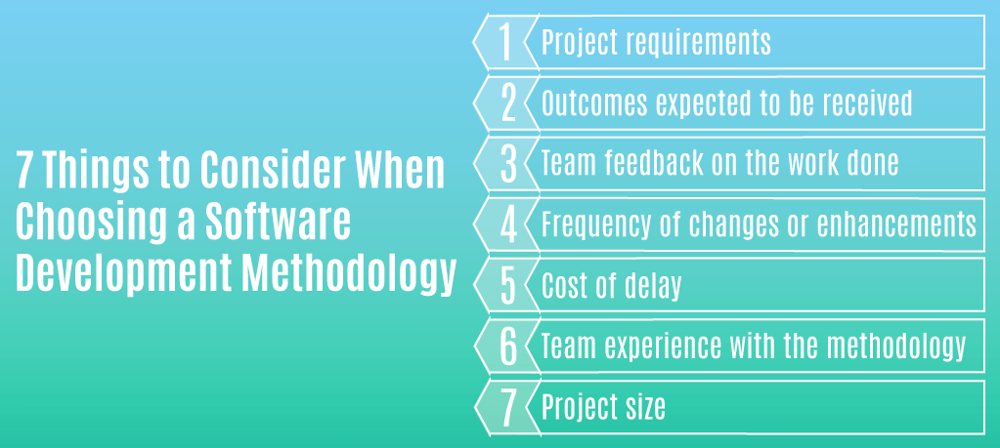
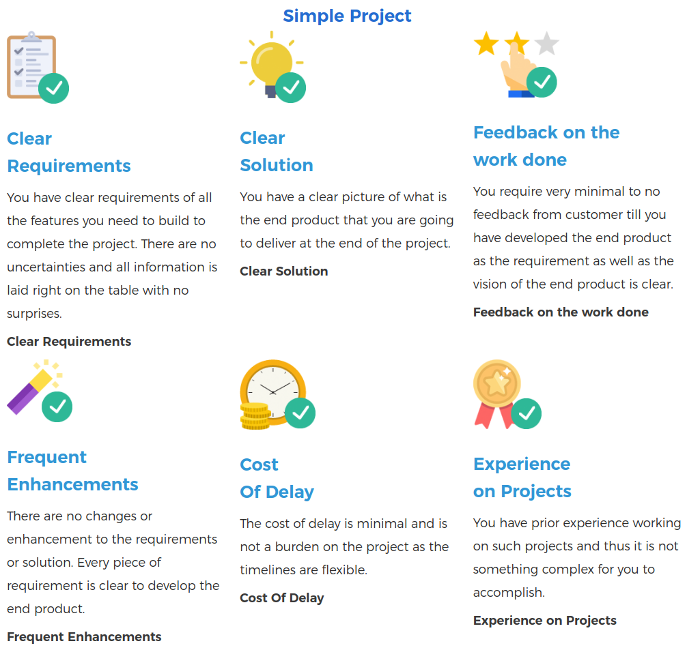
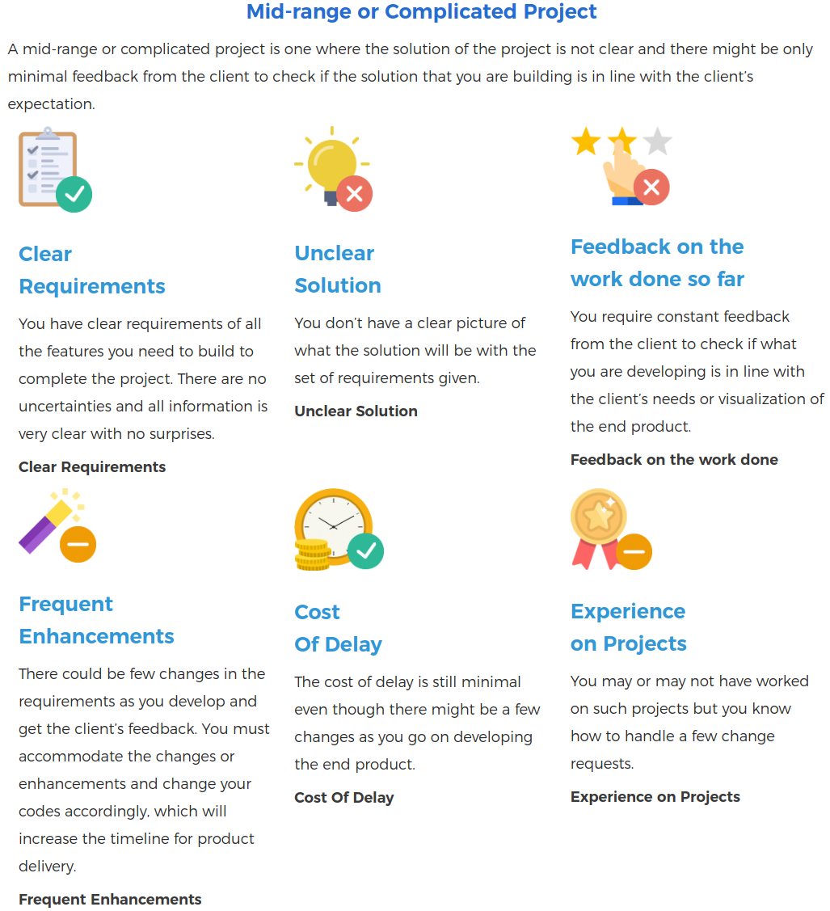
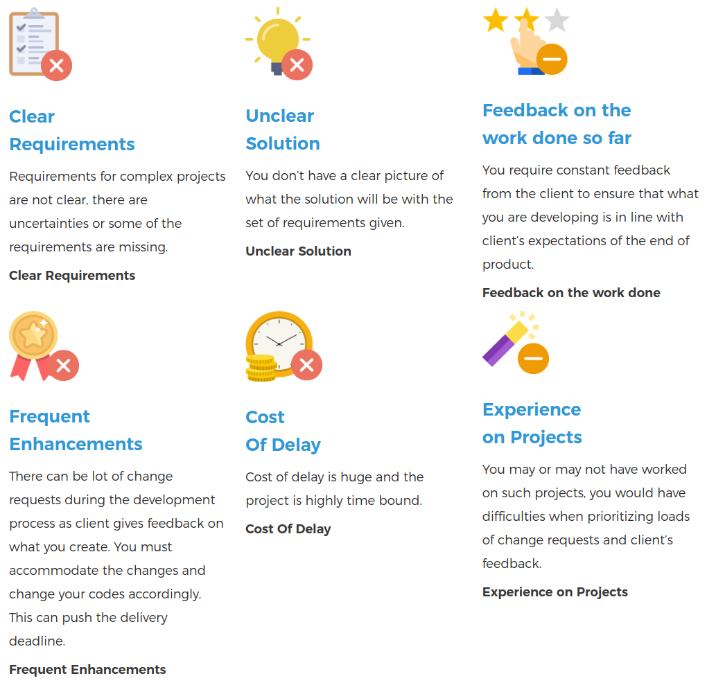
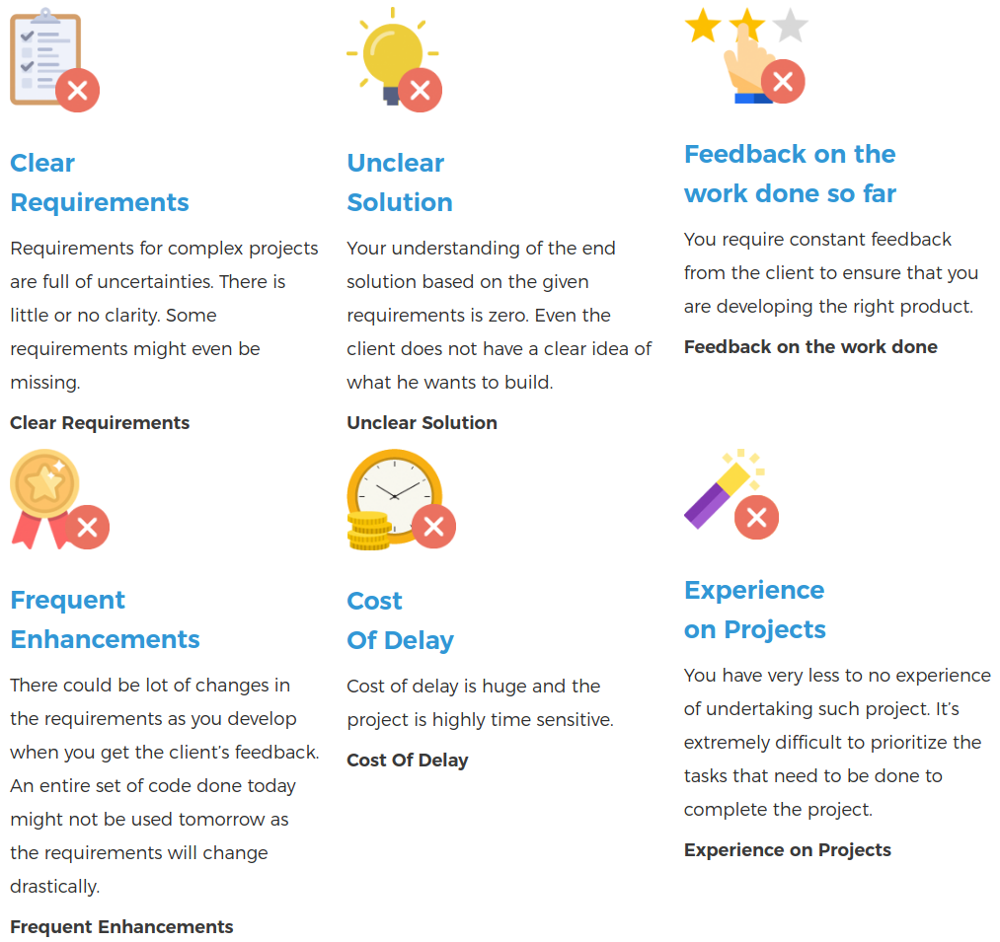

## Choose the right software development methodology

We can broadly classify a project into 4 different groups based on the above 7 points:

* ### Simple Project

    

    #### Suggested Methodology:
    * Waterfall

* ### Mid-range or Complicated Project

    A mid-range or complicated project is one where the solution of the project is not clear and there might be only minimal feedback from the client to check if the solution that you are building is in line with the client’s expectation.

    

    #### Suggested Methodology:
    * Kanban
    * Scrum

* ### Complex Projects

    Complex projects are the ones where neither the requirements are clear nor the solution is clear, cost delay is high and the requirements change often. These projects involve constant feedback and monitoring done by the client, which leads to changing requirements and the solution itself.

    

    #### Suggested Methodology:
    * Scrum
    * XP

* ### Chaotic Project

    A chaotic project is one in which the requirements are unclear, the client does not know what exactly he wants to build, the feedback from the client is high and the requirements might change often, changing the way the end product will look. The cost of delay is also very high and you have very less to no experience of handling such projects.

    

    #### Suggested Methodology:
    * XP

___

#### [Read More](https://www.asahitechnologies.com/blog/how-to-choose-the-right-software-development-methodology/)
