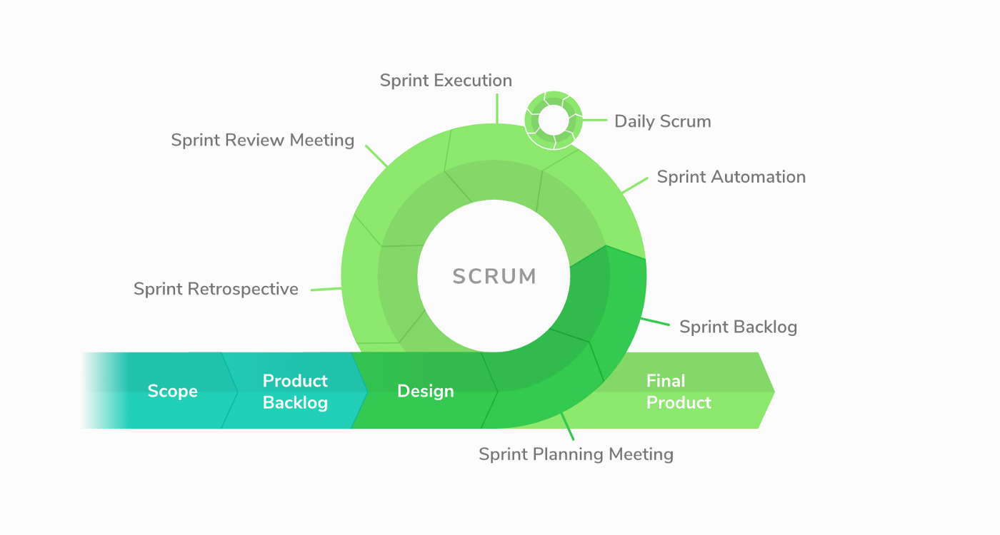

## Software Development Methodologies
Every business should decide on organizing the work process inside the company, according to its priorities and projects in development.
___

* ### Agile

    Agile software development is a conceptual framework for undertaking software engineering projects. There are a number of agile software development methodologies like Scrum, Crystal Methods and Dynamic Systems Development Model.

    The main goal of agile methods is minimizing the risk by developing software in short timeboxes, called iterations, which typically last one to four weeks. Each timebox is like a mini software project that includes all the tasks necessary to release the mini-increment of new functionality:
    * planning,
    * requirements analysis,
    * design,
    * coding,
    * testing, and
    * documentation.

    The iteration may not add enough functionality to warrant releasing the product, but an agile software project intends to be capable of releasing new software at the end of every iteration. After this iteration, the team reevaluates project priorities. Agile methods emphasize working product as the primary measure of the progress. Relative to the other methods Agile produce very little written documentation — the “real-time” is the preferable type of communication. Most of the development team members (and business owners too) are located nearby and can communicate face-to-face.

    __Pros__:
    * Adaptive approach that responds to changes favorably
    * Allows for direct communication to maintain transparency
    * Improved quality by finding and fixing defects quickly and identifying expectation mismatches early

    __Cons:__
    * Focuses on working with software and lacks documentation efficiency
    * Chances of getting off-track as outcome are not clear

___

* ### Waterfall

    The Waterfall model is a sequential development approach, in which development is seen as flowing steadily downwards (like a waterfall) through several phases, typically:
    * analysis
    * software requirements specificationSoftware design
    * software design
    * testing
    * integration (if there are multiple subsystems)
    * deployment (or Installation)
    * maintenance

    The linear and rigid nature of this method makes it easy to understand and manage. So its ideal for less experienced managers and teams. In this method, distinct goals are accomplished. Each phase must be 100% complete before moving onto the next phase, no turning back to modify the project or direction. In theory, this process leads to the project being delivered on time because each phase has been planned in detail. It can be used for projects with clear objectives and stable requirements.

    But in practice, waterfall development often falls short of expectations as it does not embrace the inevitable changes and revisions that become necessary with most projects.

    Emphasis is on planning, time schedules, target dates, budgets and implementation of an entire system at one time. Tight control is maintained over the life of the project via extensive written documentation, formal reviews, and approval/signoff by the user and information technology management occurring at the end of most phases before beginning the next phase. Written documentation is an explicit deliverable of each phase.

    Despite its inflexibility and thoughts of being out of date, this methodology intended to get rid of unnecessary paperwork, time-consuming regular meetings, and backlogs. So, this is a great choice for the small projects where all the aspects of development are known beforehand and a bad solution for complicated projects since it is quite inflexible.

    __Pros:__
    * Easy to understand and functional
    * Simple enough to handle as model is rigid
    * Saves significant amount of time
    * Allows for easy testing and analysis
    * It allows for departmentalization and managerial control

    __Cons:__
    * Only matches precise needs
    * Not applicable for maintenance projects
    * Does not allow editing in the testing phase
    * No option to know possible outcome of a project
    * Not excellent for long and ongoing projects

___

* ### Rapid Application Development Methodology

    Rapid Application Development (RAD) Methodology is created to take the maximum advantage of the development software. It aimed to reduce the amount of construction needed to build a product. RAD is a condensed development process that produces a high-quality system with low investment costs. It’s possible due to the ability to quickly adjust needed things. It aimed at providing quick results.

    RAD is most effective for projects with a well-defined business objective and a clearly defined user group, but which are not computationally complex. It is especially useful if the project is of small to medium size and time sensitive. However, it requires a stable team composition with highly skilled developers. Deep knowledge is essential when working on a condensed development timeline that requires approval after each construction phase.

    RAD (rapid application development) proposes that products can be developed faster and of higher quality by:
    * using workshops or focus groups to gather requirements.
    * prototyping and user testing of designs
    * re-using software components.
    * following a schedule that defers design improvements to the next product version.
    * keeping review meetings and other team communication informal.

    RAD usually embraces object-oriented programming methodology, which inherently fosters (поощрять) software re-use.

    __Pros:__
    * Makes the entire development process effortless
    * Assists client in taking quick reviews
    * Encourages feedback from customers for improvement

    __Cons:__
    * Dependant on the team for performance
    * Works on modularized system confined on this methodology
    * Requires extremely skilled personnel to handle complexities
    * Not applicable for the small budgeted projects

    

___

* ### Spiral

    The Spiral methodology extends the Waterfall model by adding rapid prototyping.

    It suits to large-scale complex systems. Spiral is generally chosen over the waterfall approach for large, expensive, and complicated projects.

    The Spiral Lifecycle Model is a sophisticated lifecycle model that focuses on early identification and reduction of project risks. A spiral project starts on a small scale, explores risks, makes a plan to handle the risks, and then decides whether to take the next step of the project (to do the next iteration of the spiral). It derives its rapid development benefit from continuously reducing the projects risk level. Success at using the Spiral Lifecycle Model depends on conscientious, attentive, and knowledgeable management.

    You can find the steps in the Spiral model as follows:
    1. The new system requirements are defined in details
    2. A preliminary design is created
    3. A first prototype of the new system is constructed from the preliminary design
    4. A second prototype is evolved using four steps:
        1. evaluation of the first prototype;
        2. defining the requirements for the second prototype;
        3. planning and designing the second prototype;
        4. constructing and testing the second prototype
    5. If the risk is great the project could be aborted. Risk factors might involve development cost overruns
    6. The existing prototype is evaluated in the same manner as was the previous prototype, and, if necessary, another prototype is developed from it
    7. The preceding steps are iterated until the customer is satisfied
    8. The final system is constructed (based on the refined prototype)
    9. The final system is thoroughly evaluated and tested
    10. Routine maintenance is carried out on a continuing basis to prevent large-scale failures and to minimize downtime

    __Pros:__
    * Risk factors are considerably reduced
    * Excellent for large and complex projects
    * Allows for adding functionality later
    * Suitable for highly risky projects with varied business needs

    __Cons:__
    * Costly model in software development
    * Failure in risk analysis phase may damage the whole project
    * Not appropriate for low-risk projects
    * Might get continued and never finish

___

* ### Extreme Programming

    Extreme Programming approach (__XP__) refers to an agile software engineering methodology.
    Extreme programming is a software-development discipline that organizes people to produce higher-quality software more productively.

    According to XP methodologies you have to implement the features with minimum working code. Once that’s done you can go back and beautify your code. Let the design evolve from the requirements, don’t do upfront design. Don’t think of the future requirements, just do the minimum required.

    It is the best choice if your client has a deadline to deliver the product with no clear understanding of how it must work, the risk is higher, and you have to search for the optimal solution to your client’s business problem. It will take you and the client on a journey of learning together.

    #### XP Practices:
    * __The Planning Game__

        Business and technical teams work together to create a plan, which is updated at regular intervals.

    * __Small Releases__

        Put a system into production quickly, and then release small versions in short cycles.

    * __Metaphor__

        Guide development with a simple shared story of how the system works.

    * __Simple Design__

        Keep the system as simple as possible, and remove complexity as soon as it’s discovered.

        Benefits:
        * A simple design is easier to understand
        * A simple design is easier to extend or modify (compared to a complex design)
        * A simple design only includes what is necessary to meet the requirements as they are right now.

    * __TDD__

        For a programmer following TDD, he would come up with a quick, simple, and sufficient solution, and then a quick, relatively simple refactoring afterwards.

        The reason for testing first is to give programmer some idea and goals.

    * __Refactoring__

        I also refactor. Refactoring is crucial to ensuring that your code will be easy to change, and thus easy to extend and maintain. Sometimes, refactoring makes it much easier to add a new feature.

        If you don’t refactor, then your program will eventually become a mess and become unmaintainable.

        > The cost of changing the requirements at a later stage in the project can be very high.

    * __Pair Programming__

    * __Collective Ownership__

        “Anyone can change any code anywhere in the system at any time.”

    * __Continuous Integration__

    * __40-Hour Week__

    * __On-site Customer__

        Include a real user on the team, to be able to answer any questions.

    * __Coding Standards__

        Programmers agree to certain rules and conventions, to allow the code to be clear, consistent, and expressive.

    

    #### What value will it add:
    1. __Communication__

        Extreme Programming emphasises on teamwork. Communication is an important aspect when we are working as a team. It needs to happen on daily basis and it can involve daily meetings with the key stakeholders, knowledge transfer, status updates, requirement gathering, etc.

        F2F discussions play a key role in this. Pair programming (discussed later) ensures the communication happens at the lowest possible level.

    2. __Simplicity__

        Simplicity urges to focus on what has been asked than predicting the future. This also helps in taking small baby steps towards solving a larger problem. While designing the solution to the problem one should keep in mind the KISS principle (Keep It Simple, Stupid! or Keep It Short and Simple).

        While developing the designed solution, just develop what is currently required than assuming that this is going to scale in future, i.e. YAGNI — You Aren’t Gonna Need It!

    3. __Feedback__

        Feedback involves communication at regular intervals with your team and client. It can be your pair reviewing your code or it can be your client who is providing the inputs on the piece of software you showcased. This is how feedback typically works at different stages of the software development lifecycle.

    4. __Courage__

        One should tell the truth about their progress and estimates. One should also accumulate courage to raise the issues that are harmful to the team. Courage teaches us how to succeed according to the plan, rather than documenting the reasons for the failure.

    5. __Respect__

        Respect value is about seeking respect from the team members as well as self-respect. When working in a team, every individual should respect the other team member irrespective of their role in the project or the work experience tag they are carrying. It also involves respect towards others’ time e.g. developers shouldn’t commit breaking changes. If at all something fails, they should fix or revert that first in order to unblock other team members.

    #### XP’s Life Cycle Stages:
    1. __Planning__
    2. __Designing__

        The core goal is continuously search for system implementation that is as simple as possible

    3. __Coding__

        This phase includes pair programming, metaphor, regular integration and firm observance such as 40-hour workweeks with no overtimes, code review and refactoring.

    4. __Testing__

        testing is always comes with coding and development stage rather than after the completion.

        Follow TDD. The reason for testing first is to give programmer some idea and goals.

    5. __Listening to client__

        Also developers can provide clients with feedback about the technical aspects if they understand the requirements well enough.

        All feedbacks captured will be revised the requirements by development team and that will become a foundation of new design. After this phase the cycle will be repeated over again.

    

    __Pros:__
    * Fast. Time savings are available because of the fact that XP focuses on the timely delivery of final products.
    * Extreme Programming teams save lots of money because they don’t use too much documentation. They usually solve problems through discussions inside of the team.
    * Code Simplicity.
    * It lays focus on customer involvement.
    * Developers are exceptionally committed to the project.
    * Equipped with modernistic methods for quality software.

    __Cons:__
    * Effectiveness depends on the people involved
    * Requires frequent meeting for development raising total costs
    * Necessitates for excessive development changes
    * Exact possibilities and future outcomes are really unknown
    * Lack of documentation. The constant changes cannot be documented properly.
    * Stress. There is a lot of pressure working with tight deadlines.
    * Need investment for hiring skilled professionals, automated tests & continuous delivery infrastructure.
    * TDD & Pair programming Cons.

    [Why eXtreme Programming isn’t popular](https://medium.com/agility-path/5-reasons-why-extreme-programming-isnt-popular-83790418b901)

___

* ### Kanban

    Kanban is a visualisation method that helps you see the flow of work through your team.

    Used in this way, it will show inefficiencies in your workflow and help you make tactical improvements. Central to Kanban is the visual board.

    

    

    Where:

    * __Limit Work in Progress (WIP)__: WIP is the number of items (i.e. cards, tickets, stories, tasks etc) that a team is currently working on.

        There are lots of good reasons why you should limit WIP:
        * You complete work faster
        * You get feedback faster
        * You deliver value to your customer faster
        * You avoid context switching
        * You can easily see bottlenecks
        * You won’t be flooded by unfinished work because it helps you manage capacity

    * __Make process policies explicit__: A list of “rules” for each stage of the workflow.

    * __Improve collaboratively, evolve experimentally__: The one event I advise you borrow from Scrum and lock into your team calendar from the get-go is regular Retrospectives. A key difference between Scrum-styled verses Kanban-styled Retrospectives is the focus on metrics and experimentation in Kanban.

    * __Manage flow__: Good Kanban teams focus on WIP. Great Kanban teams focus on flow — they use three artefacts and events to manage flow:

        1) The Kanban board helps them see actual and potential bottlenecks.
        2) Metrics (e.g. lead time, cycle time, queues and throughput) help them analyse flow. They use visualisation and metrics to find the biggest constraints they have and
        3) Retrospectives to make tactical process improvements to remove these constraints.

    #### How a Kanban board works:
    * The simplest Kanban board has a three-stage workflow — to do, doing and done.
    * A Kanban board isn’t a ticketing system. It helps you to visualise the flow of work through your team. Flow goes from left to right.
    * __To do__: Is the backlog. The backlog should be in prioritised order with the most important things first. The higher up an item is in the backlog, the better quality it should be i.e. the right size and the right amount of information for someone in your team to pick it up and work on it. Don’t spend too much time planning items further down the backlog. Priorities may change and that would be wasted effort. You want to plan just in time.
    * __Doing__: Is the process that a piece of work goes through from the time you start work on it through to completion. Limiting your WIP in this stage of the workflow is one of the key practices of Kanban.
    * __Done__: Is when your work has been completed. The goal is to get valuable work flowing through your team as quickly as possible. In order to measure speed you use Cycle Time: The average time it takes for an item to move from doing to done.

    

    Once you are up and running as a Kanban team, you will need to work on incremental process improvements. This is where Retrospectives come in. How to hold it:
    1. Open: Use a quick check-in activity to set the stage and engage the team.
    2. Last improvement: Review the last experiment. What did we learn from it? Should we keep it or discard it?
    3. Kanban board & metrics: Review the board and/or metrics. What does the data show you?
    4. Generate insights: Discuss what is working well and what isn’t working well. Identify the biggest constraint. Discuss the root cause.
    5. Next improvement: Agree on an experiment to remove the constraint. Use the hypothesis driven format, “We believe `<this improvement>`. Will result in `<this outcome>`. We will know we have succeeded when `<we see this measurable signal>`.”
    6. Close: Use a quick closing activity to end the Retrospective.

___

* ### Scrum

    Scrum is an iterative and incremental agile software development framework for managing product development.

    A key principle of Scrum is the dual recognition that customers will change their minds about what they want or need (requirements volatility) and that there will. Scrum adopts an evidence-based empirical approach — accepting that the problem cannot be fully understood or defined up front, and instead focusing on how to maximize the team’s ability to deliver quickly, to respond to emerging requirements, and to adapt to evolving technologies and changes in market conditions.

    Main features of Scrum:
    * a living backlog of prioritized work to be done
    * completion of a fixed set of backlog items in a series of short iterations or sprints
    * a brief daily meeting (“a scrum”) for explaining the progress, describing an upcoming work and possible obstacles
    * a brief planning session in which the backlog items for the sprint will be defined
    * a brief heartbeat retrospective when all team members reflect about the past sprint

    Scrum is best suited when the cost of delay is high and deadlines should meet a minimal delay. Scrum is often used when the end product is unclear or the requirements have no proper feedback from the clients. Here the client is involved in the whole process and determine and focus on certain sprint product backlog items that need to be completed (along with the team). Scrum takes its place among flexible methodologies that are appropriate for long-run development with frequent changes to requirements.

    __Pros:__
    * Decision making lies in the hands of the team
    * Business requirement document is considered insignificant
    * Lightly controlled method empathizing with constant updating

    __Cons:__
    * The processing method suffers because of wavering costs
    * Not suitable for big sized projects
    * Requires highly expert team, which has no place for novices

    

    #### How it works:
    

    There are 3 roles:
    * Product Owner

        The Product Owner represents the business and handles the relationship between the product and the investment of time, resources, and energy that the business is incurring. The PO ensure that maximum _ROI (Return On Investment)_ is achieved.

        Tactically, they help the team understand what is higher priority and what is lower priority, what might be more valuable to work on and less valuable to work on. Their role is to help shift resources and time and attention. Sometimes, but not always, they may prioritize things on the backlog but they are the only ones who can ask the team to work and who can change the order of the backlog.

        Finally, they help the team understand the requirements so as to maximize time and resources to produce higher efficiency and effectiveness (thus boosting ROI). They do this by creating user stories that generally look like this:

        > As a `<type of user>`, I want to `<do something>`, so that `<some value is created>`.

        A Product Owner:
        * Holds and maintains vision for the product
        * Represents the interests of the business
        * Represents the customer(s)
        * Owns the backlog
        * Orders and priorities the product backlog
        * Creates acceptance criteria for the items in backlog
        * Is available to assist and answer team’s questions

    * Scrum Master

        The Scrum Master plays the role of coach and helps guide the team to better self-organization, performance, and decision making. While the team focuses on building the best product, the SM focuses on building a high-performance team.

        In summary, they:
        * The resident Scrum expert and advisor
        * A coach for the team
        * The remove blockers, impediments, and help the team continue to move forward
        * The facilitate the backlog and the other parts of Scrum

    * Team Member

        A Team Member has the most authority in the Scrum system as they have the authority to decide how the work gets done, what tools they should use, what techniques should be deployed, and the associated costs of those decisions.

        Team Members:
        * Responsible for completing user stories to incrementally increase the value of the product
        * Self-organize to get all of the work done
        * Owns and creates the estimates for the work
        * Owns the “how to do the work” decisions
        * Avoids single-minded, specialist-thinking and instead considers the team’s performance in aggregate above their own

    __The Product Backlog__ is the master list of all of the planned and desired deliverables for the product. This can (and should) include features, bugs, documentation, Q/A, and more, essentially including anything that is meaningful and important to create for the product as a whole.

    Items within the backlog are called __user stories__.

    “Product Backlog items have the attributes of a _description_, _order_, _estimate_, and _value_.” — The Scrum Guide

    The list of backlog items or user stories is prioritized and ordered from the most important to the least important. The items at the top are also specific, well understood, and can be executed against quickly and efficiently. This means that they are also generally small tasks. Items further down the list are more ambiguous, less defined, and larger in scope and scale.

    Each item in the backlog should generally have the following:
    * Which users the story will benefit (who is it for)
    * A brief description of the desired functionality (what needs to be built)
    * The reason that this story is valuable (why we should do it)
    * An estimate as to how much work the story requires to implement
    * Acceptance criteria that will help the team know when it has been implemented correctly

    __Sprint Backlog__ is the team’s to do list for the sprint. Unlike The Product Backlog, it has a finite life-span: The length of the agreed upon sprint. It includes all the stories that the team has committed to delivering in the sprint and the associated tasks.

    __Burn Charts__ help the team understand the relationship between time and scope. Points are on the y-axis while sprints are on the x-axis. As time progresses, one can see how many points are remaining in the overall product and the relative speed and pace at which the team is working through the points and the sprints.

    

    __Task Board__ represents all the team’s tasks visibly so that everyone knows what is being worked on and by whom. The more simple of task boards have three columns:
    * To Do
    * Doing
    * Done

    Effective Scrum Teams define what _“done”_ means and then apply it to their Task Board and user stories. This is what is often described as the _“Definition of Done”_.

    __Sprint Cycle__ consists of several meetings, often called _“ceremonies”_:
    * Sprint Planning

        The goal is for the team to commit to a set of deliverables for the sprint and to also identify the tasks required to deliver upon the agreed user stories or backlog items. With the team, the Product Owner presents the suggested stories to prioritize and the team discusses their position and priority.

        The Product Owner decides which stories are going to be considered for the sprint while the team members doing the work are the ones who decide how much work they can reasonably take on.

        In the second part of the meeting the team then decides how the work will be done, decomposing the agreed stories into tasks. As tasks are defined the resulting stories on the backlog may change as well as more information become apparent and usable. It is not uncommon for a team to over-commit to the number of user stories in the beginning and then have to remove some as more details emerge.

        The result of this planning session is the Sprint Backlog which consists of the aforementioned user stories and the resulting associated tasks.

    * Daily Scrum/ Daily Standup

        Is when most teams hold a quick meeting near the beginning of the day to share the following:
        1. What tasks have been completed since the last Daily Scrum
        2. What tasks are to be completed by the next Daily Scrum
        3. What obstacles are slowing the team down

        Each member of the team participates and the meeting should be pointed, specific, and brief. The point is for everyone to get an idea of global progress and to identify issues before they become larger ones. This allows the team to actively inspect and adapt to changes in near real-time.

    * Story Time/Grooming

        Happens mid-Sprint to discuss how the team can improve on the stories in the product backlog which are user stories for future sprints. These are not user stories in the current sprint.

        The Product Owner defines and refines the acceptance criteria for user stories in the backlog and also point values for stories that do not yet have an estimate. This is essentially an opportunity for the team to guess at how much work will be required to get the story done.

        Not all Scrum Teams have an official Story Time and many teams do this at-will daily.

    * Sprint Review/Demo

        A public declaration that the current sprint or cycle is done and it’s time to show the work that’s been completed. Stakeholders from the business are often invited to review progress as well.

        The stakeholders, upon review, will undoubtedly have feedback and suggestions and it is the job of the PO primarily to capture these things for review later.

    * Retrospective

        The final meeting for the team to gather so that they can inspect, adapt, and optimize their ever-improving performance as a team. This meeting is just for the team itself.

        The conversations should revolve around what they learned during the sprint and how that learning can be effectively applied to the next sprint so that work can be done more efficiently and more effectively.

    The Sprint Cycle is a fixed period of time where you work on small parts of the larger product. The goal after each sprint is the same: A demonstrable working piece of software.

    It is very common for teams to have sprint cycles that last 2 weeks, although in early-stage ventures the cycle times might be as small as 1 week. When Scrum was first introduced the cycles were around 4 weeks or one month.

    The goal of short sprints or cycles is so that continuous improvement happens faster and that any important learnings aren’t lost into the ether. The Scrum process is designed specifically to catch these new and important learnings and then apply them immediately into the system for improvement.

    For a one week sprint, you’ll usually have the following with time breakdowns:
    * Monday: Sprint Planning (1–2 hours)
    * Tuesday: Daily Standup (15 minutes)
    * Wednesday: Daily Standup (15 minutes), Story Time (1 hour)
    * Thursday: Daily Standup (15 minutes)
    * Friday: Daily Standup (15 minutes), Sprint Review (30 minutes), Retrospective (1–2 hours)

    

    [Read More about Scrum](https://guide.freecodecamp.org/agile/scrum/)

    [Why Agile sucks at your company](https://medium.freecodecamp.org/why-agile-sucks-at-your-company-and-what-you-can-do-about-it-f4bebcc661c3)

___

* ### Scrumban

    Scrumban is an Agile development methodology that is a hybrid of Scrum and Kanban. In the simplest level, Scrumban is just the application of the principles of the Kanban method on top of your Scrum processes.

    In Scrumban, the teamwork is organized in small iterations and monitored with the help of a visual board, similar to Scrum and kanban boards.

    Planning meetings are held to determine what User Stories to complete in the next iteration. The User Stories are then added to the board and the team completes them, the team working on a few User Stories at a time as practical (the work-in-progress, or WIP, limit).

    To keep iterations short, WIP limits are thus used, and a planning trigger is set in place for the team to know when to plan next - when WIP falls below a predetermined level.

    There are no predefined roles in Scrumban; the team keeps the roles they already have.

    

    The biggest difference is in the board itself. We change the pull order of items. While in Scrum, the order of the sprint planning process and all tasks are pre-set prior to working, this can cause a level of rigidity that can result in skipping problems that arise during the process, and which may never get addressed prior to release.

    One of the greatest advantages of Kanban is that problems are identified throughout the process and can be identified before getting to the end point.

    #### Comparison of Scrumban to Scrum
    * __Iterations__: The iteration is the defining characteristic of Scrum, whereas Scrumban takes the Kanban approach of continuous workflow - with iterations being optional.
    * __Team roles__: Scrum has defined roles with development team members wearing all the hats of a development project , whereas Scrumban only requires roles as needed.
    * __Visualization__: Scrum can use a board, but is mostly dependent on backlogs and burndown charts, while Scrumban, like Kanban, is dependent on the Scrumban Board for maintaining visibility into the work.
    * __Meetings__: Both Scrum and Scrumban hold daily meetings, but there are no Sprint or release planning meetings and retrospectives in Scrumban. Scrumban embraces on-demand planning.
    * __Estimating__: Scrum teams must estimate the time work takes in order to meet the commitments of a Sprint, whereas Scrumban doesn’t have a time constraint. Instead, estimating becomes apparent over time as the team accomplishes more tasks.
    * __WIP__: The Scrum WIP (Work in Progress) is defined entirely by the Sprint backlog and planned at the start of each Sprint, while the Scrumban team limits the WIP to the available resources.
    * __Change__: Change is welcomed in Scrum because it can be responded to and planned in a subsequent Sprint, but in Scrumban change is responded to instantaneously. The lack of Sprints and backlogs means there are no limits to when tasks can be introduced. Change becomes a matter of a resource becoming available to take it on.
    * __Feature Freeze__: Although Scrumban responds to change instantaneously, there is a limit. Scrumban adopts feature freeze - a cut-off time where changes or additional features cannot be added because the project deadline is approaching.
    * __Triage__: Since Scrumban does not embrace estimating, the triage stage is critical. As a project deadline approaches, Scrumban triage enables the project manager to terminate work on less important features in order to complete essential features on time.

    #### Comparison of Scrumban to Kanban
    * __Team roles__: Kanban has no prescribed roles, but in Scrumban there is a definite team and may have required roles.
    * __Meetings__: Kanban does not require meetings, but Scrumban consists of daily meetings. Daily meetings help to maintain the collaboration between team members and to overcome impediments to progress.
    * __Metrics__: Both Kanban and Scrumban rely on measuring lead time and cycle time (sometimes used interchangeably) as their key metric. This metric estimates the average time it takes to complete a specific task.

    Lead time is what the customer sees from the time a request is made to delivery.

    Cycle time is the time from the work beginning to delivery.

    #### Application
    * A project has a great deal of unexpected change to user stories and reworking of priorities.
    * You want to add pull features to the Scrum development process.
    * Scrum has been unsuccessful due to any number of issues or because there are not enough resources to meet the time constraints of Scrum.
    * The work is event-driven, such as help desk support, where priorities shift constantly.
    * The team is entirely focused on adding features and supporting an existing product.
    * Scrum is utilized by your development team, but you are interested in some principles of Kanban.
    * You find some of the rigidness of Scrum limits your team’s ability to adapt to change.
    * You’re transitioning to Kanban, but need to make small methodology changes in order to limit disruption.

    #### Pros:
    * Allows continuous improvement of the workflow by learning from the past.

        Whereas Scrum is focused on pure workflow, once a sprint is in place, it’s difficult to make changes.  However, within Scrumban, if a developer during another sprint notices a problem, not only can he or she modify the current sprint, by adding important pieces into the flow, this knowledge can be shared across other sprints to improve the entire process.

    * No limits on the size of stories brought in to the board.

        In Scrumban, stories can be larger than the normal one, two, or five bar size;  this allows bringing in stories that may have come from another sprint or epic, even if it wasn’t planned.

    * Ensures continuous flow of work.

        Work no longer needs to stop if a developer has completed her part of a sprint.  She can move on to the next task without having to wait for a new sprint to begin.

    * Allow for Specialists

        The team can remain cross-functional however there is also space to allow for specialized resources. Sometimes a developer or Ops professional may have skills that are not necessarily shared by others in the group. Often his work within a sprint may be minimal compared to others, but he has other tasks that need to be accomplished. In Scrumban, is no reason for him to sit on his hands while everyone else finishes their roles. By bringing this person’s tasks outside of the individual sprint,  he can work in his own stream alongside existing sprints.

    [More about Scrumban](https://www.practicallogix.com/scrum-and-kanban-how-scrumban-can-help/)
___

* ### Crystal Methods

___

* ### Dynamic System Development Method

___

* ### Feature-Driven Develpment (FDD)

    Feature driven development is aligned with Agile methodology. It is a design oriented agile process in which the project is divided into features wherein the features are a small part of the complete project.

    FDD follows a 5 step process:
    1. __Develop a model__

    2. __Build a feature list__

        Using the knowledge of the 1st process, the team constructs the feature list instead of a product backlog.

        The whole project is further divided into features which need to be delivered every two weeks based on the length of the Sprint.

    3. __Plan by feature__

        Once the feature list is planned. It is up to the development team to decide which features to develop first. Teams are selected and assigned the feature set.

        FDD is different from traditional agile as it gives responsibility to individual developers instead of adopting collective ownership.

    4. __Design by feature__

        A lead developer selects a set of features to be developed in the next sprint. Depending on the requirements, testers, designers, and technical authors may join the team in the sprint. This team works together under a domain expert on the details of each selected feature and consequently

    5. __Build by feature__

        After the design inspection is complete, the code is developed and unit tested. The complete set of features are added to the build after the approval of the technical architect.

    #### Pros:
    * Works great for large-scale products requiring constant updating and always delivers value.
    * Based on the best and well-documented software development practices, ensuring developers with any experience can find their role and successfully work on the project.
    * The resulting features are always better than the initial ones

    #### Cons:
    * This model cannot be used by smaller or one-man teams of developers, as well as for smaller projects with strict deadlines.
    * The success of this model relies heavily on having the highly-skilled team leads monitoring the process throughout the development cycles.
    * Documentation is poor if any. The software owner gets the feature, yet its precise description is outside the scope of FDD model.

___
