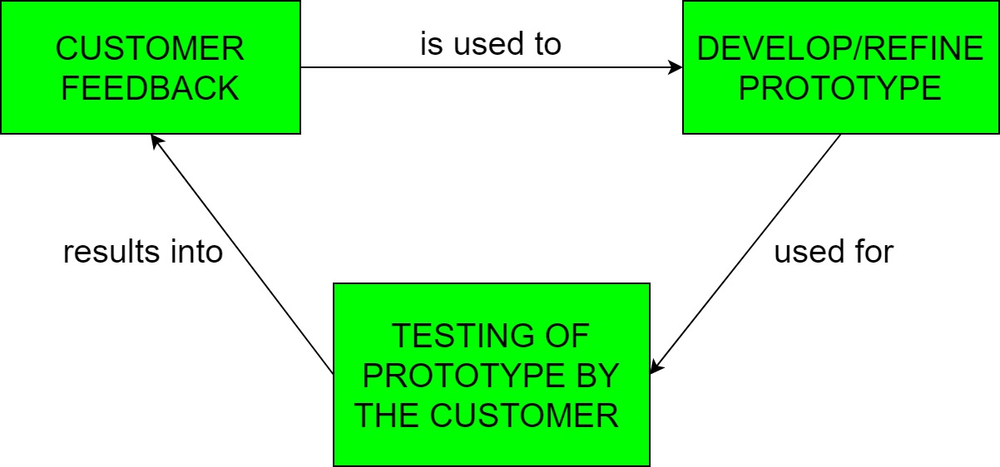

## Software Prototype SDLC Model
The Prototyping Model is the SDLC Model in which a prototype (an early approximation of a final system or product) is built, tested, and then reworked as necessary until an acceptable prototype is finally achieved from which the complete system or product can now be developed.

Software prototyping is becoming very popular as a software development model, as it enables to understand customer requirements at an early stage of development. It helps get valuable feedback from the customer and helps software designers and developers understand about what exactly is expected from the product under development.

Following is a stepwise approach explained to design a software prototype.
* Basic Requirement Identification

    This step involves understanding the very basics product requirements especially in terms of user interface. The more intricate details of the internal design and external aspects like performance and security can be ignored at this stage.

* Developing the initial Prototype

    The initial Prototype is developed in this stage, where the very basic requirements are showcased and user interfaces are provided. These features may not exactly work in the same manner internally in the actual software developed. While, the workarounds are used to give the same look and feel to the customer in the prototype developed.

* Review of the Prototype

    The prototype developed is then presented to the customer and the other important stakeholders in the project. The feedback is collected in an organized manner and used for further enhancements in the product under development.

* Revise and Enhance the Prototype

    The feedback and the review comments are discussed during this stage and some negotiations happen with the customer based on factors like – time and budget constraints and technical feasibility of the actual implementation. The changes accepted are again incorporated in the new Prototype developed and the cycle repeats until the customer expectations are met.

#### Software Prototyping Types:
* Throwaway/Rapid Prototyping

    Is also called as rapid or close ended prototyping. This type of prototyping uses very little efforts with minimum requirement analysis to build a prototype. Once the actual requirements are understood, the prototype is discarded and the actual system is developed with a much clear understanding of user requirements.

* Evolutionary Prototyping

    Is based on building actual functional prototypes with minimal functionality in the beginning. The prototype developed forms the heart of the future prototypes on top of which the entire system is built. By using evolutionary prototyping, the well-understood requirements are included in the prototype and the requirements are added as and when they are understood.

* Incremental Prototyping

    Refers to building multiple functional prototypes of the various sub-systems and then integrating all the available prototypes to form a complete system.

* Extreme Prototyping

    Is used in the web development domain. It consists of three sequential phases.

    1. Basic prototype with all the existing pages is presented in the HTML format.
    2. The data processing is simulated using a prototype services layer.
    3. The services are implemented and integrated to the final prototype.

    This process is called Extreme Prototyping used to draw attention to the second phase of the process, where a fully functional UI is developed with very little regard to the actual services.

#### Application
Software Prototyping is most useful in development of systems having high level of user interactions such as online systems. Systems which need users to fill out forms or go through various screens before data is processed. This kind of systems can use prototyping very effectively to give the exact look and feel even before the actual software is developed.

Software that involves too much of data processing and most of the functionality is internal with very little user interface does not usually benefit from prototyping.

#### Advantages:
* Increased user involvement in the product even before its implementation.
* Since a working model of the system is displayed, the users get a better understanding of the system being developed.
* Reduces time and cost as the defects can be detected much earlier.
* Quicker user feedback is available leading to better solutions.
* Missing functionality can be identified easily.
* Confusing or difficult functions can be identified.
* New requirements can be easily accommodated as there is scope for refinement.

#### Disadvantages:
* Risk of insufficient requirement analysis owing to too much dependency on the prototype.
* Users may get confused in the prototypes and actual systems.
* Practically, this methodology may increase the complexity of the system as scope of the system may expand beyond original plans.
* Developers in a hurry to build prototypes may end up with sub-optimal solutions.
* The effort invested in building prototypes may be too much if it is not monitored properly.
* The customer might lose interest in the product if he/she is not satisfied with the initial prototype.
