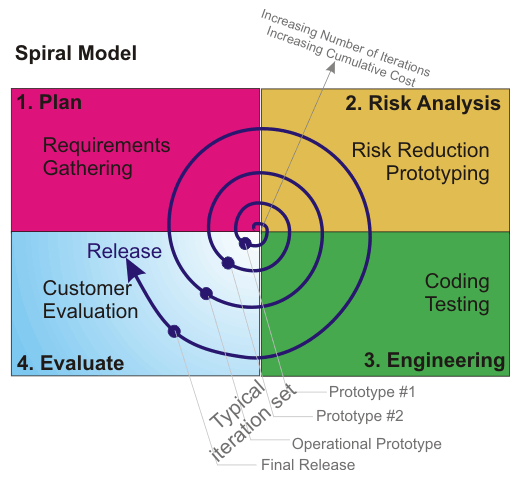

## Spiral SDLC Model
It is a combination of the Iterative and Waterfall SDLC models with the significant accent on the risk analysis. The main issue of the spiral model — is defining the right moment to make a step into the next stage. The preliminary set time frames are recommended as the solution to this issue.

Each loop of the spiral is called a _Phase_ of the software development process.

The spiral model has four phases. A software project repeatedly passes through these phases in iterations called Spirals.

<table id="tablepress-7" class="tablepress tablepress-id-7"><thead><tr class="row-1 odd"><th class="column-1">Phase Name</th><th class="column-2">Activities performed</th><th class="column-3">Deliverables / Output</th></tr></thead><tbody class="row-hover"><tr class="row-2 even"><td class="column-1">Planning</td><td class="column-2">-Requirements are studied and gathered.  - Feasibility study   - Reviews and walkthroughs to streamline the requirements </td><td class="column-3">Requirements understanding document    Finalized list of requirements. </td></tr><tr class="row-3 odd"><td class="column-1">Risk Analysis</td><td class="column-2">Requirements are studied and brain storming sessions are done to identify the potential risks    Once the risks are identified , risk mitigation strategy is planned and finalized </td><td class="column-3">Document which highlights all the risks and its mitigation plans.</td></tr><tr class="row-4 even"><td class="column-1">Engineering</td><td class="column-2">Actual development and testing if the software takes place in this phase</td><td class="column-3">Code  Test cases and test results  Test summary report and defect report. </td></tr><tr class="row-5 odd"><td class="column-1">Evaluation</td><td class="column-2">Customers evaluate the software and provide their feedback and approval</td><td class="column-3">Features implemented document</td></tr></tbody></table>

#### Application:
* When there is a budget constraint and risk evaluation is important.
* For medium to high-risk projects.
* Customer isn’t sure about the requirements.
* New product line which should be released in phases to get enough customer feedback.
* Significant changes are expected in the product during the development cycle.
* The projects with mid or high-level risk, where it is important to prevent these risks

#### Advantages:
* The scalability allow to make changes and add new functionality event at the relatively late stages.
* High amount of risk analysis
* Good for large and mission-critical projects.
* Software is produced early in the software life cycle.

#### Disadvantages:
* Management is more complex.
* End of the project may not be known early.
* Not suitable for small or low risk projects and could be expensive for small projects.
* Process is complex.
* Spiral may go on indefinitely.
* Large number of intermediate stages requires excessive documentation.
* The risk control demands involvement of the highly-skilled professionals.
