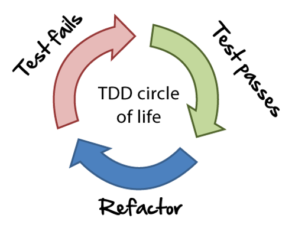

## Software Develpoment Techniques
* #### Test-Driven Development (TDD)

    TDD is a software development discipline where developers write automated test cases for enhancement or new features before they write any code.

    The pure TDD cycle is to write one failing unit test, then enough code to pass the test. Then a second failing unit test, then enough new code to pass both tests. And so forth.

    TDD helps to ensure the quality by focusing on requirement before writing the code. It assists in keeping the code clear, simple and testable by breaking it down into small achievable steps. It is also provides documentation about how the system works for anyone coming into the team later

    

    __Pros:__
    * Easy to iterate on code when the suite of tests back you up.
    * Makes code easier to maintain and refactor.
    * You never run out of time, and end up missing out the tests
    * Forces your code to be more modular (otherwise they’d be hard to test against).
    * Documents your code better than documentation (it doesn’t go out of date, since you’re running it all the time).
    * Creates a common code pattern that can be followed by other devs
    * Never get carried away and write more code than is necessary
    
    __Cons:__
    * The test suite itself has to be maintained; tests are not be completely deterministic (i.e. reliant on external dependencies).
    * Can slow down development, compared to non tested code.
    * Can over complicate code structure if over thought
    * Writing good unit tests is an art form. Don’t focus too much on metrics like code coverage. They do not tell you about the quality of the unit tests.

* #### Behavior-Driven Development (BDD)

    Behavioral Driven Development (BDD) is a software development approach that has evolved from TDD (Test Driven Development). It differs by being written in a shared language (English), which improves communication between tech and non-tech teams and stakeholders. In both development approaches, tests are written ahead of the code, but in BDD, tests are more user-focused and based on the system’s behavior.

    This technique operates at a slightly higher level than TDD while still following the basic principle of writing the test, then coding to pass the test.

    BDD focuses on the behavioural aspect of the system rather than the implementation aspect of the system.

    It can be difficult to distinguish between BDD and ATDD - the difference here is subtle.

* #### Acceptance-Test-Driven Development (ATDD)

    The name acceptance tests was changed from functional tests. This better reflects the intent, which is to guarantee that a customers requirements have been met and the system is acceptable

    A user story is not considered complete until it has passed its acceptance tests

    Acceptance tests usually are just black box system tests.

    Acceptance tests should be automated so they can be run often.

    Acceptance Test Driven Development (ATDD) is a practice in which the whole team collaboratively discusses acceptance criteria, with examples, and then distills them into a set of concrete acceptance tests before development begins.

    It’s the best way to ensure that we all have the same shared understanding of what it is we’re actually building.

* #### MDD

    MDD stands for Model-Driven Development. Together with a number of non-functional requirements such as event management and security, there are 3 main architectural characteristics that can be outlined for the functional requirements, aforementioned to development. These are the solutions:
    * Limitations
    * Configuration
    * Domain model

    It is clear that the efficiency improvements from MDD are unquestionable and this methodology was used to implement numbers of Microsoft co-operation’s projects.

* #### DDD

    Domain Driven Design or DDD is a software development method for multipart requirements through linking the development to a growing model and it has some relationship to other ideas such as:
    * Model Driven Engineering
    * Object-Oriented Analysis and Design
    * Model Driven Architecture
    * POJOs (Plain Old Java Object)
    * POCOs (Plain Old CLR Object)
    * Event Sourcing (ES)
    * Domain-specific language (DSL)
    * Command Query Responsibility Segregation (CQRS)
    * Aspect-oriented programming (AOP)
    * The naked objects pattern

    One of the disadvantages of this methodology and the reason why it is not used for this project is because there has to be a great sequestration and encapsulation deal for implementation within the domain model. This is acceptable when there are number of business domain complexity.

#### The ‘Given-When-Then’ formula BDD example
This is the proposed template for writing BDD test cases for a user story, which can be defined as:
1. Given a certain scenario
2. When an action takes place
3. Then this should be the outcome.
