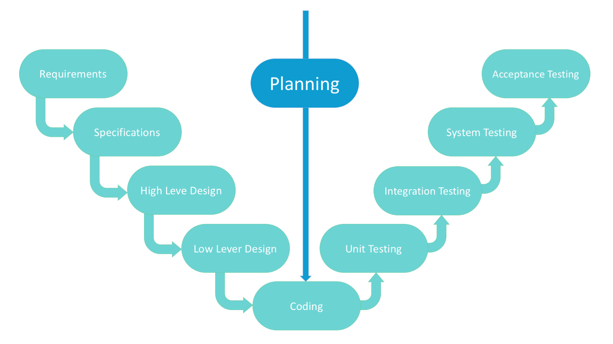

## V SDLC Model
The V-Model is an extension of the waterfall model and is based on the association of a testing phase for each corresponding development stage.

This is a very strict model and the next stage is started only after the previous phase. This is also called “Validation and Verification” model.

#### Verification Phases:
* Business Requirement Analysis

    This phase involves detailed communication with the customer to understand his expectations and exact requirement.

    The acceptance test design planning is done at this stage as business requirements can be used as an input for acceptance testing.

* System Design

    The system design will have the understanding and detailing the complete hardware and communication setup for the product under development. The system test plan is developed based on the system design.

* Architectural Design

    Architectural specifications are understood and designed in this phase. Usually more than one technical approach is proposed and based on the technical and financial feasibility the final decision is taken. The system design is broken down further into modules taking up different functionality. This is also referred to as __High Level Design__ (HLD).

* Module Design

    In this phase, the detailed internal design for all the system modules is specified, referred to as Low Level Design (LLD). These unit tests can be designed at this stage based on the internal module designs.

#### Coding Phase
The actual coding of the system modules designed in the design phase is taken up in the Coding phase. The best suitable programming language is decided based on the system and architectural requirements.

The coding is performed based on the coding guidelines and standards.

#### Validation Phases
* Unit Testing

    Unit tests designed in the module design phase are executed on the code during this validation phase.

* Integration Testing

    Integration testing is associated with the architectural design phase. Integration tests are performed to test the coexistence and communication of the internal modules within the system.

* System Testing

    System testing is directly associated with the system design phase. System tests check the entire system functionality and the communication of the system under development with external systems.

* Acceptance Testing

    Acceptance testing is associated with the business requirement analysis phase and involves testing the product in user environment.

    Acceptance tests uncover the compatibility issues with the other systems available in the user environment. It also discovers the non-functional issues such as load and performance defects in the actual user environment.

#### Application:
* Requirements are well defined, clearly documented and fixed.
* Technology is not dynamic and is well understood by the project team.
* For the projects where an accurate product testing is required

#### Advantages:
* This is a highly-disciplined model and Phases are completed one at a time.
* Every stage of the model has strict results so it is easy to control
* Testing and verification take place in the early stages.
* Good for the small projects, where requirements are static and clear.

#### Disadvantages:
* Lack of flexibility.
* Bad choice for small projects.
* Relatively big risk.
