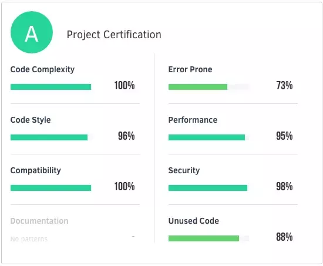

## Code Quality
Code quality is a group of different attributes and requirements, determined and prioritized by your business. Here are the main attributes that can be used to determine it:
* __Clarity__: Easy to read and oversee for anyone who isn’t the creator of the code. If it’s easy to understand, it’s much easier to maintain and extend the code. Not just computers, but also humans need to understand it.
* __Maintainable__: A high-quality code isn’t overcomplicated. Anyone working with the code has to understand the whole context of the code if they want to make any changes.
* __Documented__: The best thing is when the code is self-explaining, but it’s always recommended to add comments to the code to explain its role and functions. It makes it much easier for anyone who didn’t take part in writing the code to understand and maintain it.
* __Refactored__: Code formatting needs to be consistent and follow the language’s coding conventions. Some [code refactoring tips here](https://apiumhub.com/tech-blog-barcelona/code-refactoring-techniques/).
* __Well-tested__: The less bugs the code has the higher its quality. Thorough testing filters out critical bugs ensuring that the software works the way it’s intended.
* __Extendible__: The code you receive has to be extendible. It’s not really great when you have to throw it away after a few weeks.
* __Efficiency__: High-quality code doesn’t use unnecessary resources to perform a desired action.

### Why care about it?
* __Readability__: Make the code more readable and easier to comprehend for everyone working on the project. It’s much harder to read and understand a bad quality code than to write it.
* __Maintainability__: It’s easier, safer and less time consuming to maintain and test quality code.
* __Lower technical debt__: Good quality code can speed up long-term software development since it can be reused and developers don’t have to spend that much time fixing old bugs and polishing code. It also makes it easier for new project members to join the project.

### How improve
* Style guide. For code style consistency.
* Linter. Provide hints/advices how to iprove code quality.
* Refactor legacy code.
* Follow best practices.
* Code review.
* Functional tests. It shows if your code actually works or not.
* Static code analysis tools

#### Use CI
Here is the process:
* Continuous integration platform will run the linters on the code. If it fails, the process will stop here and the developer have to fix the style-related issues.
* It will run the functional test and move to the next step if the code runs according to plan.
* Then it starts calculating test coverage. If it doesn’t meet the predefined threshold, it will fail.

### Clean code principles:
* If it isn’t tested, it’s broken
* Choose meaningful names. This is what makes code self-documenting.
* Classes and functions should be small and obey the Single Responsibility Principle (SRP)
* Catch and handle exceptions, even if you don’t think you need to. Better to be safe than sorry.
* Logs, logs, logs

### How to measure
Use _Static Code Analysis Tools — Sonar_. Below there’s a small list of some of the cool things a tool of this sort can offer. It also provides the code quality metrics, which are:
* #### Reliability

    The analyzer detects possible failure points and points them out to us. These types of issues are important and should be resolved first since they expose points of failure. That means that our code is not simply low quality, but potentially broken.

* #### Maintainability (code smells)

    Code smells are maintainability related issues that may cause problems in the future and contribute to the technical debt of our codebase. Technical debt is measured by the amount of estimated time it will take to fix all code smells and contributes to the maintainability rating of the project.

    Lastly, the maintainability rating is a measure of the proportion of technical debt and total project time.

    Most common code smells:
    * __Duplicated code__: don’t repeat yourself!
    * __Long methods__: although they are not always wrong, shorter methods still are easier to read and to understand.
    * __Large class/lazy class/’overloaded’ class__: a class could be too long, or do too little, or have too many responsibilities. Beware your class!
    * __Data classes__: classes with all data and no behaviour can smell.
    * __Long parameter list__: limit the number of parameters or use an object to combine them.
    * __Comments__: ask yourself — are the comments necessary? Can you refactor the code so that comments are not required?
    * __Dead code__: delete code that isn’t being used.
    * __Inconsistent names__: pick a set of standard terminology and stick to it throughout your methods.
    * __Uncommunicative name__: does the name of the method describe what the method does? If not, change the name of your method.

* #### Complexity (of functions)

* #### Security

* #### Coverage

* #### Test Coverage

    The best way to measure test effectiveness is to track test coverage. It shows what portion (%) of the code is covered by the testing algorithm. To get a better understanding, it’s worth breaking down test coverage:
    * __Statement coverage__ (%): number of statements executed during a test divided by all statements
    * __Branch coverage__ (%): number of executed conditions divided by all conditions
    * __Function coverage__ (%): number of executed functions divided by all functions
    * __Lines coverage__ (%): number of lines ran during a test divided by all lines

    [Istanbul](https://istanbul.js.org/) is a cool tool for measuring test coverage for JavaScript codebase.

    Even if coverage wouldn’t be flawed, it still would be a mistake to try and get 100% coverage. While everything can be tested, not everything is easy to test!

    Think about UI animations, communication between Threads, operations on filesystem,…

    

    Trying to test complex things doesn’t just take way to much effort. The resulting tests usually also tend to be so complex that they will end up being a maintenance burden.

    _[Read More](https://ordepdev.me/posts/code-coverage)_

