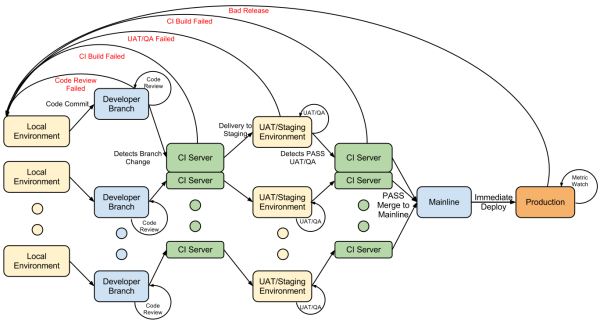

# DevOps
## Continuous Integration
__Continuous Integration__ - developement process where developers continually commit their changes to shared repo. The code repo is automatically built and tested before it is merged. 

The idea here is to test your code as often as possible so you can catch issues early on.

CI tools: `Jenkins`, `Travis CI`, `Circle CI` ...

Use Circle CI as a CI tool if pusing to GitHub as Circle CI is already integrated into GirHub.

Continuous Integration encourages the team members to integrate the work frequently and automate the task of building the code, static analysis of code, running unit tests, functional test cases…etc.

## Continuous Delivery
__Continuous delivery__ is the continual delivery of code to an environment once the developer feels the code is ready to ship - this could be user acceptance testing (UAT), staging or production.

The idea behind continuous delivery is that you’re constantly delivering code to a user base, whether it be QA or directly to customers for continual review and inspection.

Although similar to continuous integration, continuous delivery differs because it can feed business logic tests where unit tests are unable to catch all business logic, particularly design issues.

In CI/CD you setup a pipeline. Pipeline is nothing but a set of tasks to be run from the moment you pushed your code to the main branch till the final build is deployed on the server which makes the product live. Early feedback is the key in CI/CD.

## Continuous Deployment
__Continuous deployment__ is the deployment or release of code to production as soon as it’s ready.

Any testing is done prior to merging to the Mainline branch and is performed on production-like environments.

The production branch is always stable and ready to be deployed by an automated process.

The key feature of the continuous deployment process is that it requires continuous integration and continuous delivery

## How They Work Together
In the ideal workflow, the entire process could be automated from start to finish:
1.  Developer checks in code to development branch.
2. Continuous integration server picks up the change, merges it with Master/Trunk/Mainline, performs unit tests and votes on the merge to staging environment based on test results.
3. If Step 2 is successful, developer deploys it to the staging environment and QA tests the environment.
4. If Step 3 passed, you vote to move to production and the continuous integration server picks this up again and determines if it’s ok to merge into production.
5. If Step 4 is successful, it will deploy to production environment.  

___

#### [Read More](https://blog.assembla.com/AssemblaBlog/tabid/12618/bid/92411/Continuous-Delivery-vs-Continuous-Deployment-vs-Continuous-Integration-Wait-huh.aspx)
