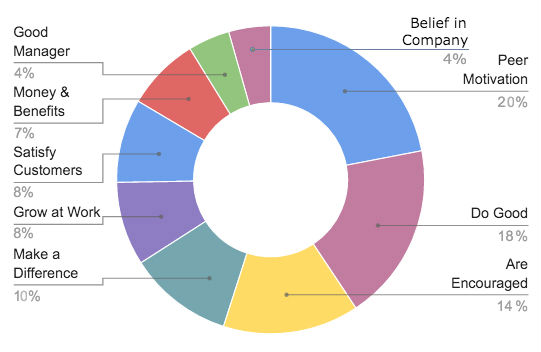

## Management
__Management__ is the use of key skills and practices designed to help the organization reach its highest potential.

Management skils:
* Managing performance
* Managing people
* Managing the business

### Manager vs Leader
Leaders promote change and grwth.

Managers promote order and consistency.

Approches:
* Managing is tactical and hands-on.
* Leading is strategc and visionary.

Time Frame:
* Managing occurs here and now. Looks for _short time_ and _midrange_ goals.
* Leading focuses on the future.

Scope:
* For managers scope is narrow and internal.
* For leaders scope is broader and external.

Resurces and Strucures:
* Managing relies on current and existing resources and structurres.
* Leading relies on new and innovation resources and structurres.

Task goals:
* For managing - Diecting daily works of exployees to achieve identified gols.
* For Leading - Setting a long-term visoin and stategy to bring change.

People skills:
* Managing: 1:1 meetings, Delegating tasks, Coaching employees.
* Leadng: Building culture, Inspired vision, Fostering collaboration, Cultivating future leaders.

## People Management
__People Management__, also known as human resource management (HRM), encompasses the tasks of recruitment, management, and providing ongoing support and direction for the employees of an organization. These tasks can include the following: compensation, hiring, performance management, organization development, safety, wellness, benefits, employee motivation, communication, administration, and training.

When managing the people within an organization, a manager must focus on both hiring the right people and then getting the most out of these people.

### Why employee is demotivated
* Unrealistic workload.
* Lack of flexibility.
* Low salary.
* Boredom (Uninterested tasks).
* Lack of recognition.
* Poor communication.

    In the absence of information, rumors thrive. Employees end up guessing, confused, and frustrated.

* Bad relationships.
* Status.
* Conflict.
* No development opportunitis.
* Poor leadership/management.

### How to motivate
* Make your business a pleasant place to be.
* Be a respectful, honest, and supportive manager.
* Offer employee rewards.
* Give them room to grow.
* Share positive feedback.
* Be transparent.
* Offer flexible scheduling (work from home).
* Offer food in the workplace.
* Recognize their achievements.
* Ask them what they want.
* Let Them Know You Trust Them.
* Set Smaller Weekly Goals.
* Give Your Employees Purpose.

[Read More](https://www.snacknation.com/blog/how-to-motivate-employees/)

