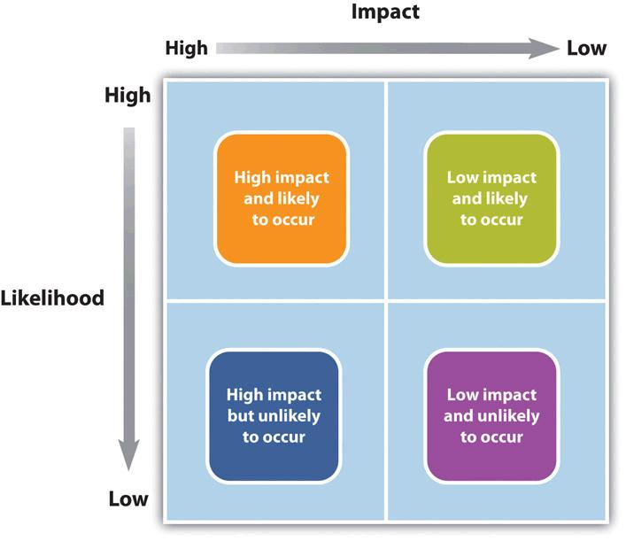

## Project Risk Management
Managing risks on projects is a process that includes risk assessment and a mitigation strategy for those risks.

__Risk assessment__ includes both the identification of potential risk and the evaluation of the potential impact of the risk.

__Risk mitigation plan__ is designed to eliminate or minimize the impact of the risk events—occurrences that have a negative impact on the project.

Identifying risk is both a creative and a disciplined process. The creative process includes brainstorming sessions where the team is asked to create a list of everything that could go wrong.

### Risk Identification
A more disciplined process involves using checklists of potential risks and evaluating the likelihood that those events might happen on the project.

Identifying the sources of risk by category is another method for exploring potential risk on a project. Some examples of categories for potential risks include the following:
* Technical
* Cost
* Schedule
* Client
* Contractual
* Weather
* Financial
* Political
* Environmental
* People

__Risk Breakdown Structure__ (__RBS__) organizes the risks that have been identified into categories using a table with increasing levels of detail to the right. The people category can be subdivided into different types of risks associated with the people. Examples of people risks include the risk of not finding people with the skills needed to execute the project or the sudden unavailability of key people on the project.

The result is a clearer understanding of where risks are most concentrated. This approach helps the project team identify known risks, but can be restrictive and less creative in identifying unknown risks and risks not easily found inside the WBS.

### Risk Evaluation
After the potential risks have been identified, the project team then evaluates each risk based on the probability that a risk event will occur and the potential loss associated with it.

Risk evaluation is about developing an understanding of which potential risks have the greatest possibility of occurring and can have the greatest negative impact on the project.

> There is a positive correlation—both increase or decrease together—between project risk and project complexity.

> A project with new and emerging technology will have a high-complexity rating and a correspondingly high risk.

Risk evaluation often occurs in a workshop setting. Building on the identification of the risks, each risk event is analyzed to determine the likelihood of occurrence and the potential cost if it did occur.

On projects with a low-complexity profile, the project manager may informally track items that may be considered risk items. On more complex projects, the project management team may develop a list of items perceived to be higher risk and track them during project reviews. On projects of even greater complexity, the process for evaluating risk is more formal with a risk assessment meeting or series of meetings during the life of the project to assess risks at different phases of the project. On highly complex projects, an outside expert may be included in the risk assessment process, and the risk assessment plan may take a more prominent place in the project implementation plan.

### Risk Mitigation
The project team mitigates risks in various ways:
* Risk avoidance

    Involves developing an alternative strategy that has a higher probability of success but usually at a higher cost associated with accomplishing a project task.
    
    A common risk avoidance technique is to use proven and existing technologies rather than adopt new techniques, even though the new techniques may show promise of better performance or lower costs.

* Risk sharing

    Involves partnering with others to share responsibility for the risky activities.

    Many organizations that work on international projects will reduce political, legal, labor, and others risk types associated with international projects by developing a joint venture with a company located in that country.

* Risk reduction

    Is an investment of funds to reduce the risk on a project. On international projects, companies will often purchase the guarantee of a currency rate to reduce the risk associated with fluctuations in the currency exchange rate.

    Some companies reduce risk by forbidding key executives or technology experts to ride on the same airplane.

* Risk transfer

    Is a risk reduction method that shifts the risk from the project to another party. The purchase of insurance on certain items is a risk-transfer method.

### Contingency Plan
The project team often develops an alternative method for accomplishing a project goal when a risk event has been identified that may frustrate the accomplishment of that goal. These plans are called contingency plans.

Some project managers allocate the contingency budget to the items in the budget that have high risk rather than developing one line item in the budget for contingencies.

### Common types of project management risks
* Estimating time and risks.

    One of the most important things about implementing a project is estimating it correctly. But since every website and mobile app is somewhat unique, it’s not always possible to come up with exact estimations right off the bat.

* Change of requirements.

    Today’s market is competitive as ever. Because of that, clients may sometimes change their vision of how their product or certain features in it should look like. Even though it’s hard to be prepared for change of requirements, it’s one of the things that you need to consider.

* Unforeseen circumstances.

    Just like any other people, project managers and developers are humans. For example, if some of them gets sick, it can delay the project for an indefinite period of time or even derail it.

* Unclear specifications.

    Because of incorrect project initiation, specifications may not always be clear or complete enough for developers to start their part of the work.

* Neglecting (пренебрегать) design.

    Trying save time, many developers sometimes tend to neglect design processes. However, that decision often throws them a wobbly, since design plays one of the most crucial aspects about development.

* Technical risks.

    Budget cut is among the most challenging risks as it forces you into a situation where you need to satisfy client’s requirements while being low on resources.

* Unavoidable risks.

    These are risks, which can’t be controlled or estimated: starting from technologies being discontinued to even changes in government policy.

A list of rules that should help you avoid them and manage projects efficiently:
* Identify risks.

    In the very beginning, thoroughly analyze the whole project and put down all potential problems that may occur in the future. Brainstorming with your team is also a good way to identify risks. Also, don’t forget to explain each team member their scope of work and responsibilities.

* Keep in touch with your client’s.

    In order to avoid any conflict situations or misunderstandings, make sure you always inform your clients about everything that can somehow affect the project, including potential risks. The last thing you want to happen is your client finding out that they are out of budget.

* Don’t miss good opportunities.

    Make sure you spend an equal amount of time on outlining both risks and opportunities to improve things. It’ll allow you to be more effective and help the client to save their time and/or money.

* Remember to prioritize risks.

    Each risk affects the project you’re working on differently. From this perspective, you should focus on the project managment risks that cause the biggest losses and deal with them first.

* Make a risk response plan.

    Arrange a meeting with your team and try to find answers to the following questions: What can be done to avoid risks? How can we manage them effectively? How to make sure we haven’t missed any opportunities? Answering these questions should allow you to improve the development processes.

* Keep track of every risk.

    This will allow both you and your team to avoid your mistakes in future projects.
