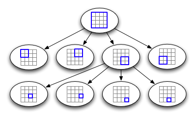
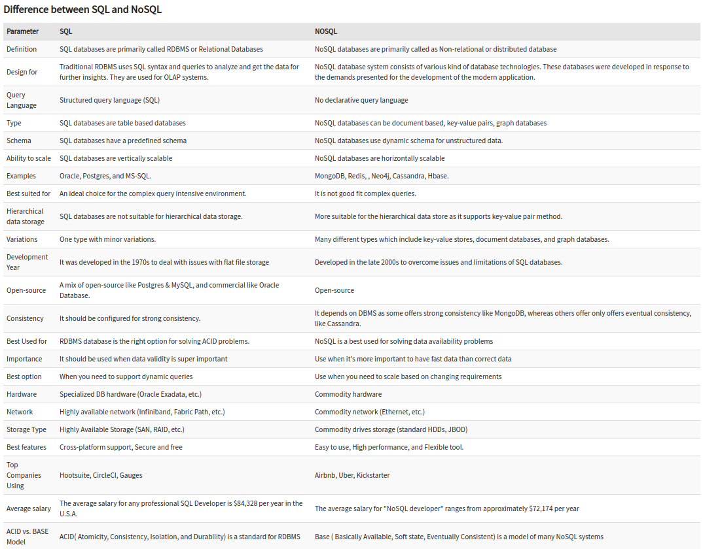

## No SQL
NoSQL is a non-relational DMS, that does not require a fixed schema, avoids joins, and is easy to scale.

NoSQL databases are query inefficient, because of their dynamic schema.

NoSQL is highly suitable for storing hierarchical data and solving data availability problems.

### Types
Following are the most common types of NoSQL:
* #### Document databases

    In these databases, data is stored in documents (instead of rows and columns in a table) and these documents are grouped together in collections. Each document can have an entirely different structure.

    A document database can store data in JSON, BSON , or XML documents (not Word documents or Google docs, of course).
    
    In a document database, documents can be nested. Particular elements can be indexed for faster querying.

    Document databases are popular with developers because they have the flexibility to rework their document structures as needed to suit their application, shaping their data structures as their application requirements change over time. This flexibility speeds development because in effect data becomes like code and is under the control of developers. In SQL databases, intervention by database administrators may be required to change the structure of a database.

    Use cases include ecommerce platforms, trading platforms, and mobile app development across industries.

    > Document databases include: CouchDB, MongoDB, DynamoDB.

* #### Key-value stores

    The simplest type of NoSQL database is a key-value store. Every data element in the database is stored as a key value pair consisting of an attribute name (or "key") and a value. In a sense, a key-value store is like a relational database with only two columns: the key or attribute name (such as state) and the value (such as Alaska).

    > Simplicity of this model makes this database fast, easy to use, portable, and flexible.

    Key-value databases offer fast in-memory access. So we can use it in a situation when our application needs to handle lots of small continuous reads and writes.

    Use cases include: In-memory data caching, session management, user preferences, user profiles, CDN.

    > Well-known key-value stores include: Aerospike, Redis, Apache Cassandra, Amazon DynamoDB, Berkeley DB, Memcached, Riak, Redis.

* #### Column databases

    A column-family database represents data in tables like a relational database but maintains column families in files rather than rows and does not enforce relational constraints.

    This model improves performance by minimizing the amount of data that has to be read for data with strong column-family access patterns. Columns can also be compressed to conserve space because they tend to store repetitive information, especially if the data is sparse.
    
    Use cases include analytics.

    While columnar databases are great for analytics, the way in which they write data (a row) makes it very difficult for them to be strongly consistent as writes of all the columns require multiple write events on disk. Relational databases don't suffer from this problem as row data is written contiguously to disk.

    > Columnar databases are best suited for analyzing large datasets - big names include Cassandra, HBase.

* #### Graph databases

    A graph database focuses on the relationship between data elements. Each element is stored as a node (such as a person in a social media graph). The connections between elements are called links or relationships. In a graph database, __connections are primary elements__ of the database, stored directly. Unlike relational databases, links are implied, using data to express the relationships.

    Graph databases take advantage of their underlying graph structure to perform complex queries on deeply connected data very fast.

    A graph database is optimized to capture and search the connections between data elements, overcoming the overhead associated with JOINing multiple tables in SQL.

    Very few real-world business systems can survive solely on graph queries. As a result graph databases are usually run alongside other more traditional databases.
    
    Graph databases are thus often preferred to relational databases when dealing with systems where data points naturally form a graph and have multiple levels of relationships—for example, social networks.

    Use cases include fraud detection, social networks, and knowledge graphs.

    __Cypther__ - is a graph query language that was originally developed for the Neo4j graph database, but that has since been standardized to be used with other graph databases in an effort to make it the "SQL for graphs."

    > Examples of graph database include: Neo4J, CosmosDB, InfiniteGraph.

* #### Spatial Database

    A type of database optimized for storing and querying spatial data like locations on a map. Spatial databases rely on spatial indexes like quadtrees to quickly perform spatial queries like finding all locations in the vicinity of a region.

    __Quadtree__ - is a tree data structure most commonly used to index two-dimensional spatial data. Each node in a quadtree has either zero children nodes (and is therefore a leaf node) or exactly four children nodes.

    Typically, quadtree nodes contain some form of spatial data—for example, locations on a map—with a maximum capacity of some specified number `n`. So long as nodes aren't at capacity, they remain leaf nodes; once they reach capacity, they're given four children nodes, and their data entries are split across the four children nodes.

    A quadtree lends itself well to storing spatial data because it can be represented as a grid filled with rectangles that are recursively subdivided into four sub-rectangles, where each quadtree node is represented by a rectangle and each rectangle represents a spatial region. Assuming we're storing locations in the world, we can imagine a quadtree with a maximum node-capacity n as follows:

    The root node, which represents the entire world, is the outermost rectangle.
    If the entire world has more than `n` locations, the outermost rectangle is divided into four quadrants, each representing a region of the world.

    So long as a region has more than n locations, its corresponding rectangle is subdivided into four quadrants (the corresponding node in the quadtree is given four children nodes).

    Regions that have fewer than `n` locations are undivided rectangles (leaf nodes).

    The parts of the grid that have many subdivided rectangles represent densely populated areas (like cities), while the parts of the grid that have few subdivided rectangles represent sparsely populated areas (like rural areas).

    Finding a given location in a perfect quadtree is an extremely fast operation that runs in `log_4(x)` time (where `x` is the total number of locations), since quadtree nodes have four children nodes.

    

    Why do we need quadtrees? While in theory using latitude and longitude we can determine things such as how close points are to each other using euclidean distance, for practical use cases it is simply not scalable because of its CPU-intensive nature with large data sets.

    Quadtrees enable us to search points within a two-dimensional range efficiently, where those points are defined as latitude/longitude coordinates or as cartesian (x, y) coordinates. Additionally, we can save further computation by only subdividing a node after a certain threshold. And with the application of mapping algorithms such as the Hilbert curve, we can easily improve range query performance.

    Use cases:
    * Image representation, processing, and compression.
    * Spacial indexing and range queries.
    * Location-based services like Google Maps, Uber, etc.
    * Mesh generation and computer graphics.
    * Sparse data storage.

* #### Time Series Database

    A time-series database is optimized for data entries that need to be strictly organized by time. The key use case is storing real-time data streams from system monitors. Because time series databases need a lot of writing, they typically include services for sorting streams as they arrive to ensure that they are appended in the correct order. These datasets can readily be divided into periods.
    
    > InfluxDB, Prometheus, Graphite are the industry’s top time-series databases.

### When to use
* When ACID support is not needed
* When Traditional RDBMS model is not enough
* Data which need a flexible schema
* Constraints and validations logic not required to be implemented in database
* Logging data from distributed sources
* It should be used to store temporary data like shopping carts, wish list and session data

### Pros
* Flexible data models

    NoSQL databases typically have very flexible schemas. A flexible schema allows you to easily make changes to your database as requirements change. You can iterate quickly and continuously integrate new application features to provide value to your users faster.

* Horizontal scaling

    Most SQL databases require you to scale-up vertically (migrate to a larger, more expensive server) when you exceed the capacity requirements of your current server. Conversely, most NoSQL databases allow you to scale-out horizontally, meaning you can add cheaper, commodity servers whenever you need to.

* Fast queries

    Queries in NoSQL databases can be faster than SQL databases. Why? Data in SQL databases is typically normalized, so queries for a single object or entity require you to join data from multiple tables. As your tables grow in size, the joins can become expensive. However, data in NoSQL databases is typically stored in a way that is optimized for queries. The rule of thumb when you use MongoDB is Data is that is accessed together should be stored together. Queries typically do not require joins, so the queries are very fast.

* Easy for developers

    Some NoSQL databases like MongoDB map their data structures to those of popular programming languages. This mapping allows developers to store their data in the same way that they use it in their application code. While it may seem like a trivial advantage, this mapping can allow developers to write less code, leading to faster development time and fewer bugs.

### Cons
One of the most frequently cited drawbacks of NoSQL databases is that they don’t support ACID (atomicity, consistency, isolation, durability) transactions across multiple documents. With appropriate schema design, single record atomicity is acceptable for lots of applications. However, there are still many applications that require ACID across multiple records.

To address these use cases MongoDB added support for multi-document ACID transactions in the 4.0 release, and extended them in 4.2 to span sharded clusters.

## SQL vs NoSQL
### SQL databases
SQL databases use structured query language (SQL) for defining and manipulating data. On one hand, this is extremely powerful: SQL is one of the most versatile and widely-used options available, making it a safe choice and especially great for complex queries. On the other hand, it can be restrictive. SQL requires that you use predefined schemas to determine the structure of your data before you work with it. In addition, all of your data must follow the same structure.

### NoSQL databases
NoSQL databases, on the other hand, have dynamic schemas for unstructured data, and data is stored in many ways: They can be column-oriented, document-oriented, graph-based or organized as a KeyValue store. This flexibility means that:
* You can create documents without having to first define their structure
* Each document can have its own unique structure
* The syntax can vary from database to database, and
* You can add fields as you go.

### Difference
* SQL is primarily called Relational Databases whereas NoSQL is a Non-relational or Distributed Database.
* SQL databases are table based databases whereas NoSQL databases can be document based, key-value pairs, graph databases.
* SQL databases are vertically scalable while NoSQL databases are horizontally scalable.

    In most situations, SQL databases are vertically scalable, which means that you can increase the load on a single server by increasing things like CPU, RAM or SSD. NoSQL databases, on the other hand, are horizontally scalable. This means that you handle more traffic by sharding, or adding more servers in your NoSQL database. It’s like adding more floors to the same building versus adding more buildings to the neighborhood. The latter can ultimately become larger and more powerful, making NoSQL databases the preferred choice for large or ever-changing data sets.

* SQL databases have a predefined schema whereas NoSQL databases use dynamic schema for unstructured data.
* SQL requires specialized DB hardware for better performance while NoSQL uses commodity hardware.

