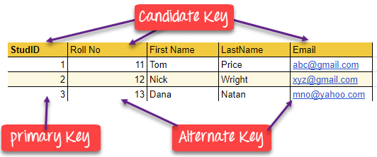

# Relational Database
A relational database is a digital database based on the relational model of data. A software system used to maintain relational databases is a relational database management system (__RDBMS__). Many relational database systems have an option of using the __SQL__ (Structured Query Language) for querying and maintaining the database.

__RELATIONAL MODEL (RM)__ represents the database as a collection of relations. A relation is nothing but a table of values. Every row in the table represents a collection of related data values. These rows in the table denote a real-world entity or relationship.

Relational Model Concepts
* __Attribute__: Each column in a Table. Attributes are the properties which define a relation. e.g., Student_Rollno, NAME,etc.
* __Tables__ – In the Relational model the, relations are saved in the table format. It is stored along with its entities. A table has two properties rows and columns. Rows represent records and columns represent attributes.
* __Tuple__ – It is nothing but a single row of a table, which contains a single record.
* __Relation Schema__: A relation schema represents the name of the relation with its attributes.
* __Degree__: The total number of attributes which in the relation is called the degree of the relation.
* __Cardinality__: Total number of rows present in the Table.
* __Column__: The column represents the set of values for a specific attribute.
* __Relation instance__ – Relation instance is a finite set of tuples in the RDBMS system. Relation instances never have duplicate tuples.
* __Relation key__ - Every row has one, two or multiple attributes, which is called relation key.
* __Attribute domain__ – Every attribute has some pre-defined value and scope which is known as attribute domain.

## Database Base Management System (DBMS)
__Database Management System (DBMS)__ is a software system that enables users to define, create, maintain and control access to the database.

This model organizes data into one or more tables (or "relations") of columns and rows, with a unique key identifying each row. Rows are also called records or tuples. Columns are also called attributes. Generally, each table/relation represents one "entity type" (such as customer or product). The rows represent instances of that type of entity (such as "Lee" or "chair") and the columns representing values attributed to that instance (such as address or price).

Relationships are a logical connection between different tables, established on the basis of interaction among these tables.

## Keys
* __Super Key__ -  A super key is a group of single or multiple keys which identifies rows in a table.
* __Primary Key__ -  is a column or group of columns in a table that uniquely identify every row in that table. The value in a primary key column can never be modified or updated if any foreign key refers to that primary key.
* __Candidate Key__ -  is a set of attributes that uniquely identify tuples in a table. Candidate Key is a super key with no repeated attributes. Candidate Key is a super key with no repeated attributes. The Primary key should be selected from the candidate keys. Every table must have at least a single candidate key. A table can have multiple candidate keys but only a single primary key.
* __Alternate Key__ -  is a column or group of columns in a table that uniquely identify every row in that table. A table can have multiple choices for a primary key but only one can be set as the primary key. All the keys which are not primary key are called an Alternate Key.
* __Foreign Key__ -  is a column that creates a relationship between two tables. The purpose of Foreign keys is to maintain data integrity and allow navigation between two different instances of an entity. The purpose of Foreign keys is to maintain data integrity and allow navigation between two different instances of an entity. It acts as a cross-reference between two tables as it references the primary key of another table.
* __Compound Key__ -  has two or more attributes that allow you to uniquely recognize a specific record. It is possible that each column may not be unique by itself within the database. However, when combined with the other column or columns the combination of composite keys become unique. The purpose of the compound key in database is to uniquely identify each record in the table.
* __Composite Key__ -  An artificial key which aims to uniquely identify each record is called a surrogate key. These kind of key are unique because they are created when you don't have any natural primary key.
* __Surrogate Key__ -  An artificial key which aims to uniquely identify each record is called a surrogate key. These kind of key are unique because they are created when you don't have any natural primary key. They do not lend any meaning to the data in the table. Surrogate key is usually an integer. A surrogate key is a value generated right before the record is inserted into a table.

> The difference between compound and the composite key is that any part of the compound key can be a foreign key, but the composite key may or maybe not a part of the foreign key.

> Primary Key never accept null values while a foreign key may accept multiple null values.

### Tuple
A __tuple__ is a finite ordered list (sequence) of elements. An __n-tuple__ is a sequence (or ordered list) of n elements, where n is a non-negative integer.

Thus a tuple has properties that distinguish it from a set.
1. A tuple may contain multiple instances of the same element, so
tuple `(1, 2, 2, 3) ≠ (1, 2, 3)`; but set `{1, 2, 2, 3} = {1, 2, 3}`.
2. Tuple elements are ordered: tuple `(1, 2, 3) ≠ (3, 2, 1)`, but set `{1, 2, 3} = {3, 2, 1}`.
3. A tuple has a finite number of elements, while a set or a multiset may have an infinite number of elements.

### Stored Procedures
Most of the programming within a RDBMS is accomplished using stored procedures (SP). A stored procedure is executable code that is associated with, and generally stored in, the database. Stored procedures usually collect and customize common operations, like inserting a [tuple](https://en.wikipedia.org/wiki/Tuple) into a relation, gathering statistical information about usage patterns, or encapsulating complex business logic and calculations. Frequently they are used as an application programming interface (API) for security or simplicity.

### Index
Indexing is an excellent way to improve database performance. An index is nothing more than a reference to data in a table. For example, we can think of a database index the same way we think of a book index. The aim of creating an index is to perform read and search queries faster. 

Indexing is a data structure technique which allows you to quickly retrieve records from a database file. An Index is a small table having only two columns. The first column comprises a copy of the primary or candidate key of a table. Its second column contains a set of pointers for holding the address of the disk block where that specific key value stored.

Relational databases typically supply multiple indexing techniques, each of which is optimal for some combination of data distribution, relation size, and typical access pattern. Indices are usually implemented via [B+ trees](https://en.wikipedia.org/wiki/B%2B_tree), [R-trees](https://en.wikipedia.org/wiki/R-tree), and bitmaps.

#### Disadvantages of Indexing
* Indexing takes up more storage space since the indices are stored together in a table. If several fields within the same table are indexed, this file can easily exceed the size limits of the underlying file system.
* Indexing reduces the write speed of the database.
* A primary key on the table with a unique value is needed to perform the indexing database management scheme.

## ACID
In order for a database management system (DBMS) to operate efficiently and accurately, it must use ACID transactions.

__ACID__ (atomicity, consistency, isolation, durability) is a set of properties of database transactions intended to guarantee data validity despite errors, power failures, and other mishaps.

In the context of databases, a sequence of database operations that satisfies the ACID properties (which can be perceived as a single logical operation on the data) is called a transaction. For example, a transfer of funds from one bank account to another, even involving multiple changes such as debiting one account and crediting another, is a single transaction.

* #### Atomicity

    Transactions are often composed of multiple statements. Atomicity guarantees that each transaction is treated as a single "unit", which either succeeds completely, or fails completely: if any of the statements constituting a transaction fails to complete, the entire transaction fails and the database is left unchanged. An atomic system must guarantee atomicity in each and every situation, including power failures, errors and crashes. A guarantee of atomicity prevents updates to the database occurring only partially, which can cause greater problems than rejecting the whole series outright. As a consequence, the transaction cannot be observed to be in progress by another database client. At one moment in time, it has not yet happened, and at the next it has already occurred in whole (or nothing happened if the transaction was cancelled in progress).

* #### Consistency

    Consistency ensures that a transaction can only bring the database from one valid state to another, maintaining database invariants: any data written to the database must be valid according to all defined rules, including constraints, cascades, triggers, and any combination thereof. This prevents database corruption by an illegal transaction, but does not guarantee that a transaction is correct.

* #### Isolation

    Transactions are often executed concurrently (e.g., multiple transactions reading and writing to a table at the same time). Isolation ensures that concurrent execution of transactions leaves the database in the same state that would have been obtained if the transactions were executed sequentially. Isolation is the main goal of concurrency control; depending on the method used, the effects of an incomplete transaction might not even be visible to other transactions.

* #### Durability

    Durability guarantees that once a transaction has been committed, it will remain committed even in the case of a system failure (e.g., power outage or crash). This usually means that completed transactions (or their effects) are recorded in non-volatile memory (SSD or HDD).

## DBMS Concurrency Control
Concurrency control is the procedure in DBMS for managing simultaneous operations without conflicting with each another.

Many databases rely upon __locking__ to provide ACID capabilities. Locking means that the transaction marks the data that it accesses so that the DBMS knows not to allow other transactions to modify it until the first transaction succeeds or fails. The lock must always be acquired before processing data, including data that is read but not modified. Non-trivial transactions typically require a large number of locks, resulting in substantial overhead as well as blocking other transactions. For example, if user A is running a transaction that has to read a row of data that user B wants to modify, user B must wait until user A's transaction completes.

### Potential problems of Concurrency
* Lost Updates occur when multiple transactions select the same row and update the row based on the value selected
* Uncommitted dependency issues occur when the second transaction selects a row which is updated by another transaction (dirty read)
* Non-Repeatable Read occurs when a second transaction is trying to access the same row several times and reads different data each time.
* Incorrect Summary issue occurs when one transaction takes summary over the value of all the instances of a repeated data-item, and second transaction update few instances of that specific data-item. In that situation, the resulting summary does not reflect a correct result.

### Concurrency Control Protocols
Different concurrency control protocols offer different benefits between the amount of concurrency they allow and the amount of overhead that they impose.
* #### Lock-Based Protocols

    A lock is a data variable which is associated with a data item. This lock signifies that operations that can be performed on the data item. Locks help synchronize access to the database items by concurrent transactions.

    All lock requests are made to the concurrency-control manager. Transactions proceed only once the lock request is granted.

    __Starvation__ is the situation when a transaction needs to wait for an indefinite period to acquire a lock.

    Following are the reasons for Starvation:
    * When waiting scheme for locked items is not properly managed
    * In the case of resource leak
    * The same transaction is selected as a victim repeatedly

    __Deadlock__ refers to a specific situation where two or more processes are waiting for each other to release a resource or more than two processes are waiting for the resource in a circular chain.

* #### Two Phase Locking (2PL) Protocol

    This locking protocol divides the execution phase of a transaction into three different parts.
    * In the first phase, when the transaction begins to execute, it requires permission for the locks it needs.
    * The second part is where the transaction obtains all the locks. When a transaction releases its first lock, the third phase starts.
    * In this third phase, the transaction cannot demand any new locks. Instead, it only releases the acquired locks.

* #### Timestamp-Based Protocols

    The timestamp-based algorithm uses a timestamp to serialize the execution of concurrent transactions. This protocol ensures that every conflicting read and write operations are executed in timestamp order. The protocol uses the System Time or Logical Count as a Timestamp.

* #### Validation-Based Protocols

An ideal concurrency control DBMS mechanism has the following objectives:
* Must be resilient to site and communication failures.
* It allows the parallel execution of transactions to achieve maximum concurrency.
* Its storage mechanisms and computational methods should be modest to minimize overhead.
* It must enforce some constraints on the structure of atomic actions of transactions.

## Dependencies
* __Functional dependency__ - when _non-prime attribute_ depends on _prime attribute_.
* __Partial dependency__ - when _non-prime attribute_ depends on a _part of primary key_. (2NF)
* __Transitive dependency__ - when _non-prime attribute_ depends on a _non prime attribute_. (3NF)
* A table is said to have __multi-valued dependency__, if the following conditions are true,

    * For a dependency `A → B`, if for a single value of `A`, multiple values of `B` exists, then the table may have multi-valued dependency.
    * Also, a table should have at-least 3 columns for it to have a multi-valued dependency.
    * And, for a relation `R(A,B,C)`, if there is a multi-valued dependency between, `A` and `B`, then `B` and `C` should be independent of each other.

On the question about what happens when prime attribute depends on a non-prime attribute, answers BCNF.

Fourth Normal Form comes into picture when Multi-valued Dependency occur in any relation.

## Normalization
__Normalization__ is the process of structuring a relational database in accordance with a series of so-called normal forms in order to reduce data redundancy and improve data integrity.

There are three main reasons to normalize a database.
1. Minimize duplicate data.
2. Minimize or avoid data modification issues.
3. Simplify queries.

The drawbacks of data redundancy include:
* Data maintenance becomes tedious – data deletion and data updates become problematic
* It creates data inconsistencies
* Insert, Update and Delete anomalies become frequent. An update anomaly, for example, means that the versions of the same record, duplicated in different places in the database, will all need to be updated to keep the record consistent
* Redundant data inflates the size of a database and takes up an inordinate amount of space on disk

### Normal Forms
1. __1NF__ (First Normal Form) Rules
    * Each table cell should contain a single value.

        No first name and last name in the same cell.

    * Each record needs to be unique.
2. __2NF__ (Second Normal Form) Rules
    * Be in 1NF.
    * No __Partial Dependency__.

        Partial Dependency is where an attribute in a table depends on only a part of the primary key and not on the whole key. Meaning to uniquely identify a row, we need two or more columns.

        To remove Partial dependency, we can divide the table, remove the attribute which is causing partial dependency, and move it to some other table where it fits in well.

3. __3NF__ (Third Normal Form) Rules
    * Be in 2NF.
    * Has no __Transitive functional dependencies__.

        A __transitive functional dependency__ is when changing a non-key column, might cause any of the other non-key columns to change.

        Solution is a division of the table.

    3.5. __Boyce Codd Normal Form (BCNF)__
        * Be in 3NF
        * For a dependency `A → B` (`B` depends on `A`). If `B` is a prime attribute, `A` cannot be a non-prime attribute.

    [Example](https://www.studytonight.com/dbms/boyce-codd-normal-form.php)

4. __4NF__ (Fourth Normal Form) Rules
    * It should be in the Boyce-Codd Normal Form.
    * It should not have any __Multi-valued Dependency__.

    If no database table instance contains two or more, independent and multi-valued data describing the relevant entity, then it is in 4th Normal Form.

    [Example](https://www.studytonight.com/dbms/fourth-normal-form.php)

5. __5NF__ (Fifth Normal Form) Rules
   * It should be in the 4NF Form.
   * It should not have __Join Dependency__.

    A table is in 5th Normal Form only if it is in 4NF and it cannot be decomposed into any number of smaller tables without loss of data.

### Example
| EmployeeID | SalesPerson | SalesOffice | Office number | Customer1 | Customer2 | Customer3 |
| - | - | - | - | - | - | - |
| 1003 | Mary Smith | Chicago | 123456 | Ford | GM | |
| 1004 | John Hunt | New York | 789123 | Dell | HP | Google |
| 1005 | MArtin Hap | Chicago | 456789 | Boeing | | |

#### Advantages
* Reduces data redundancy.
* Better data design.
* Increases data consistency.
* Enforces referential integrity.

#### Disadvantages
* Data design is complex.
* Slower performance.
* Maintenance overhead.
* Require more joins.

Problems:
* Data Duplication and Modification Anomalies

    Notice that for each `SalesPerson` we have listed both the `SalesOffice` and `OfficeNumber`. There are duplicate salesperson data. Duplicated information presents two problems:
    1. It increases storage and decrease performance.
    2. It becomes more difficult to maintain data changes.

    For example:
    Consider if we move the Chicago office to Evanston, IL. To properly reflect this in our table, we need to update the entries for all the SalesPersons currently in Chicago.

* Insert Anomaly

    There are facts we cannot record until we know information for the entire row.  In our example we cannot record a new sales office until we also know the sales person.  Why?  Because in order to create the record, we need provide a primary key.  In our case this is the `EmployeeID`.

* Update Anomaly

    In this case we have the same information in several rows. For instance if the office number changes, then there are multiple updates that need to be made.  If we don’t update all rows, then inconsistencies appear.

* Deletion Anomaly

    Deletion of a row causes removal of more than one set of facts.  For instance, if John Hunt retires, then deleting that row cause us to lose information about the New York office.

* Search and Sort Issues

    If you want to search for a specific customer such as Ford, you would have to write a big and complex query.

    Our current table makes this tough. You would have to use three separate UNION queries! You can eliminate or reduce these anomalies by separating the data into different tables. This puts the data into tables serving a single purpose.

## Denormalization
Denormalization is a database optimization technique in which we add redundant data to one or more tables. This can help us avoid costly joins in a relational database. It attempts to improve read performance at the expense of some write performance. Redundant copies of the data are written in multiple tables to avoid expensive joins.

Once data becomes distributed with techniques such as federation and sharding, managing joins across the network further increases complexity. Denormalization might circumvent the need for such complex joins.

> Note: Denormalization does not mean reversing normalization.

#### Advantages
* Retrieving data is faster.
* Writing queries is easier.
* Reduction in number of tables.
* Convenient to manage.

#### Disadvantages
* Expensive inserts and updates.
* Increases complexity of database design.
* Increases data redundancy.
* More chances of data inconsistency.

---

#### [Big DBMS Tutorial](https://www.guru99.com/dbms-tutorial.html)
