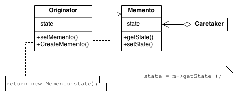

## Memento Design Pattern
The Memento captures and externalizes an object's internal state so that the object can later be restored to that state.

### Problem
Need to restore an object back to its previous state (e.g. "undo" or "rollback" operations).

### Structure
The Memento design pattern defines three distinct roles:
* _Originator_ - the object that knows how to save itself.
* _Caretaker_ - the object that knows why and when the Originator needs to save and restore itself.
* _Memento_ - the lock box that is written and read by the Originator, and shepherded by the Caretaker.

### Example
This pattern is common among do-it-yourself mechanics repairing drum brakes on their cars. The drums are removed from both sides, exposing both the right and left brakes. Only one side is disassembled and the other serves as a Memento of how the brake parts fit together. Only after the job has been completed on one side is the other side disassembled. When the second side is disassembled, the first side acts as the Memento.

### Check list
* Identify the roles of “caretaker” and “originator”.
* Create a Memento class and declare the originator a friend.
* Caretaker knows when to "check point" the originator.
* Originator creates a Memento and copies its state to that Memento.
* Caretaker holds on to (but cannot peek into) the Memento.
* Caretaker knows when to "roll back" the originator.
* Originator reinstates itself using the saved state in the Memento.

### Rules of thumb
* Command and Memento act as magic tokens to be passed around and invoked at a later time. In Command, the token represents a request; in Memento, it represents the internal state of an object at a particular time. Polymorphism is important to Command, but not to Memento because its interface is so narrow that a memento can only be passed as a value.
* Command can use Memento to maintain the state required for an undo operation.
* Memento is often used in conjunction with Iterator. An Iterator can use a Memento to capture the state of an iteration. The Iterator stores the Memento internally.
