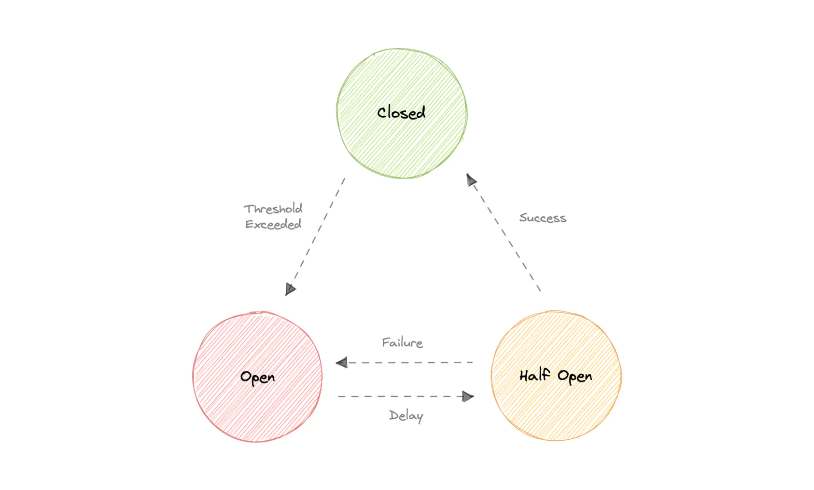

## Circuit Breaker
The circuit breaker is a design pattern that prevents an application from performing an operation that is likely to fail. It is used to stop the request and response process if a service is not working

States:
* #### Closed
    
    When everything is normal, the circuit breakers remain closed, and all the request passes through to the services as normal. If the number of failures increases beyond the threshold, the circuit breaker trips and goes into an open state.

* #### Open

    In this state circuit breaker returns an error immediately without even invoking the services. The Circuit breakers move into the half-open state after a certain timeout period elapses. Usually, it will have a monitoring system where the timeout will be specified.

* #### Half-open

    In this state, the circuit breaker allows a limited number of requests from the service to pass through and invoke the operation. If the requests are successful, then the circuit breaker will go to the closed state. However, if the requests continue to fail, then it goes back to the open state.

It's common for software systems to make remote calls to software running in different processes, probably on different machines across a network. One of the big differences between in-memory calls and remote calls is that remote calls can fail, or hang without a response until some timeout limit is reached. What's worse is if we have many callers on an unresponsive supplier, then we can run out of critical resources leading to cascading failures across multiple systems.

Let's say a service is taking more time to process requests. It means after some, when a server can't process new requests, the new requests will be queued. The whole system could failed due to the huge queue created behind the service. Because even if the service recovers back, the request queues will consume the service and eventually the service will fail.

From the user’s perspective, having to wait a long time for a response is not a good user experience. Rather than keeping the consumer waiting for a longer duration, it is better to respond quickly. It doesn’t matter if it’s a success or a failure; what counts is that the user isn’t kept waiting.
