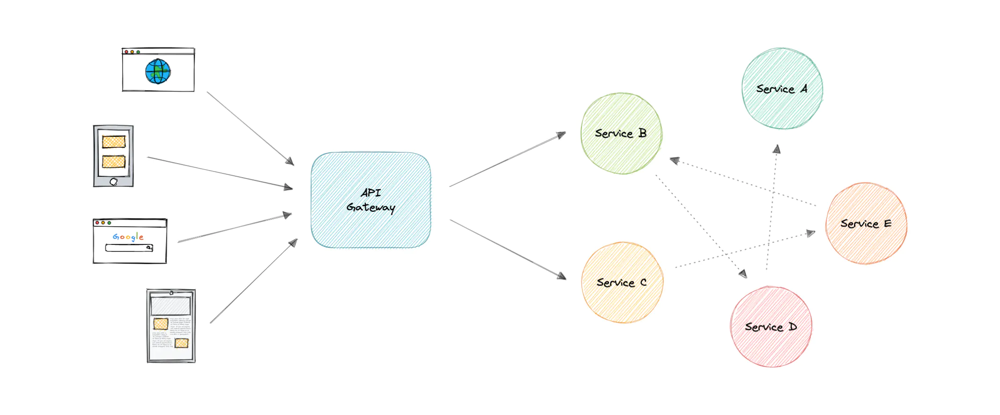
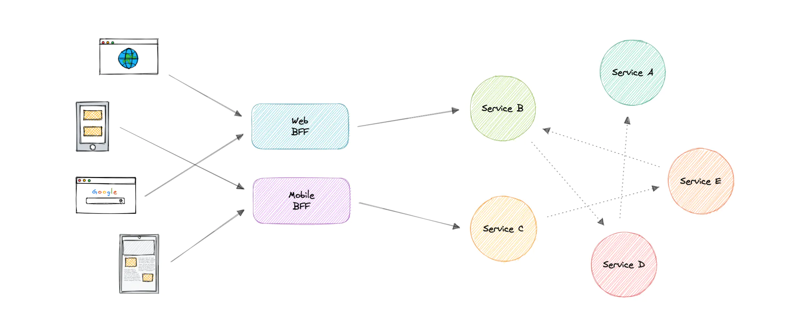

## API Gateway
__API__ stands for Application Programming Interface. It is a set of definitions and protocols for building and integrating application software.

The __API Gateway__ is an API management tool that sits between a client and a collection of backend services. It is a single entry point into a system that encapsulates the internal system architecture and provides an API that is tailored to each client. It also has other responsibilities such as authentication, monitoring, load balancing, caching, throttling, logging, etc.

The granularity of APIs provided by microservices is often different than what a client needs. Microservices typically provide fine-grained APIs, which means that clients need to interact with multiple services. Hence, an API gateway can provide a single entry point for all clients with some additional features and better management.

### Features
* Authentication and Authorization
* Service discovery
* Reverse Proxy
* Caching
* Firewall
* Retry and Circuit breaking
* Load balancing
* Logging, Tracing
* API composition
* Rate limiting and throttling
* Versioning
* Routing
* IP whitelisting or blacklisting

### Advantages
* Encapsulates the internal structure of an API.
* Provides a centralized view of the API.
* Simplifies the client code.
* Monitoring, analytics, tracing, and other such features.

### Disadvantages
* Possible single point of failure.
* Might impact performance.
* Can become a bottleneck if not scaled properly.
* Configuration can be challenging.

---

## Backend For Frontend (BFF) pattern
In the Backend For Frontend (BFF) pattern, we create separate backend services to be consumed by specific frontend applications or interfaces. This pattern is useful when we want to avoid customizing a single backend for multiple interfaces. This pattern was first described by Sam Newman.

Also, sometimes the output of data returned by the microservices to the front end is not in the exact format or filtered as needed by the front end. To solve this issue, the frontend should have some logic to reformat the data, and therefore, we can use BFF to shift some of this logic to the intermediate layer.

The primary function of the backend for the frontend pattern is to get the required data from the appropriate service, format the data, and sent it to the frontend.

`GraphQL` performs really well as a backend for frontend (BFF).
