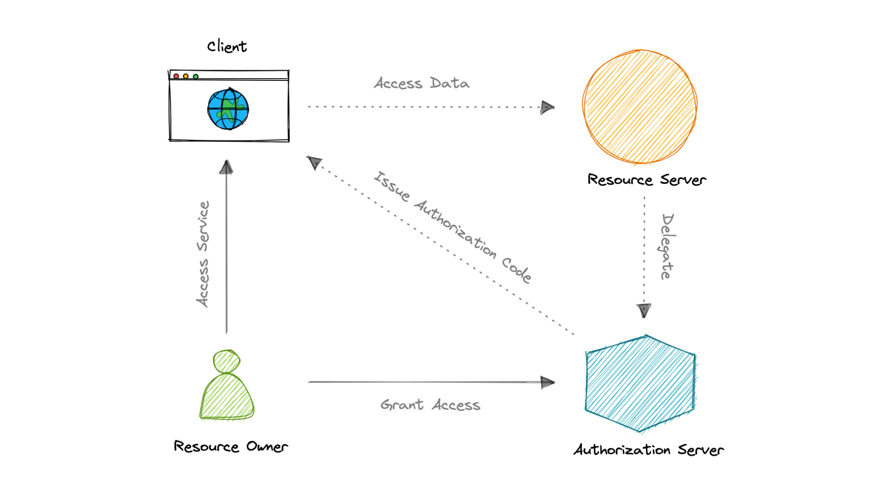
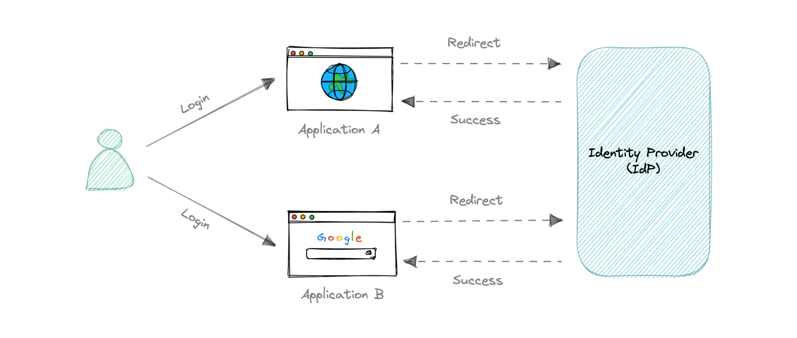

## Authorization

### OAuth 2.0
OAuth 2.0, which stands for __Open Authorization__, is a standard designed to provide consented access to resources on behalf of the user, without ever sharing the user's credentials. OAuth 2.0 is an authorization protocol and not an authentication protocol, it is designed primarily as a means of granting access to a set of resources, for example, remote APIs or user's data.

#### Concepts:
* __Resource Owner:__ The user or system that owns the protected resources and can grant access to them.
* __Client:__ The client is the system that requires access to the protected resources.
* __Authorization Server:__ This server receives requests from the Client for Access Tokens and issues them upon successful authentication and consent by the Resource Owner.
* __Resource Server:__ A server that protects the user's resources and receives access requests from the Client. It accepts and validates an Access Token from the Client and returns the appropriate resources.
* __Scopes:__ They are used to specify exactly the reason for which access to resources may be granted. Acceptable scope values, and which resources they relate to, are dependent on the Resource Server.
* __Access Token:__ A piece of data that represents the authorization to access resources on behalf of the end-user.

#### How does OAuth 2.0 work?
1. The client requests authorization from the Authorization Server, supplying the client id and secret as identification. It also provides the scopes and an endpoint URI to send the Access Token or the Authorization Code.
2. The Authorization Server authenticates the client and verifies that the requested scopes are permitted.
3. The resource owner interacts with the authorization server to grant access.
4. The Authorization Server redirects back to the client with either an Authorization Code or Access Token, depending on the grant type. A Refresh Token may also be returned.
5. With the Access Token, the client can request access to the resource from the Resource Server.

### OpenID Connect (OIDC)
OAuth 2.0 is designed only for authorization, for granting access to data and features from one application to another. OpenID Connect is a thin layer that sits on top of OAuth 2.0 that adds login and profile information about the person who is logged in.

When an Authorization Server supports OIDC, it is sometimes called an __identity provider (IdP)__, since it provides information about the Resource Owner back to the Client. OpenID Connect is relatively new, resulting in lower adoption and industry implementation of best practices compared to OAuth.

#### Concepts:
* __Relying Party:__ The current application.
* __OpenID Provider:__ This is essentially an intermediate service that provides a one-time code to the Relying Party.
* __Token Endpoint:__ A web server that accepts the One-Time Code (OTC) and provides an access code that's valid for an hour. The main difference between OIDC and OAuth 2.0 is that the token is provided using JSON Web Token (JWT).
* __UserInfo Endpoint:__ The Relying Party communicates with this endpoint, providing a secure token and receiving information about the end-user

Both OAuth 2.0 and OIDC are easy to implement and are JSON based, which is supported by most web and mobile applications. However, the OpenID Connect (OIDC) specification is more strict than that of basic OAuth.

---

## Authentication

### Single Sign-On (SSO)
SSO is an authentication process in which a user is provided access to multiple applications or websites by using only a single set of login credentials. This prevents the need for the user to log separately into the different applications.

The user credentials and other identifying information are stored and managed by a centralized system called __Identity Provider (IdP)__. The Identity Provider is a trusted system that provides access to other websites and applications.

Single Sign-On (SSO) based authentication systems are commonly used in enterprise environments where employees require access to multiple applications of their organizations.

#### Components
* Identity Provider (IdP)

    User Identity information is stored and managed by a centralized system called Identity Provider (IdP). The Identity Provider authenticates the user and provides access to the service provider.

    The identity provider can directly authenticate the user by validating a username and password or by validating an assertion about the user's identity as presented by a separate identity provider. The identity provider handles the management of user identities in order to free the service provider from this responsibility.

* Service Provider

    A service provider provides services to the end-user. They rely on identity providers to assert the identity of a user, and typically certain attributes about the user are managed by the identity provider. Service providers may also maintain a local account for the user along with attributes that are unique to their service.

* Identity Broker

    An identity broker acts as an intermediary that connects multiple service providers with various different identity providers. Using Identity Broker, we can perform single sign-on over any application without the hassle of the protocol it follows.

#### SAML
Security Assertion Markup Language is an open standard that allows clients to share security information about identity, authentication, and permission across different systems. SAML is implemented with the Extensible Markup Language (XML) standard for sharing data.

SAML specifically enables identity federation, making it possible for identity providers (IdPs) to seamlessly and securely pass authenticated identities and their attributes to service providers.

#### How does SSO work?
1. The user requests a resource from their desired application.
2. The application redirects the user to the Identity Provider (IdP) for authentication.
3. The user signs in with their credentials (usually, username and password).
4. Identity Provider (IdP) sends a Single Sign-On response back to the client application.
5. The application grants access to the user.

#### Advantages
* Ease of use as users only need to remember one set of credentials.
* Ease of access without having to go through a lengthy authorization process.
* Enforced security and compliance to protect sensitive data.
* Simplifying the management with reduced IT support cost and admin time.

#### Disadvantages
* Single Password Vulnerability, if the main SSO password gets compromised, all the supported applications get compromised.
* The authentication process using Single Sign-On is slower than traditional authentication as every application has to request the SSO provider for verification.
