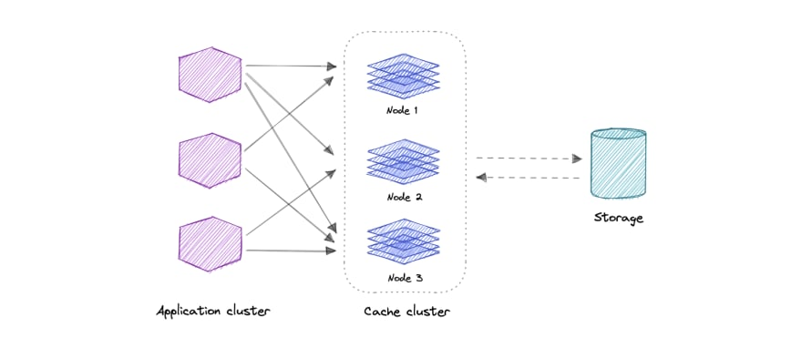
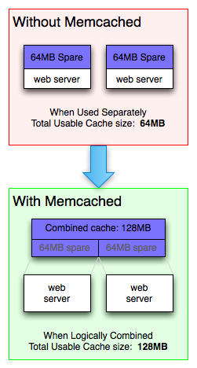
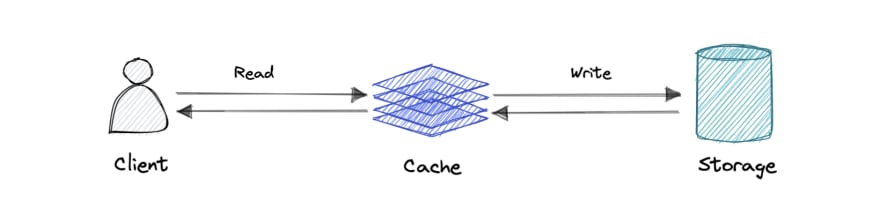
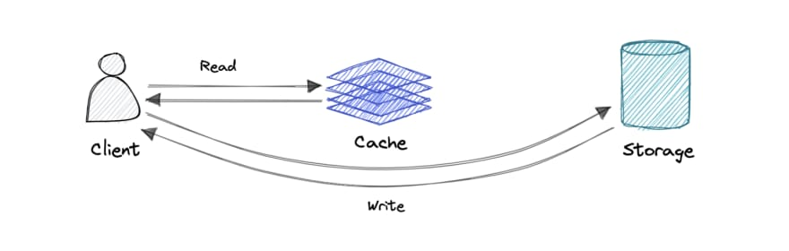
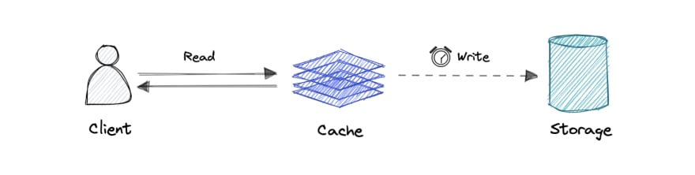

## Caching
__Caching__ is the process of storing the results of a request in a cache or a temporary storage location so they can be accessed more quickly.

So critical question is: What is cache? In system design, __cache__ is a high-speed data storage that stores a subset of data so that future requests for that data are served up faster. In other words, caching allows us to reuse previously retrieved data efficiently.

Caching Examples:
* Web Browsers cache the HTML, CSS, JS, and images for faster access to the website when requested again.
* CDN store static files and help us to reduce latency.
* DNS is used to get the IP address of a query. So, rather than requesting the IP address multiple times, it can be stored in a cache storage, allowing us not to re-perform a DNS query again, and the web pages can be accessed more quickly.

__Cache hit__ - when requested data is found in a cache.

__Cache miss__ - When requested data could have been found in a cache but isn't. This is typically used to refer to a negative consequence of a system failure or of a poor design choice.

Caches can exist at all levels in architecture, but are often found at the level nearest to the front end where they are implemented to return data quickly without taxing downstream levels.

### Types
* Browser Cache
* Web server caching

    A reverse proxy cache acts as an intermediary between the browser and the origin server. When a user makes a request, the reverse proxy cache checks if it has a copy of the requested content. If it does, it serves the cached version to the user rather than forwarding the request to the origin server.

    Key/value stores, such as Memcached or Redis, can cache any web content desired by the application developer.

* Distributed Cache

    A distributed cache is a system that pools together the RAM of multiple networked computers into a single in-memory data store used as a data cache to provide fast access to data. While most caches are traditionally in one physical server or hardware component, a distributed cache can grow beyond the memory limits of a single computer by linking together multiple computers.

    

* Database caching

    Database caching is a technique that involves storing frequently accessed data in a cache to improve the performance of a database. This can significantly increase throughput and reduce data retrieval latency, resulting in improved overall performance for the application. A database cache layer can be implemented in front of any database, including relational and NoSQL databases.

* In-memory cache

    In-memory cache is a key-value database used to improve performance by caching data and storing them in RAM of a server.

    When developing a read-heavy system like Twitter or Facebook, we may end up caching a lot of data, even entire timelines, to achieve the low latency requirement.

    You can think of it as a short-term memory for your applications. But ut can also be stored in permanent storage to survive reboots and system failures.

    With memcached, you can see that all of the servers are looking into the same virtual pool of memory. This means that a given item is always stored and always retrieved from the same location in your entire web cluster. It is can easily be scaled horizontally.

    

    Of course, you aren't required to use your web server's memory for cache. Many memcached users have dedicated machines that are built to only be memcached servers.

    [Redis](https://redis.io/) or [Memcached](https://memcached.org/) are two best options here.

### Cache Eviction Policy
Note that data in a cache can become stale if the main source of truth for that data (i.e., the main database behind the cache) gets updated and the cache doesn't.

The policy by which values get evicted or removed from a cache. Popular cache eviction policies are:
* __Random Replacement (RR)__ - randomly selects a candidate item and discards it to make space when necessary.
* __Least Frequently Used (LFU)__ - counts how often an item is needed. Those that are used least often are discarded first.
* __Least Recently Used (LRU)__ - discards the least recently used items first.
* __Most Recently Used (MRU)__ - discards, in contrast to LRU, the most recently used items first.
* __First In First Out (FIFO)__ - holds an object queue in the order that the objects have been loaded into the cache. It evicts one or more objects from the head when a cache misses and inserts a new object into the queue tail. Upon a cache hit, the list does not shift.
* __Last In First Out (LIFO)__: The cache evicts the block accessed most recently first without any regard to how often or how many times it was accessed before.

### Cache Invalidation
Caching can significantly improve the performance of an application by reducing the number of requests made to the database. However, when data in the database is constantly being updated, it is important to ensure that the cache is also updated to reflect these changes. Otherwise, the application may serve outdated or stale data to clients.

Solving this problem is known as cache invalidation; there are three main schemes that are used:
* __Write-through cache__: Under this scheme, data is written into the cache and the corresponding database at the same time. The cached data allows for fast retrieval and, since the same data gets written in the permanent storage, we will have complete data consistency between the cache and the storage. Also, this scheme ensures that nothing will get lost in case of a crash, power failure, or other system disruptions. Although, write through minimizes the risk of data loss, since every write operation must be done twice before returning success to the client, this scheme has the disadvantage of higher latency for write operations.

    

* __Write-around cache__: This technique is similar to write through cache, but data is written directly to permanent storage, bypassing the cache. This can reduce the cache being flooded with write operations that will not subsequently be re-read, but has the disadvantage that a read request for recently written data will create a “cache miss” and must be read from slower back-end storage and experience higher latency.

    

* __Write-back cache__: Under this scheme, data is written to cache alone and completion is immediately confirmed to the client. The write to the permanent storage is done after specified intervals or under certain conditions. This results in low latency and high throughput for write-intensive applications, however, this speed comes with the risk of data loss in case of a crash or other adverse event because the only copy of the written data is in the cache.

    

### Advantages of Caching
* __Improve Performance:__ Caching can be used to improve system performance and API latency.
* __Reduce Database Cost:__ Caching can take up additional traffic to its cache server and reduce database traffic, eventually reducing database cost.
* __Reduce the Load on the Backend:__ Offloading the same request traffic from the main server to caching server would reduce the backend load.
* __Increase Read Throughput (IOPS):__ Caching server responds much faster than the main server for the cached key, which increases read throughput.
