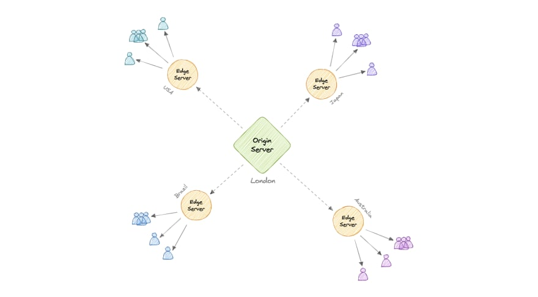

## Content Distribution Network (CDN)
A __CDN__ is a network of edge servers strategically placed across the globe with the purpose of delivering digital content to users as fast as possible.

Besides speeding up the delivery of your assets around the globe a CDN also can dramatically decrease your latency.

In a CDN, the origin server contains the original versions of the content while the edge servers are numerous and distributed across various locations around the world.

To minimize the distance between the visitors and the website's server, a CDN stores a cached version of its content in multiple geographical locations known as edge locations. Each edge location contains a number of caching servers responsible for content delivery to visitors within its proximity.

Once the static assets are cached on all the CDN servers for a particular location, all subsequent website visitor requests for static assets will be delivered from these edge servers instead of the origin, thus reducing origin load and improving scalability.

If the system we are building isn’t yet large enough to have its own CDN, we can ease a future transition by serving the static media off a separate subdomain (e.g. `static.yourservice.com`) using a lightweight HTTP server like `Nginx`, and cut-over the DNS from your servers to a CDN later.

> Content Distribution Network (CDN) and Content Delivery Network (CDN) are the same.

### Types
* Push CDNs

    Push CDNs receive new content whenever changes occur on the server. We take full responsibility for providing content, uploading directly to the CDN, and rewriting URLs to point to the CDN. We can configure when content expires and when it is updated. Content is uploaded only when it is new or changed, minimizing traffic, but maximizing storage.

    Sites with a small amount of traffic or sites with content that isn't often updated work well with push CDNs. Content is placed on the CDNs once, instead of being re-pulled at regular intervals.

* Pull CDNs
    
    In a Pull CDN situation, the cache is updated based on request. When the client sends a request that requires static assets to be fetched from the CDN if the CDN doesn't have it, then it will fetch the newly updated assets from the origin server and populate its cache with this new asset, and then send this new cached asset to the user.

    Contrary to the Push CDN, this requires less maintenance because cache updates on CDN nodes are performed based on requests from the client to the origin server. Sites with heavy traffic work well with pull CDNs, as traffic is spread out more evenly with only recently-requested content remaining on the CDN.
