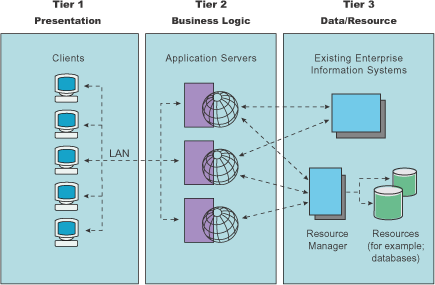
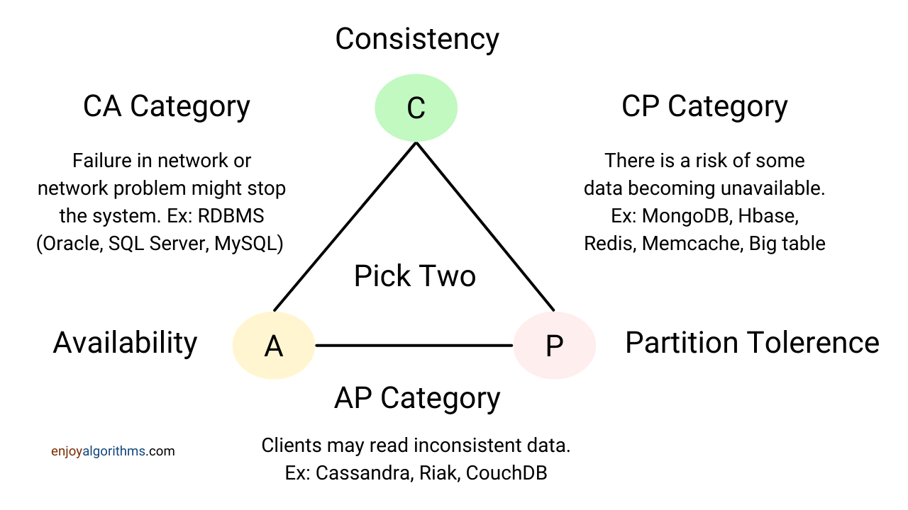

## Distributed Systems
A __distributed system__ is a collection of independent software components or machines that work together as a single system for the end user.

In a distributed system, multiple computers, also known as nodes, communicate with each other and share resources to perform tasks that would be too complex or time-consuming for a single machine to handle.

They operate concurrently and can fail independently without affecting the system's performance. They are also easily scalable and can significantly increase performance.

Key characteristics of a distributed system include:
* #### Scalability

    Scalability measures how much a system can grow or shrink.

    One of the main benefits of using distributed systems is their ability to provide highly scalable services. The goal of a scalable distributed system is to achieve high scalability without a decrease in performance.

    Traditionally, systems scale using _vertical scaling_, which involves adding more power (such as CPU, RAM, and storage) to an existing server. However, this approach is not suitable for large-scale operations because it is expensive and prone to a single point of failure. It is also limited by the capacity of a single server, and scaling beyond that capacity often requires downtime.

    On the other hand, _horizontal scaling_ allows for indefinite scaling by adding more servers to the pool of resources. If there is any performance degradation, we can simply add more machines, making the system extremely fast with minimal overhead cost compared to vertical scaling. Horizontal scaling is a common approach for distributed systems because it allows for flexibility and efficiency in handling growing workloads.

    The figure below describes how much a company costs to use Vertical vs Horizontal Scaling.

    

    Good examples of horizontally scalable systems include Cassandra and MongoDB. MySQL is an example of a vertically scalable system. However, this process often requires downtime.

* #### Reliability

    __Reliability__ is the probability that a system will fail in a given period. In simple terms, a distributed system is considered reliable if it keeps delivering its services even when one or several of its software or hardware components fail.
    
    Reliability can be achieved through redundancy, meaning that if the server hosting the user's shopping cart fails, another server with an exact replica of the shopping cart should take its place. However, redundancy comes at a cost, and a reliable system must be prepared to pay for this resilience by eliminating all single points of failure.

* #### Availability

    Availability is the time a system remains operational to perform its required function in a specific period. It is the percentage of time that a system, service, or a machine remains operational under normal conditions.

    __Reliability Vs. Availability:__ If a system is reliable, it is available. However, if it is available, it is not necessarily reliable. In other words, high reliability contributes to high availability, but it is possible to achieve a high availability even with an unreliable product by minimizing repair time and ensuring that spares are always available when they are needed.

    For example, suppose a system has 99.99% availability for the first two years after its launch. Unfortunately, the system was launched without any security testing. The customers are happy, but they never realize that system is vulnerable to security risks. In the third year, the system experiences a series of security problems that suddenly result in low availability for long periods.

* #### Performance

    Performance measures how quickly a system can process a request or perform a specific task.

    There are two standard parameters to measure the performance of a distributed system:
    1. __Latency__ or __response time__: This refers to the delay in obtaining the response to the request.
    2. __Throughput__: This refers to the number of requests served in a given time.

    It's important to note that the performance of distributed systems also depends on other factors such as network load, the architecture of software and hardware components, etc.

    Many highly scalable services are read-heavy, which can decrease system performance. To address this issue, one solution is to use replication, which ensures high availability and fault tolerance. However, there is a limit to this approach. To further increase performance, distributed systems can use sharding to scale the service by dividing the central database server into smaller servers called shards. This allows for a higher level of performance by distributing the load across multiple servers.

* #### Manageability/Serviceability

    __Serviceability__ or __manageability__ refers to how easy it is to operate and maintain the system; _if the time to fix a failed system increases, then availability will decrease_. Things to consider for manageability are the ease of diagnosing and understanding problems when they occur, ease of making updates or modifications, and how simple the system is to operate (i.e., does it routinely operate without failure or exceptions?).

* #### Concurrency

    This refers to the ability of multiple components to access and update shared resources concurrently without interference. Concurrency helps to reduce latency and increase the throughput of the distributed system.

* #### Transparency

    Transparency allows users to view a distributed system as a single, logical device, without needing to be aware of the system architecture. This is an abstraction where a distributed system, consisting of millions of components spread across multiple computers, appears as a single system to the end user.

* #### Openness

    Openness refers to the ability to update and scale a distributed system independently. This is about how easy it is to integrate new components or replace existing ones without affecting the overall computing environment.

* #### Security

* #### Heterogeneity

    When components may have a variety of differences in terms of networks, hardware, operating systems, programming languages, and implementations by different developers.

### Types of Distributed Systems
One common way to categorize distributed systems is by their architecture, which refers to the way that components are organized and interact with each other.
* __Client-Server Model:__ a type of distributed system that consists of clients and servers. The server is responsible for hosting, managing, and delivering services to clients. Clients are connected to the central server and communicate with it over the internet using a computer network. So when a client needs a service, it sends a request to the server, which processes the request and sends a response back to the client.

    Note that a single machine or piece of software can be both a client and a server at the same time. For instance, a single machine could act as a server for end users and as a client for a database.

    Disadvantages:
    * Centralized control can lead to increased chances of failure. If many clients send simultaneous requests to the server (causing traffic congestion), it can overload the server and drastically slow down performance. This could also lead to server failure, resulting in the whole system going down and clients not receiving any responses.
    * Servers are more powerful than client computers, which means they are more expensive. They also require personnel with networking and infrastructure knowledge to manage the system.
    * The client-server architecture is vulnerable to Denial of Service (DoS) attacks because the number of servers is typically smaller than the number of clients.

* __Three-Tier:__ In such architecture, a central server manages all the requests and services and acts as a middle layer between the communication. The middle tier accepts the request, does some pre-processing, and forwards it to the server for further processing.

    

* __Multi-Tier:__ Such architectures are used when an application needs to forward requests to various network services. Here the application servers interact both with the presentation tiers and data tiers.
* __Peer-to-Peer:__ A collection of machines referred to as peers that divide a workload between themselves to presumably complete the workload faster than would otherwise be possible. Peer-to-peer networks are often used in file-distribution systems.

### Disadvantages of Distributed Systems
* _Complexity:_ Distributed systems are highly complex. Although using a large number of machines, the system can become scalable, but it increases the system’s complexity. There will be more messages, network calls, devices, user requests, etc.
* _Network failure:_ Distributed systems have heavily relied on network calls for communications and transferring information or data. In case of network failure, message mismatch or incorrect ordering of segments leads to communication failure and eventually deteriorates its application’s overall performance.
* _Consistency:_ Because of its highly complex nature, it becomes too challenging to synchronise the application states and manage the data integrity in the service.
* _Management:_ Many functions, such as load balancing, monitoring, increased intelligence, logging, etc., need to be added to prevent the distributed systems’ failures.

---

## CAP Theorem
According to the __CAP Theorem__, any distributed database can only satisfy two of the three requirements:
* __Consistency:__ Every node answers with the most recent version of the data, ensuring consistency.
* __Availability:__ A distributed system is always able to respond to client requests for data even if one or more nodes are down or experiencing issues.
* __Partition Tolerance:__ Even if connectivity between any node is disrupted, the system continues to function.

We can only build a system that has any two of these three properties. Because, to be consistent, all nodes should see the same set of updates in the same order. But if the network suffers a partition, updates in one partition might not make it to the other partitions before a client reads from the out-of-date partition after having read from the up-to-date one. The only thing that can be done to cope with this possibility is to stop serving requests from the out-of-date partition, but then the service is no longer 100% available.

### CAP Theorem Database Architecture
Distributed networks heavily depend on NoSQL databases as they offer horizontal scalability, and they are highly distributed. Hence, they can easily and rapidly scale across a growing network of multiple interconnected nodes.

The different combinations and their use cases are discussed below:
* __CP System:__ This system focuses more on consistency and partition tolerance. So these systems are not available most of the time. When any issue occurs in the system, it has to shut down the non-consistent node until the partition is resolved, and during that time, it is not available.
* __AP System:__ This type of database focuses more on availability and partition tolerance rather than consistency. When any issue occurs in the system, then it will no longer remain in a consistent state. However, all the nodes remain available, and affected nodes might return a previous version of data, and the system will take some time to become consistent.
* __CA System:__ This type of database focuses more on consistency and availability across all nodes than partition tolerance. Fault-Tolerance is the basic necessity of any distributed system, and hence it is almost rare to use a CA type of architecture for any practical purpose.

If horizontal scalability is essential to the application with eventual consistency, an `AP` database like `Cassandra` can help meet deployment requirements and simplify deployment. On the other hand, if the application depends heavily on data consistency, such as in a payment service, it may be better to opt for a relational database like `PostgreSQL`, which focuses on a `CP` database style.

---

## Leader Election
The goal of leader election is to give a specific entity (such as a process, host, thread, object, or person) special powers within a distributed system. These powers may include the ability to delegate tasks, the ability to modify data, or the responsibility for handling all system requests.

Leader election can be a useful tool for improving efficiency, minimizing coordination, simplifying architectures, and reducing overhead, but it can also introduce additional failure modes and scaling challenges and make it more difficult to assess the validity of the system.

A specialized algorithm choses a leader based on multiple criterion.

### Use cases
There are three scenarios to consider when determining if a leader election is appropriate:
1. _When each node is roughly the same and there is no clear contender for a permanently assigned leader:_ In this case, any node can be voted as the leader of the system, and there is no single point of failure.
2. _When the cluster is performing a complex task that requires close collaboration:_ Coordination can involve dividing the work, assigning work to specific nodes, and combining the results from different nodes. For example, in a scientific computation to determine how a protein folds, a leader node may be needed to allocate each node to a specific part of the computation and then combine the results to obtain the full folded protein configuration.
3. _When the system executes many distributed writes to data and requires good consistency:_ In this case, a leader ensures consistency by being the source of truth about the system's current state, and the leader election algorithm must maintain this properly. For example, a bank may require strong consistency to ensure that a user's bank account balance is accurate regardless of which server responds to their online banking request and that multiple transactions on the same bank account do not conflict with each other.

### Advantages
* A single leader can work more efficiently. It can often simply inform other systems about changes, rather than building consensus about the changes to be made.
* Single leaders can easily offer clients consistency because they can see and control all the changes made to the state of the system.
* A single leader can improve performance or reduce cost by providing a single consistent cache of data which can be used every time.

### Disadvantages
* A single leader creates a single point of failure, as the entire system may become unavailable if the system fails to detect or correct a faulty leader.
* A single leader limits the scale of the system in terms of data size and request rate, and a complete re-architecture may be required if the system needs to expand beyond a single leader.
* A leader represents a single point of trust, as a faulty leader can quickly spread problems throughout the system and have a large impact (referred to as a "blast radius").

### Leader election algorithm
__Consensus Algorithm__ - is a type of complex algorithms used to have multiple entities agree on a single data value, like who the "leader" is amongst a group of machines. Some popular consensus algorithms are: `Leases`, `Paxos`, `Raft`, `ZooKeeper`.

The __Bully Algorithm__ is a simple synchronous leader election technique that requires each node to have a unique numeric id and for all nodes in the cluster to know each other's ids. When a node starts up or the current leader fails the health check, the election process begins.

There are two possible outcomes:
1. If a node has the highest id, it declares itself the winner and sends this message to the other nodes.
2. If a node has a lower id, it sends messages to all nodes with higher ids. If it does not receive a response, it assumes that these nodes have failed or are unavailable and declares itself the winner.

How to ckeck if a server is down? Make every server send a message every 5 seconds. If a server fails to do so, it is considered down. 

__Etcd__ - is a strongly consistent and highly available key-value store that's often used to implement leader election in a system.

__ZooKeeper__ - is a strongly consistent, highly available key-value store. It's often used to store important configuration or to perform leader election.
