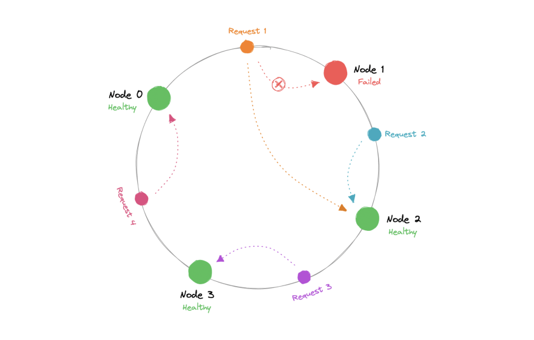
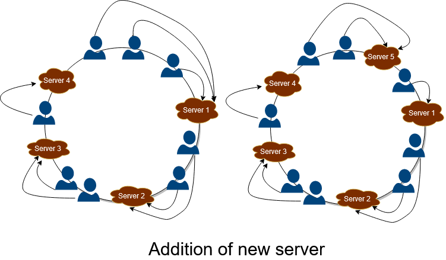
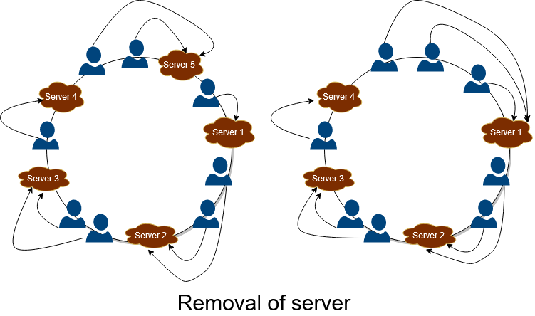
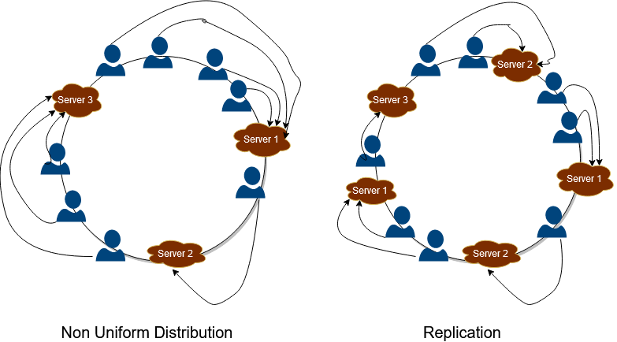

## Hashing
In a distributed system, load balancers need to distribute the load uniformly across the servers. But, in a distributed system, the number and location of servers may change. How do we address these challenges?

The traditional hashing method is not well-suited for use in distributed systems where multiple users are requesting services from multiple servers. This is because it assumes that the number of servers and their mapping locations are fixed, which is not the case in a distributed system. If a server fails or goes offline, the traditional method requires significant computation to remap requests to different servers, which can affect the throughput and latency of the service.

### Consistent Hashing
Suppose we are designing a distributed caching system. Given `n` cache servers, an intuitive hash function would be `key mod n`. It is simple and commonly used. But it has two major drawbacks:
1. It is NOT horizontally scalable. Whenever a new cache host is added to the system, all existing mappings are broken. It will be a pain point in maintenance if the caching system contains lots of data. Practically, it becomes difficult to schedule a downtime to update all caching mappings.
2. It may NOT be load balanced, especially for non-uniformly distributed data. In practice, it can be easily assumed that the data will not be distributed uniformly. For the caching system, it translates into some caches becoming hot and saturated while the others idle and are almost empty.

Consistent Hashing is a distributed hashing scheme that operates independently of the number of nodes in a distributed hash table by assigning them a position on an abstract circle, or hash ring. The hash ring is considered infinite and can accommodate any number of servers, which are assigned to random locations based on a hash function. This allows for flexible allocation of servers and efficient handling of requests in a distributed system.

Consistent Hashing helps us in effective organization and distribution of resources by ensuring minimum reorganization of requests in any failure. In Consistent Hashing, a hash function is used to map servers to locations in a virtual ring. The position of the server is just a random position obtained using the hash function.

Consistent Hashing is organized in the following manner:
1. The servers are hashed using their IP addresses and placed in the virtual ring based on the output of hash function.
2. Similarly, requests are hashed to positions using the same hash function and placed in the virtual ring.
3. They map requests with the server having the same position, and in case the position doesn’t match, then assign the requests to the first server that we get while moving in a clockwise direction.

#### Adding new server

When server 5 is added between 1and 4, all the requests after 4 are assigned to 5 instead of mapping to 1. Hence in this way, Consistent Hashing helps reduce loads of massive servers and proves highly effective in scaling and increasing the throughput, and improves the latency of the application.

#### Removing a server
Whenever any server fails in the system, then all the requests previously mapped to the failed server will redirect to the next server, which is located after the failed server in the clockwise direction. Hence in this manner, the service remains active and provides fault-tolerant service.

When server 4 breakdowns, then all the requests mapped to 4 are reallocated to 1, preventing the system from breaking down.

#### Server Virtual Replicataion
There is a disadventage of this approach. All the requests may get mapped to the one server, and hence one server will get all the workload, other servers will remain idle. To deal with this, a new concept has been introduced. All the servers are replicated and arranged at different positions in the ring. So, with an increased number of servers, the distribution becomes much more uniform and helps in the service’s scaling. This is shown in the figure below. All the servers are replicated and allocated to different locations, and hence this makes the distribution of requests uniform in the hash ring.

If some server has more power than others and can handle more requests, then it can be hashed more times and placed around the hash circle. This will increase the probability of a request hitting that server. 

### Rendezvous Hashing
> a `key` in the context of hashing means a client request.

The goal of rendezvous hashing is to have good load balancing performance - we want each server to be responsible for about the same number of key-value pairs.

Rendezvous hashing provides a clever solution. Rather than pick a single server, each key generates a randomly sorted list of servers and chooses the first server from the list. If our first choice for a server goes offline, we simply move the key to the second server in the list (which becomes our new first choice). It is easy to see that we only need to move the keys that were previously managed by the server that went offline. The rest of the keys do not need to move, since they are still managed by their first choice.

To use rendezvous hashing, each key needs its own unique server priority list. How do we generate a random permutation of servers for each key? It turns out that we can directly apply a common hashing technique to permute a set of items.1 First, we hash each server to get a set of integer hash values. Then, we sort the servers based on the hash values. The result is a randomly permuted list of servers. To ensure that each key gets a unique permutation, we also have to make the hash function depend on the key. But this is not difficult - the solution is to concatenate the key with each server.

#### Advantages
* Cascaded Failover: When a server fails, many load balancing algorithms forward all of the load to a single server. This can lead to cascaded failure if the failover server cannot handle the new load. Rendezvous hashing avoids this problem because each key potentially has a different second-choice server. With a sufficiently good hash function, the load from a failing server is evenly distributed across the remaining servers.
* Weighted Servers: In some situations, we want to do biased load balancing rather than uniform random key assignment. For example, some servers might have larger capacity and should therefore be selected more often. Rendezvous hashing accommodates weighted servers in a very elegant way. Instead of sorting the servers based on their hash values, we rank them based on `− w_i / ln(h_i(x))`, where `x` is the key, `w_i` is the weight associated with server `i`, and `h_i(x)` is the hash value.
* Lightweight Memory: Requires less memory that Consistent Hashing.

#### Disadvantages 
* Adding Servers: It is hard to maintain the “first choice” invariant when adding servers because the new server might become the first choice for a key that is already in the system.
* Query Time: If we have `N` servers, the lookup algorithm is `O(N)` because we have to examine all of the key-server combinations. Consistent hashing is `O(logN)` and can be much faster when `N` is large enough.

#### VS
Rendezvous hashing is a good way to do distributed load balancing for small to medium-sized distributed caches. If working with a system that does not eventually satisfy the “first choice” invariant, rendezvous hashing will require some care when scaling up the number of servers.

#### SHA
Short for "Secure Hash Algorithms", the SHA is a collection of cryptographic hash functions used in the industry. These days, SHA-3 is a popular choice to use in a system.
