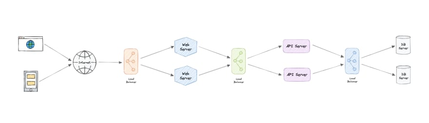
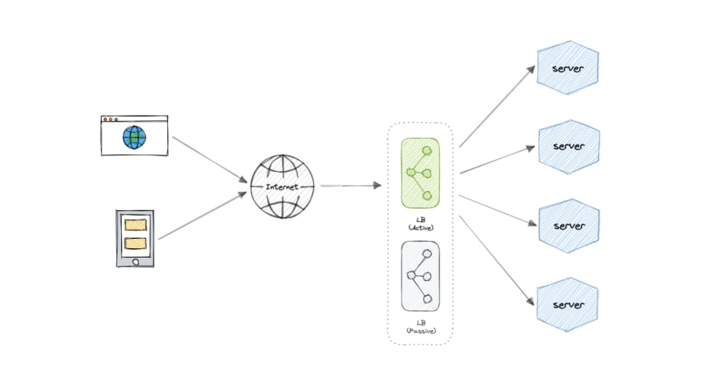

## Load Balancing
__Load Balancer (LB)__ - is a type of reverse proxy that distributes traffic across servers. Load balancers can be found in many parts of a system, from the DNS layer all the way to the database layer.

Suppose we have several clients sending requests to a single server. When the number of requests increases significantly, the server experiences an overload, leading to failure in the system. So, how do we handle the above problem?
1. We can try to scale our system. The first way is to __vertically__ scale our system or increase the power of our server. But, there's only so much that we can do about it to increase a single machine's power. 
2. Another way is to scale the system __horizontally__ by adding more servers to our system. Now for handling the request, we can add a load balancer and distribute the request across multiple servers. This could allow our services to handle a large number of requests by adding more servers. 

### Where do we add a load balancer?
We can add load balancers at various places in the system, especially with multiple resources like servers, databases, or caches.
* Between the client and the server
* Between the server and application servers
* Between the application and cache servers
* Between the cache and database servers

### Benefits of Load Balancing:
* We use a load balancer for better user experience and uninterrupted service by distributing the client requests to an available and responsive server. In other words, it ensures the _availability_ and _scalability_ of the application.
* It prevents server overload and a single point of failure.
* It can also offer functionalities like encryption, authentication, etc. to provide a single control point for securing, managing, and monitoring the application. It can provide efficient protection from the DoS attack.
* The end-user only needs to know the address of the load balancer, not the address of every server in the cluster. So it also provides a layer of Abstraction.
* We can roll out software updates without taking the whole service down by using the load balancer to take out one server at a time.
* It minimizes server response time and maximizes throughput.
* It can do health checks and monitor the request handling capability of servers.
* Based on the number of requests, it can add or remove the number of servers.

### Load Balancing Algorithms
__Health Checks__ - Load balancers should only forward traffic to “healthy” backend servers. To monitor the health of a backend server, “health checks” regularly attempt to connect to backend servers to ensure that servers are listening. If a server fails a health check, it is automatically removed from the pool, and traffic will not be forwarded to it until it responds to the health checks again.

There is a variety of load balancing methods, which use different algorithms for different needs:
* __Least Connection Method__ — This method directs traffic to the server with the fewest active connections.

    The additional calculations required to determine the server with the least number of connections may increase the load on the load balancer itself.

    This approach is useful when there are a large number of persistent client connections which are unevenly distributed between the servers.

* __Weighted Least Connections Method__ - distributes load based on both the number of current and active connections to each server and the relative capacity of the server. It takes into account that some servers can handle more connections than others.
* __Least Response Time Method__ — This algorithm directs traffic to the server with the fewest active connections and the lowest average response time.
* __Least Bandwidth Method__ - This method selects the server that is currently serving the least amount of traffic measured in megabits per second (Mbps).
* __Round Robin Method__ — This method cycles through a list of servers and sends each new request to the next server. When it reaches the end of the list, it starts over at the beginning. It is most useful when the servers are of equal specification and there are not many persistent connections.

    It works best if every server in the load balancer list has roughly the same specification. Otherwise, a low processing server may have the same load as a high processing server.

* __Weighted Round Robin Method__ — The weighted round-robin scheduling is designed to better handle servers with different processing capacities. Each server is assigned a weight (an integer value that indicates the processing capacity). Servers with higher weights receive new connections before those with less weights and servers with higher weights get more connections than those with less weights.

    It does not consider the current load of each server or the relative computation cost of each request.

* __IP Hash__ — Under this method, a hash of the IP address of the client is calculated to redirect the request to a server.

    This way, the same user is redirected to the same server over and over again. If caching is implemented, it means more cache hits. Since users tend to request same data over time.

    If the session is broken, the key can be regenerated and the client request can be directed back to the same server that was originally handling it.
    
    This algorithm is useful when a dropped connection needs to be returned to the same server.

### Load Balancer Cluster
The load balancer can be a single point of failure; to overcome this, a second load balancer can be connected to the first to form a __cluster__. Each LB monitors the health of the other and, since both of them are equally capable of serving traffic and failure detection, in the event the main load balancer fails, the second load balancer takes over.

### DNS
DNS load balancing is the practice of configuring a domain in the Domain Name System (DNS) such that client requests to the domain are distributed across a group of server machines.

Unfortunately, DNS load balancing has inherent problems limiting its reliability and efficiency. Most significantly, DNS does not check for server and network outages, or errors. It always returns the same set of IP addresses for a domain even if servers are down or inaccessible.
