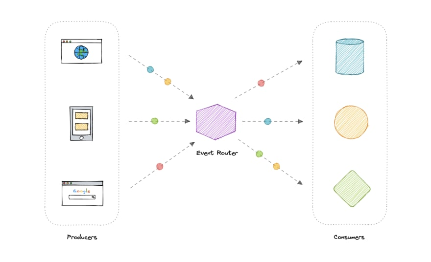
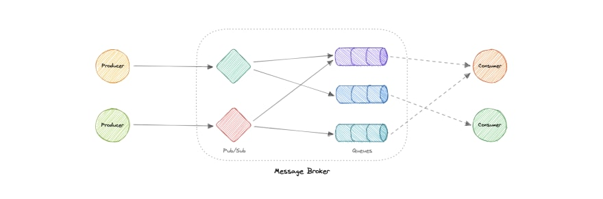
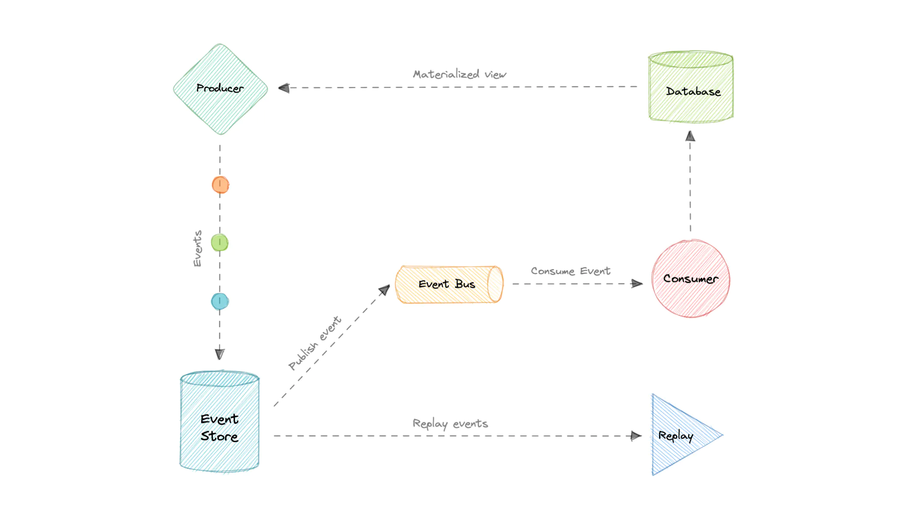
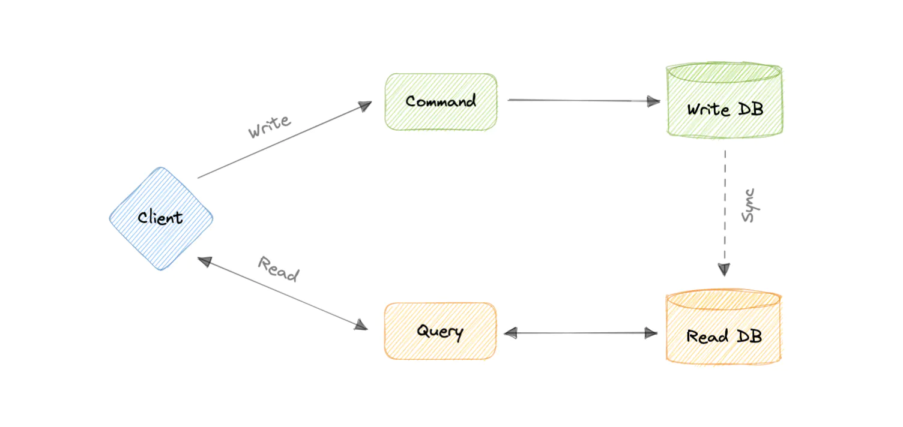

## Event-Driven Architecture (EDA)
EDA is about using events as a way to communicate within a system. It is simply a way of achieving loose coupling between services within a system.

An __event__ is a data point that represents state changes in a system. It doesn't specify what should happen and how the change should modify the system, it only notifies the system of a particular state change. When a user makes an action, they trigger an event.

Event-driven architectures have three key components:
* __Event producers:__ Publishes an event to the router.
* __Event routers:__ Filters and pushes the events to consumers.
* __Event consumers:__ Uses events to reflect changes in the system.

### Patterns
There are several ways to implement the event-driven architecture, and which method we use depends on the use case but here are some common examples:
* Publish-Subscribe
* Event Sourcing
* Command and Query Responsibility Segregation (CQRS)

### Advantages:
* Decoupled producers and consumers.
* Highly scalable and distributed.
* Easy to add new consumers.
* Improves agility.

### Challenges:
* Guaranteed delivery.
* Error handling is difficult.
* Event-driven systems are complex in general.
* Exactly once, in-order processing of events.

---

## Message Brokers
A message broker is a software that enables applications, systems, and services to communicate with each other and exchange information. The message broker does this by translating messages between formal messaging protocols. This allows interdependent services to "talk" with one another directly, even if they were written in different languages or implemented on different platforms.

Message brokers can validate, store, route, and deliver messages to the appropriate destinations. They serve as intermediaries between other applications, allowing senders to issue messages without knowing where the receivers are, whether or not they are active, or how many of them there are. This facilitates the decoupling of processes and services within systems.

Message brokers offer two basic message distribution patterns or messaging styles:
* __Point-to-Point__ messaging: This is the distribution pattern utilized in message queues with a one-to-one relationship between the message's sender and receiver.
* __Publish-subscribe__ messaging: In this message distribution pattern, often referred to as "pub/sub", the producer of each message publishes it to a topic, and multiple message consumers subscribe to topics from which they want to receive messages.

### Existing message brokers:
* NATS
* Apache Kafka
* RabbitMQ
* ActiveMQ

---

## Message Queues
A message queue is a form of service-to-service communication that facilitates asynchronous communication. It asynchronously receives messages from producers and sends them to consumers.

Messages are stored in the queue until they are processed and deleted. Each message is processed only once by a single consumer. Here's how it works:
* A producer publishes a job to the queue, then notifies the user of the job status.
* A consumer picks up the job from the queue, processes it, then signals that the job is complete.

If queues start to grow significantly, the queue size can become larger than memory, resulting in cache misses, disk reads, and even slower performance. __Backpressure__ can help by limiting the queue size, thereby maintaining a high throughput rate and good response times for jobs already in the queue. Once the queue fills up, clients get a server busy or HTTP 503 status code to try again later. Clients can retry the request at a later time, perhaps with exponential backoff strategy.

### Existing message queues:
* Amazon SQS
* RabbitMQ
* ActiveMQ
* ZeroMQ

---

## Publish/Subscribe Pattern
The __Pub/Sub__ - is an architectural design pattern that enables publishers and subscribers to communicate with one another. In this arrangement, the publisher and subscriber rely on a message broker to send messages from the publisher to the subscribers. __Messages__ (_events_) are sent out by the host (publisher) to a channel, which subscribers can join.

Publishers publish messages to special topics (sometimes called channels) without caring about or even knowing who will read those messages, and subscribers subscribe to topics and read messages coming through those topics.

Here Event Bus is responsible for routing messages to the appropriate subscribers. It does this by keeping track of which subjects each subscriber is subscribed to.

Pub/Sub systems often come with very powerful guarantees like at-least-once delivery, persistent storage, ordering of messages, and replayability of messages.

### Advantages
* _Low coupling on the publisher's end:_ Publishers do not need to know the number, identity, or types of messages that subscribers are interested in. They simply output data in response to the correct events through their API. This allows for flexibility and scalability, as new subscribers can be easily added to the system without affecting the publisher.
* _Separation of concerns:_ The simplicity of the Pub/Sub architecture (data flows one way from publishers to subscribers) allows developers to practice fine-grained separation of concerns. This means that different message types can be split into distinct categories that each fulfill a single, straightforward purpose. For example, data with the topic "/cats" could contain information about cats, while data with the topic "/dogs" could contain information about dogs.
* _Improved testability:_ The fine-grained control over topics makes it easy to confirm that the various event buses are transmitting the necessary messages.
* _Improved security:_ The Pub/Sub architecture is well-suited for the security principle of assigning minimal privileges or information. Developers can easily create modules that are subscribed to only the minimum number of message types needed to function.

### Disadvantages
* #### The inflexibility of data sent by the publisher

    The publish/subscribe approach can introduce a high level of semantic coupling in the messages that are sent between publishers and subscribers. This means that it can be difficult to modify the data structure of these messages once it has been established. To change the format of the messages, all of the subscribers must be updated to accept the new format, which can be challenging or impossible if the subscribers are external. This is a common problem with versioned APIs.

    One solution to this issue is to use a versioned message format that allows subscribers to validate the format they are receiving. However, this assumes that subscribers are correctly consuming the versioning information.

    Another option is to use versioned endpoints, such as "/APIV0/" and "/APIV1/," to maintain backward compatibility. This approach has the disadvantage of requiring developers to support multiple versions, which can be time-consuming.

* #### Instability of Delivery

    One disadvantage of the publish/subscribe model is that it can be difficult to determine the health of subscribers. The publisher does not have complete information about the systems that are listening to the messages, which can lead to problems.

    For example, logging systems often use the publish/subscribe model. If a logger subscribed to the "Critical" message type crashes or becomes stuck in an error state, it may miss important messages. Any services that rely on error warnings will then be unaware of issues with the publisher.

    To mitigate this risk, changes to the design could be implemented, such as requiring receipts of received messages. This would allow the publisher to receive feedback on the status of the subscribers.

### Apache Kafka
A distributed messaging system created by LinkedIn. Very useful when using the streaming paradigm as opposed to polling.

### Cloud Pub/Sub
A highly-scalable Pub/Sub messaging service created by Google. Guarantees at-least-once delivery of messages and supports "rewinding" in order to reprocess messages.

---

## Enterprise Service Bus (ESB)
An Enterprise Service Bus (ESB) is an architectural pattern whereby a centralized software component performs integrations between applications. It performs transformations of data models, handles connectivity, performs message routing, converts communication protocols, and potentially manages the composition of multiple requests.

### Advantages
In theory, a centralized ESB offers the potential to standardize and dramatically simplify communication, messaging, and integration between services across the enterprise.

* Improved developer productivity: Enables developers to incorporate new technologies into one part of an application without touching the rest of the application.
* Simpler, more cost-effective scalability: Components can be scaled independently of others.
* Greater resilience: Failure of one component does not impact the others, and each microservice can adhere to its own availability requirements without risking the availability of other components in the system.

### Disadvantages
While ESBs were deployed successfully in many organizations, in many other organizations the ESB came to be seen as a bottleneck. Here are some disadvantages of using an ESB:

* Making changes or enhancements to one integration could destabilize others who use that same integration.
* A single point of failure can bring down all communications.
* Updates to the ESB often impact existing integrations, so there is significant testing required to perform any update.
* ESB is centrally managed which makes cross-team collaboration challenging.
* High configuration and maintenance complexity.

---

## Event Sourcing
The fundamental idea of Event Sourcing is that of ensuring every change to the state of an application is captured in an event object, and that these event objects are themselves stored in the sequence they were applied for the same lifetime as the application state itself.

### Advantages
* Excellent for real-time data reporting.
* Great for fail-safety, data can be reconstituted from the event store.
* Extremely flexible, any type of message can be stored.
* Preferred way of achieving audit logs functionality for high compliance systems.

### Disadvantages
* Requires an extremely efficient network infrastructure.
* Requires a reliable way to control message formats, such as a schema registry.
* Different events will contain different payloads.

---

## Materialized View
A __materialized view__ is a database object that contains the results of a query. For example, it may be a local copy of data located remotely, or may be a subset of the rows and/or columns of a table or join result, or may be a summary using an aggregate function.

The process of setting up a materialized view is sometimes called materialization. This is a form of caching the results of a query, similar to memoization of the value of a function in functional languages, and it is sometimes described as a form of precomputation.

In any database management system following the relational model, a view is a virtual table representing the result of a database query. Whenever a query or an update addresses an ordinary view's virtual table, the DBMS converts these into queries or updates against the underlying base tables. A materialized view takes a different approach: the query result is cached as a concrete ("materialized") table (rather than a view as such) that may be updated from the original base tables from time to time. This enables much more efficient access, at the cost of extra storage and of some data being potentially out-of-date. Materialized views find use especially in data warehousing scenarios, where frequent queries of the actual base tables can be expensive.

---

## Command Query Responsibility Segregation (CQRS)
CQRS is an architectural pattern that divides a system's actions into commands and queries.

In CQRS, a _command_ is an instruction, a directive to perform a specific task. It is an intention to change something and doesn't return a value, only an indication of success or failure. And, a _query_ is a request for information that doesn't change the system's state or cause any side effects.

The core principle of CQRS is the separation of commands and queries. They perform fundamentally different roles within a system, and separating them means that each can be optimized as needed, which distributed systems can really benefit from.

The CQRS pattern is often used along with the Event Sourcing pattern. CQRS-based systems use separate read and write data models, each tailored to relevant tasks and often located in physically separate stores.

When used with the Event Sourcing pattern, the store of events is the write model and is the official source of information. The read model of a CQRS-based system provides materialized views of the data, typically as highly denormalized views.

### Advantages
* Allows independent scaling of read and write workloads.
* Easier scaling, optimizations, and architectural changes.
* Closer to business logic with loose coupling.
* The application can avoid complex joins when querying.
* Clear boundaries between the system behavior.

### Disadvantages
* More complex application design.
* Message failures or duplicate messages can occur.
* Dealing with eventual consistency is a challenge.
* Increased system maintenance efforts.

### Use cases
* The performance of data reads must be fine-tuned separately from the performance of data writes.
* The system is expected to evolve over time and might contain multiple versions of the model, or where business rules change regularly.
* Integration with other systems, especially in combination with event sourcing, where the temporal failure of one subsystem shouldn't affect the availability of the others.
* Better security to ensure that only the right domain entities are performing writes on the data.
