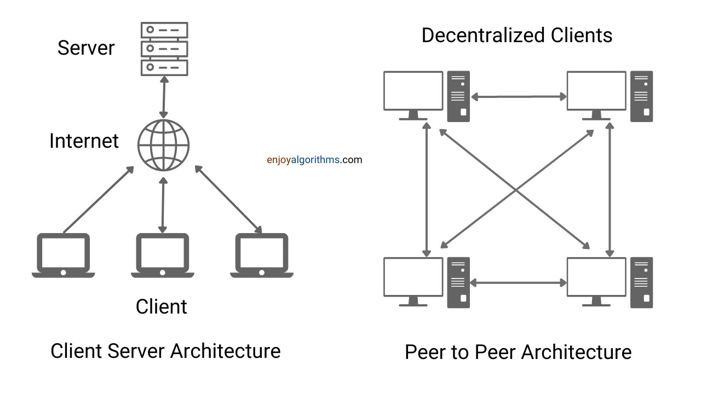

## Peer-To-Peer Network
Peer-to-peer (P2P) architecture is a distributed system in which each node acts as both a client and a server. This allows the nodes to share the workload or tasks among themselves.

In a P2P system:
* Each node, or peer, has the same functional capability and holds part of the resources in the system. Some peers may have more resources and may be able to contribute more to the network, while others may not contribute any resources and only consume from the network.
* Peers are visible to each other and can connect with as many other peers as they wish. They are free to join or leave the network at any time and can transmit and receive data from other peers simultaneously.
* P2P systems are often used in applications where decentralized control is desired, such as file sharing or distributed computing.

In a P2P network, tasks are distributed among all the peers rather than being handled by a single server, which makes P2P networks more resilient as there is no single point of failure. In some cases, a central tracking server may be used to help the peers find each other and manage the network, but it does not have control over the network itself. The decentralized nature of P2P networks allows for more flexibility and autonomy compared to traditional centralized systems.

Security is a major concern in P2P networks, as access to data and resources is managed on each individual machine. Each computer can allow or deny access to other computers, so users must be careful about what they share. For example, a user might share a folder containing sensitive payroll information, but only allow other users to access the files within that folder. Because there is no central administrator in a P2P network, users must manage access to their own files and resources. Therefore, P2P networks are often used in small deployments or situations where security is not a major concern, such as home networks or small businesses.

### Application
P2P architecture is most effective when there are many active peers in the network. This allows new peers to easily find other peers to connect to and ensures that there are enough remaining peers to take up the slack if many peers leave the network. When there are only a few peers in the network, there are fewer resources available overall.

In a P2P file-sharing program, the more common a file is, the faster it can be downloaded because many peers are sharing it. To make P2P work more efficiently, the workload is often divided into small pieces that can be reassembled later. This allows many peers to work on the same task simultaneously and reduces the amount of work that each peer has to do.

There are several uses for peer-to-peer (P2P) architecture, including:
* __File sharing:__ P2P networks are often used for file sharing because they allow users to share files directly with each other without the need for a central server.
* __Instant messaging:__ P2P networks can be used to enable instant messaging between users, allowing them to communicate in real-time.
* __Voice/Video communication:__ P2P networks can also be used for voice communication, such as through VoIP (Voice over Internet Protocol) technology.
* __Collaboration:__ P2P networks can enable collaboration among users by allowing them to share and access resources and data directly with each other.
* __High performance:__ P2P networks can offer high performance and scalability due to their decentralized nature and the ability to share resources among multiple nodes.

Some examples of P2P architecture
* __Napster:__ Napster was a popular file-sharing service that was shut down in 2001 due to copyright issues. It used a central tracking server to facilitate file sharing among users.
* __BitTorrent:__ BitTorrent is a popular P2P file-sharing protocol that allows users to share large files directly with each other without the need for a central server.
* __Skype:__ Skype originally used a proprietary hybrid P2P protocol for voice and video communication, but after being acquired by Microsoft, it now uses a client-server model.
* __Bitcoin:__ Bitcoin is a P2P cryptocurrency that operates without a central monetary authority. Transactions are verified and recorded on a decentralized network of computers, rather than being centrally managed.

### Types of peer-to-peer network
1. #### Unstructured P2P networks

    In unstructured peer-to-peer (P2P) networks, the nodes are not arranged in any particular order, meaning that node-to-node communication is random. This makes unstructured P2P networks well-suited for high-activity use cases, such as social platforms where users may regularly join or leave the network.

    However, unstructured P2P networks have a disadvantage in that they require a significant amount of CPU and memory to function properly. The hardware must be able to support the maximum number of network transactions, ensuring that all nodes can communicate with each other at any given time. This can be a challenge, especially if the network is large or has a high volume of activity.

2. #### Structured P2P networks

    Structured peer-to-peer (P2P) networks are the opposite of unstructured P2P networks in that the nodes have a way to interact with each other in a more organized manner. This is achieved through a well-organized architecture that allows users to find and use files more efficiently rather than searching randomly. Hash functions are often used for database lookups in structured P2P networks.

    While structured P2P networks are generally more effective, they have some centralization due to their organized architecture. This means that they may be more expensive to maintain and set up than unstructured P2P networks. However, structured P2P networks are more stable than unstructured P2P networks.

3. #### Hybrid P2P networks

    Hybrid peer-to-peer (P2P) networks combine the peer-to-peer architecture with the client-server model. This allows for a central server with P2P capabilities, which can be beneficial for certain types of networks.

    Hybrid P2P networks offer several benefits over structured and unstructured P2P networks, including a more strategic approach, increased performance, and other advantages. Overall, hybrid P2P networks can be a good choice for networks that need the benefits of both P2P and client-server architectures.

### Advantages
* __Cost-effective:__ due to the absence of a central server that needs to be maintained and paid for (apart from monitoring servers). This also means there is no need for a network operating system, further reducing costs.
* __No single point of failure:__ If the server hosting your content goes down, all of your data may be lost. However, in a P2P network, this is not a concern because the data is distributed among multiple peers.
* __Scalable bandwidth and storage:__ P2P networks are decentralized and distributed, which means that as more people interact with your data, more nodes (i.e., computers or devices) are added to the network. This allows for unlimited and automatic scaling of bandwidth and storage.
* __No third-party intervention:__ In a P2P network, data is secure because no third party is involved. You can share data only with the friends you choose to share with.
* __An open, neutral platform:__ In a P2P network, all nodes have equal privileges, ensuring minimum corporate control or intervention. This means that you have control over your data.

### Disadvantages
Peer-to-peer (P2P) networks have some security risks that should be considered. One potential issue is that if a peer becomes infected with a virus and uploads a file containing the virus, the virus can easily spread to other peers in the network.

Another concern is that it can be difficult to ensure that all peers have the correct permissions to access the network, particularly if there are a large number of peers

Some users of P2P networks take advantage of resources shared by other nodes without contributing anything themselves. These users are known as "leachers." While the decentralized nature of P2P networks can make them difficult to shut down, this can also be a drawback if the network is used for illegal or unethical activities.

P2P networks can make it easy to distribute copyrighted content without control.

If all the nodes in the P2P network are offline, the data becomes unavailable.

### Gossip Protocol
When a set of machines talk to each other in a uncoordinated manner in a cluster to spread information through a system without requiring a central source of data.
