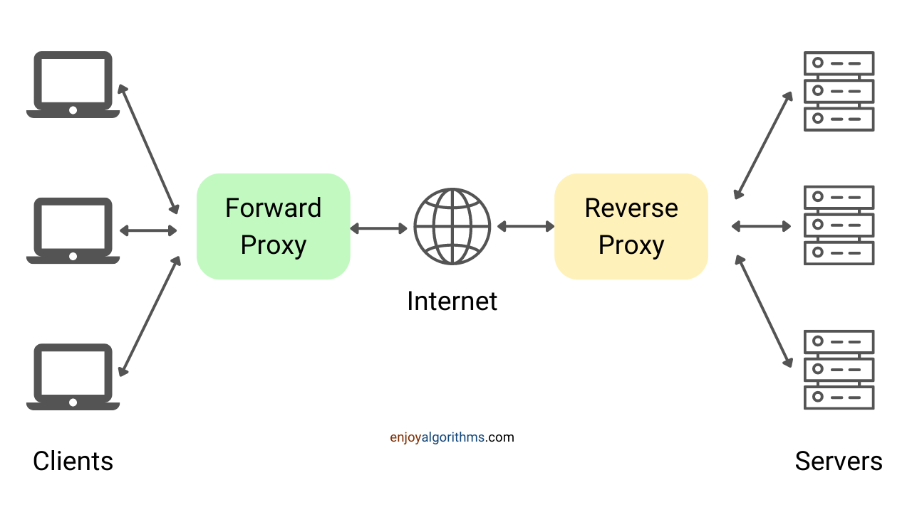

## Proxies
A __proxy__ is a server that acts as an intermediary between a client and another server.

A proxy acts on behalf of a client or group of clients. When a client issues a request to communicate with the server, it goes to the proxy instead of going directly to the server, which then forwards the request to the server. In other words, the client makes a request meant to go to the server but first goes to the proxy to communicate with the server on the client’s behalf.

### Types
* __Forward Proxy__
  
    A server that sits between a client and servers and acts on behalf of the client, typically used to mask the client's identity (IP address). Note that forward proxies are often referred to as just proxies.

    Use cases:
    * Hide identity.
    * Mmanage requests and responses.
    * Filter, log, and transform requests by adding and removing headers.
    * If several clients access a particular resource, the proxy server can cache it and respond to all clients without sending the request to the server multiple times.
    * It is also used as a load balancer between servers.

* __Reverse Proxy__

    A server that sits between clients and servers and acts on behalf of the servers, typically used for logging, load balancing, or caching.

    Use cases:
    * __Security:__ When we use a reverse proxy, a website’s origin server IP address is abstracted from the attackers. So to exploit any vulnerabilities, malicious clients can not access them directly. Many reverse proxy servers include features that help protect backend servers against distributed denial-of-service (DDoS)] attacks, such as rejecting traffic from specific IP addresses of the client (blacklisting) or limiting the number of requests accepted from each client.
    * __Load Balancing:__ A website with millions of users visiting every day may find it hard to handle such huge traffic with a single server. Instead, we can use more than one server and use reverse proxy as a load balancing solution to distribute the traffic among servers and prevent any server from getting overloaded.
    * __Caching:__ A reverse proxy can also be used to cache requests, resulting in faster performance. If multiple clients access a particular resource, the proxy server can cache it and serve it to all the clients without going to the remote server.

