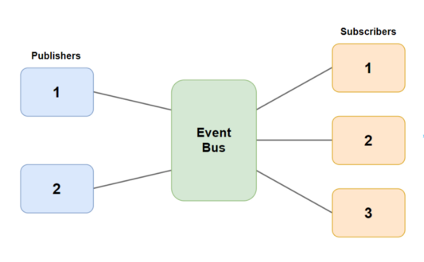

## Publish/Subscribe Pattern
The __Pub/Sub__ - is an architectural design pattern that enables publishers and subscribers to communicate with one another. In this arrangement, the publisher and subscriber rely on a message broker to send messages from the publisher to the subscribers. __Messages__ (_events_) are sent out by the host (publisher) to a channel, which subscribers can join.

Publishers publish messages to special topics (sometimes called channels) without caring about or even knowing who will read those messages, and subscribers subscribe to topics and read messages coming through those topics.

Here Event Bus is responsible for routing messages to the appropriate subscribers. It does this by keeping track of which subjects each subscriber is subscribed to.

Pub/Sub systems often come with very powerful guarantees like at-least-once delivery, persistent storage, ordering of messages, and replayability of messages.

### Advantages
* _Low coupling on the publisher's end:_ Publishers do not need to know the number, identity, or types of messages that subscribers are interested in. They simply output data in response to the correct events through their API. This allows for flexibility and scalability, as new subscribers can be easily added to the system without affecting the publisher.
* _Separation of concerns:_ The simplicity of the Pub/Sub architecture (data flows one way from publishers to subscribers) allows developers to practice fine-grained separation of concerns. This means that different message types can be split into distinct categories that each fulfill a single, straightforward purpose. For example, data with the topic "/cats" could contain information about cats, while data with the topic "/dogs" could contain information about dogs.
* _Improved testability:_ The fine-grained control over topics makes it easy to confirm that the various event buses are transmitting the necessary messages.
* _Improved security:_ The Pub/Sub architecture is well-suited for the security principle of assigning minimal privileges or information. Developers can easily create modules that are subscribed to only the minimum number of message types needed to function.

### Disadvantages
* #### The inflexibility of data sent by the publisher

    The publish/subscribe approach can introduce a high level of semantic coupling in the messages that are sent between publishers and subscribers. This means that it can be difficult to modify the data structure of these messages once it has been established. To change the format of the messages, all of the subscribers must be updated to accept the new format, which can be challenging or impossible if the subscribers are external. This is a common problem with versioned APIs.

    One solution to this issue is to use a versioned message format that allows subscribers to validate the format they are receiving. However, this assumes that subscribers are correctly consuming the versioning information.

    Another option is to use versioned endpoints, such as "/APIV0/" and "/APIV1/," to maintain backward compatibility. This approach has the disadvantage of requiring developers to support multiple versions, which can be time-consuming.

* #### Instability of Delivery

    One disadvantage of the publish/subscribe model is that it can be difficult to determine the health of subscribers. The publisher does not have complete information about the systems that are listening to the messages, which can lead to problems.

    For example, logging systems often use the publish/subscribe model. If a logger subscribed to the "Critical" message type crashes or becomes stuck in an error state, it may miss important messages. Any services that rely on error warnings will then be unaware of issues with the publisher.

    To mitigate this risk, changes to the design could be implemented, such as requiring receipts of received messages. This would allow the publisher to receive feedback on the status of the subscribers.

### Apache Kafka
A distributed messaging system created by LinkedIn. Very useful when using the streaming paradigm as opposed to polling.

### Cloud Pub/Sub
A highly-scalable Pub/Sub messaging service created by Google. Guarantees at-least-once delivery of messages and supports "rewinding" in order to reprocess messages.
