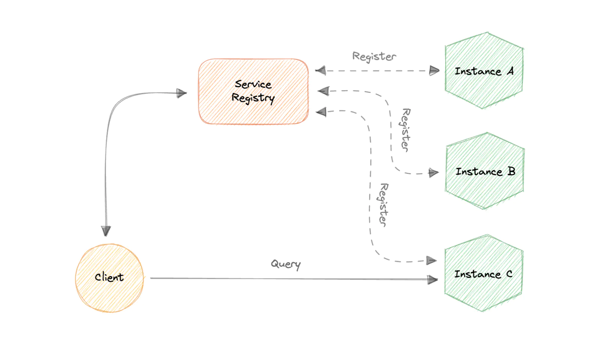
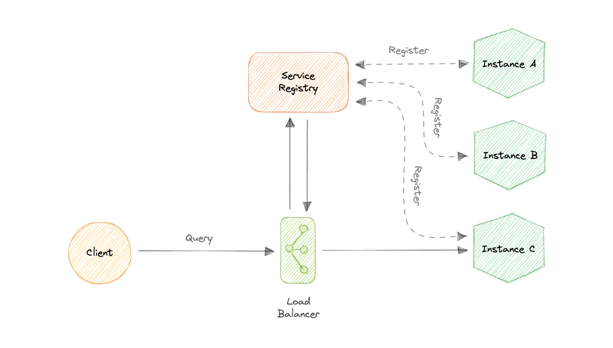

## Service Discovery
Service discovery is the detection of services within a computer network. Service Discovery Protocol (SDP) is a networking standard that accomplishes the detection of networks by identifying resources.

In a monolithic application, services invoke one another through language-level methods or procedure calls. However, modern microservices-based applications typically run in virtualized or containerized environments where the number of instances of a service and their locations change dynamically. Consequently, we need a mechanism that enables the clients of service to make requests to a dynamically changing set of ephemeral service instances.

### Variations
* Client-side discovery

    In this approach, the client obtains the location of another service by querying a service registry which is responsible for managing and storing the network locations of all the services.

    

* Server-side discovery

    In this approach, we use an intermediate component such as a load balancer. The client makes a request to the service via a load balancer which then forwards the request to an available service instance.

    

A __service registry__ - is basically a database containing the network locations of service instances to which the clients can reach out. A Service Registry must be highly available and up-to-date.

### Service Registration
* Self-Registration

    When using the self-registration model, a service instance is responsible for registering and de-registering itself in the Service Registry. In addition, if necessary, a service instance sends heartbeat requests to keep its registration alive.

* Third-party Registration

    The registry keeps track of changes to running instances by polling the deployment environment or subscribing to events. When it detects a newly available service instance, it records it in its database. The Service Registry also de-registers terminated service instances.

Some commonly used service discovery infrastructure tools:
* `etcd`
* `Consul`
* `Apache Thrift`
* `Apache Zookeeper`

## Service mesh
Service-to-service communication is essential in a distributed application but routing this communication, both within and across application clusters, becomes increasingly complex as the number of services grows. Service mesh enables managed, observable, and secure communication between individual services. It works with a service discovery protocol to detect services. `Istio` and `envoy` are some of the most commonly used service mesh technologies.

A service mesh is a way to control how different parts of an application share data with one another. Unlike other systems for managing this communication, a service mesh is a dedicated infrastructure layer built right into an app. This visible infrastructure layer can document how well (or not) different parts of an app interact, so it becomes easier to optimize communication and avoid downtime as an app grows.

Service-to-service communication is what makes microservices possible. The logic governing communication can be coded into each service without a service mesh layer—but as communication gets more complex, a service mesh becomes more valuable.

What’s different about a service mesh is that it takes the logic governing service-to-service communication out of individual services and abstracts it to a layer of infrastructure.

In a service mesh, requests are routed between microservices through proxies in their own infrastructure layer. For this reason, individual proxies that make up a service mesh are sometimes called "sidecars," since they run alongside each service, rather than within them. Taken together, these "sidecar" proxies—decoupled from each service—form a mesh network.

Without a service mesh, each microservice needs to be coded with logic to govern service-to-service communication, which means developers are less focused on business goals. It also means communication failures are harder to diagnose because the logic that governs interservice communication is hidden within each service.
