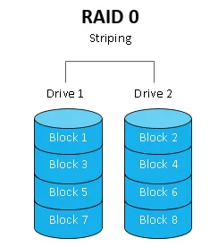
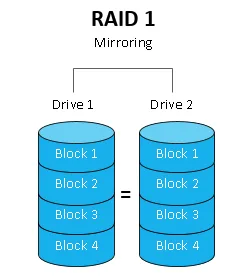
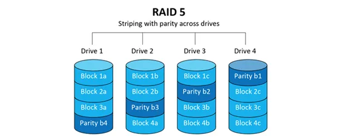
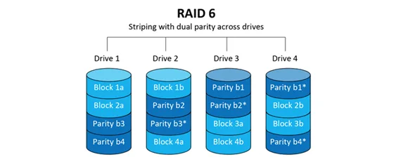
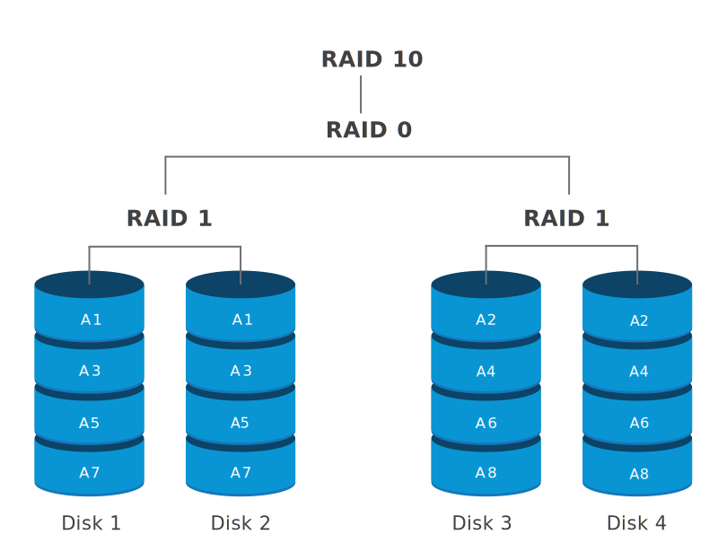

## Storage
Storage is a mechanism that enables a system to retain data, either temporarily or permanently. 

### Redundant Array of Independent Drives (RAID)
RAID is a technology that is used to increase the performance and/or reliability of data storage.

RAID is a way of storing the same data on multiple hard disks or SSDs to protect data in the case of a drive failure.

Types:
* __RAID 0__

    In a RAID 0 system, data are split up into blocks that get written across all the drives in the array. By using multiple disks (at least 2) at the same time, this offers fast read and write speeds. All storage capacity can be fully used with no overhead. The downside to RAID 0 is that it is NOT redundant, the loss of any individual disk will cause complete data loss. Thus, it is not recommended to use unless the data has no value to you.

    

* __RAID 1__

    RAID 1 is a setup of at least two drives that contain the exact same data. If a drive fails, the others will still work. It is recommended for those who need high reliability. An additional benefit of RAID 1 is the high read performance, as data can be read off any of the drives in the array. However, since the data needs to be written to all the drives in the array, the write speed is slower than a RAID 0 array. Also, only capacity of a single drive is available to you.

    

* __RAID 5__

    RAID 5 requires the use of at least 3 drives, striping the data across multiple drives like RAID 0, but also has a “parity” distributed across the drives. In the event of a single drive failure, data is pieced together using the parity information stored on the other drives. There is zero downtime. Read speed is very fast but write speed is somewhat slower due to the parity that has to be calculated. It is ideal for file and application servers that have a limited number of data drives.

    RAID 5 loses 33 percent of storage space (using three drives) for that parity, but it is still a more cost-effective setup than RAID 1. The most popular RAID 5 configurations use four drives, which lowers the lost storage space to 25 percent. It can work with up to 16 drives.

    

* __RAID 6__

    RAID 6 is like RAID 5, but the parity data are written to two drives. That means it requires at least 4 drives and can withstand 2 drives dying simultaneously. Read speed is as fast as RAID 5, but write speed is slower than RAID 5 due to the additional parity data that have to be calculated. RAID 6 is a very good option for a standard web server, where most of the transactions are reads. But it is not recommended for a heavy write environment, such as a database server.

    

* __RAID 10__

    RAID 10 consists of a minimum for four drives and combine the advantages of RAID 0 and RAID 1 in one single system. It provides security by mirroring all data on secondary drives while using striping across each set of drives to speed up data transfers. This means that RAID 10 can provide the speed of RAID 0 with the redundancy of RAID 1. You can lose any single drive, and possibly even a 2nd drive without losing any data. Just like RAID 1, only half of the total drive capacity is available, but you will see improved read and write performance and also have the fast rebuild time of RAID 1. Compared to large RAID 5 or RAID 6 arrays, this is an expensive way to have redundancy though.

    

| Features | RAID 0 | RAID 1 | RAID 5 | RAID 6 | RAID 10 |
| - | - | - | - | - | - |
| __Minimum number of drives__ | 2 | 2 | 3 | 4 | 4 |
| __Fault tolerance__ | None | Single-drive failure | Single-drive failure | Two-drive failure | Up to one disk failure in each sub-array |
| __Read performance__ | High | Medium | Low | Low | High |
| __Write Performance__ | High | Medium | Low | Low | Medium |
| __Capacity utilization__ | 100% | 50% | 67% – 94% | 50% – 88% | 50% |
| __Typical applications__ | High end workstations, data logging, real-time rendering, very transitory data | Operating systems, transaction databases | Data warehousing, web serving, archiving | Data archive, backup to disk, high availability solutions, servers with large capacity requirements | Fast databases, file servers, application servers |

For most small to medium sized enterprises, RAID 5, RAID 6 and RAID 10 suffice for good fault tolerance and performance. If you have a limited budget and want to get the most out of the disks you have popped into your array, RAID 5 and RAID 6 are ideal.

For big data operations such as server farms and data centers however, where budgets will be bigger and performance more important, RAID 10 still offers the most benefits.

### File storage
File storage is a solution to store data as files and present it to its final users as a hierarchical directories structure. The main advantage is to provide a user-friendly solution to store and retrieve files. To locate a file in file storage, the complete path of the file is required. It is economical and easily structured and is usually found on hard drives, which means that they appear exactly the same for the user and on the hard drive.

File storage is best used when you want to store documents, spreadsheets, and text files you can open like traditional files that are stored on your computer or smartphone. You typically can’t store larger files with file storage since they will take up too much space.

### Block storage
Block storage divides data into blocks (chunks) and stores them as separate pieces. Each block of data is given a unique identifier, which allows a storage system to place the smaller pieces of data wherever it is most convenient.

Block storage also decouples data from user environments, allowing that data to be spread across multiple environments. This creates multiple paths to the data and allows the user to retrieve it quickly. When a user or application requests data from a block storage system, the underlying storage system reassembles the data blocks and presents the data to the user or application

### Object storage
Object storage stores data as objects with metadata and globally unique identifier. This metadata is used for searching and indexing.

> A __flat file system__ is a system in which every file in an operating system is at the same directory level. These primitive file systems were mostly used in early computing systems prior to the development of the hierarchical file systems that are used today.

### Object Storage vs. Block Storage
| Point of Comparison | Object storage | Block storage |
| - | - | - |
| __Data storage__ | Unique, identifiable, and distinct units called objects store data in a flat-file system. | Fixed-sized blocks store portions of the data in a hierarchical system and reassemble when needed. |
| __Metadata__ | Unlimited, customizable contextual information. | Limited, basic information. |
| __Cost__ | More cost-effective. | More expensive. |
| __Scalability__ | Unlimited scalability. | Limited scalability. |
| __Performance__ | Suitable for high volumes of unstructured data. Performs best with large files. | Best for transactional data and database storage. Performs best with files small in size. |
| __Location__ | A centralized or geographically dispersed system that stores data on-premise, private, hybrid, or public cloud. | A centralized system that stores data on-premise or in private cloud. Latency may become an issue if the application and the storage are geographically far apart. |

One benefit is object storage's ability to scale infinitely. Because object storage can store anything from a small text file to terabytes of data there’s no limit to how much object storage can hold.

Other benefits of object storage include its security and cost savings. Companies can use object storage to lock down critical data and avoid the high costs of storing unstructured data, which object storage does easily since it’s designed for long-term archiving.

Block storage reduces power consumption when magnetic spinning hard drive disks are used because the disks don’t spin at the same time; since there isn’t a separate file for each storage block, the disks spin only when requested data needs to be read or written.

Storage blocks can be flushed to disks asynchronously, which enables optimized disk I/O operations by grouping them together. This reduces system resource requirements because disk I/O operations are reduced and the CPU is freed for other tasks.

when considering block storage, there are far more options for data resilience since block storage can provide self-repair functions beyond the capabilities of current file system-based storage. For example, block storage can provide multiregional replication—redundant replicas stored in as many locations as desired that can provide durability far beyond traditional file system-based storage.

### Network Attached Storage (NAS)
A NAS is a storage device connected to a network that allows storage and retrieval of data from a central location for authorized network users. NAS devices are flexible, meaning that as we need additional storage, we can add to what we have. It's faster, less expensive, and provides all the benefits of a public cloud on-site, giving us complete control.

### Hadoop Distributed File System (HDFS)
> __Commodity hardware__, in an IT context, is a device or device component that is relatively inexpensive, widely available and more or less interchangeable with other hardware of its type.

The HDFS is a distributed file system designed to run on commodity hardware. HDFS is highly fault-tolerant and is designed to be deployed on low-cost hardware. HDFS provides high throughput access to application data and is suitable for applications that have large data sets. It has many similarities with existing distributed file systems.

HDFS is designed to reliably store very large files across machines in a large cluster. It stores each file as a sequence of blocks, all blocks in a file except the last block are the same size. The blocks of a file are replicated for fault tolerance.
