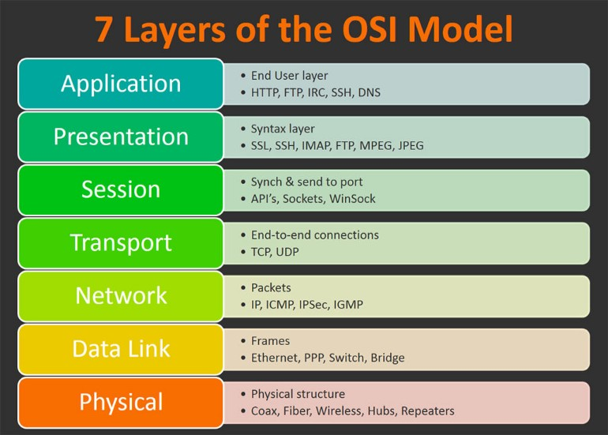

# Open Systems Interconnection (OSI)
The Open Systems Interconnection (OSI) Model is a description of how the Internet works. It breaks down the functions involved in sending data over the Internet into seven layers. Each layer has some function that prepares the data to be sent over wires, cables, and radio waves as a series of bits.

The OSI Model breaks down this data transfer/communication procedure into different components (called layers). Why layers, because those components follow a proper order of execution.

## Application Layer
Data generated by and usable by software applications. The main protocol used at this layer is HTTP.

## Presentation Layer
Presentation layer is also called the Translation layer.The data from the application layer is extracted here and manipulated as per the required format to transmit over the network.
The functions of the presentation layer are :
1. __Translation__ : For example, ASCII to EBCDIC.
2. __Encryption/ Decryption__ : Data encryption translates the data into another form or code. The encrypted data is known as the cipher text and the decrypted data is known as plain text. A key value is used for encrypting as well as decrypting data.
3. __Compression__: Reduces the number of bits that need to be transmitted on the network.

## Session Layer
This layer is responsible for establishment of connection, maintenance of sessions, authentication and also ensures security.
The functions of the session layer are :
1. __Session establishment, maintenance and termination__: The layer allows the two processes to establish, use and terminate a connection.
2 __Synchronization__ : This layer allows a process to add checkpoints which are considered as synchronization points into the data. These synchronization point help to identify the error so that the data is re-synchronized properly, and ends of the messages are not cut prematurely and data loss is avoided.
3. __Dialog Controller__ : The session layer allows two systems to start communication with each other in half-duplex or full-duplex.

## Transport Layer
The transport layer is the “traffic control” of networks. Some examples of protocols in this layer include TCP (Transmission Control Protocol) and UDP (User Datagram Protocol).

The data in the transport layer is referred to as _Segments_.

#### At sender’s side
Transport layer receives the formatted data from the upper layers, performs Segmentation and also implements Flow & Error control to ensure proper data transmission. It also adds Source and Destination port number in its header and forwards the segmented data to the Network Layer.

Note: The sender need to know the port number associated with the receiver’s application.

Generally, this destination port number is configured, either by default or manually. For example, when a web application makes a request to a web server, it typically uses port number 80, because this is the default port assigned to web applications. Many applications have default port assigned.

#### At receiver’s side:
Transport Layer reads the port number from its header and forwards the Data which it has received to the respective application. It also performs sequencing and reassembling of the segmented data.

The functions of the transport layer are :
1. __Segmentation and Reassembly__: This layer accepts the message from the (session) layer , breaks the message into smaller units . Each of the segment produced has a header associated with it. The transport layer at the destination station reassembles the message.
2. __Service Point Addressing__: In order to deliver the message to correct process, transport layer header includes a type of address called service point address or port address. Thus by specifying this address, transport layer makes sure that the message is delivered to the correct process.

The services provided by the transport layer :
1. __Connection Oriented Service__: It is a three-phase process which include
    
    – Connection Establishment
    – Data Transfer
    – Termination / disconnection

    In this type of transmission, the receiving device sends an acknowledgement, back to the source after a packet or group of packet is received. This type of transmission is reliable and secure.

2. __Connection less service__: It is a one-phase process and includes Data Transfer. In this type of transmission, the receiver does not acknowledge receipt of a packet. This approach allows for much faster communication between devices. Connection-oriented service is more reliable than connectionless Service.

## Network Layer
Network layer works for the transmission of data from one host to the other located in different networks. It also takes care of packet routing i.e. selection of the shortest path to transmit the packet, from the number of routes available. The sender & receiver’s IP address are placed in the header by the network layer.

The functions of the Network layer are :
1. __Routing__: The network layer protocols determine which route is suitable from source to destination. This function of network layer is known as routing.
2. __Logical Addressing__: In order to identify each device on internetwork uniquely, network layer defines an addressing scheme. The sender & receiver’s IP address are placed in the header by network layer. Such an address distinguishes each device uniquely and universally.

## The Data Link Layer (DLL)
Once the network layer identifies where to send the data, the data link layer takes care of the data transfer between neighbouring network elements. It ensures that the data transfer is error-free over the physical layer.

When a packet arrives in a network, it is the responsibility of DLL to transmit it to the Host using its MAC address.

Data Link Layer is divided into two sub layers :
* Logical Link Control (LLC)
* Media Access Control (MAC)

The packet received from Network layer is further divided into frames depending on the frame size of NIC(Network Interface Card). DLL also encapsulates Sender and Receiver’s MAC address in the header.

The functions of the data Link layer are :
1. __Framing__: Framing is a function of the data link layer. It provides a way for a sender to transmit a set of bits that are meaningful to the receiver. This can be accomplished by attaching special bit patterns to the beginning and end of the frame.
2. __Physical addressing__: After creating frames, Data link layer adds physical addresses (MAC address) of sender and/or receiver in the header of each frame.
3. __Error control__: Data link layer provides the mechanism of error control in which it detects and retransmits damaged or lost frames.
4. __Flow Control__: The data rate must be constant on both sides else the data may get corrupted thus , flow control coordinates that amount of data that can be sent before receiving acknowledgement.
5. __Access control__: When a single communication channel is shared by multiple devices, MAC sub-layer of data link layer helps to determine which device has control over the channel at a given time.

## Physical Layer
The lowest layer of the OSI reference model is the physical layer. It is responsible for the actual physical connection between the devices. The physical layer contains information in the form of bits. It is responsible for transmitting individual bits from one node to the next. When receiving data, this layer will get the signal received and convert it into 0s and 1s and send them to the Data Link layer, which will put the frame back together.

The functions of the physical layer are :
1. __Bit synchronization__: The physical layer provides the synchronization of the bits by providing a clock. This clock controls both sender and receiver thus providing synchronization at bit level.
2. __Bit rate control__: The Physical layer also defines the transmission rate i.e. the number of bits sent per second.
3. __Physical topologies__: Physical layer specifies the way in which the different, devices/nodes are arranged in a network i.e. bus, star or mesh topolgy.
4. __Transmission mode__: Physical layer also defines the way in which the data flows between the two connected devices. The various transmission modes possible are: Simplex, half-duplex and full-duplex.

> It is important to keep in mind that the OSI model is an abstract conceptualization of the processes that make the Internet work, and interpreting and applying the model to the real-world Internet is sometimes a subjective exercise.

---

#### [Read More](https://www.cloudflare.com/learning/ddos/glossary/open-systems-interconnection-model-osi/)
