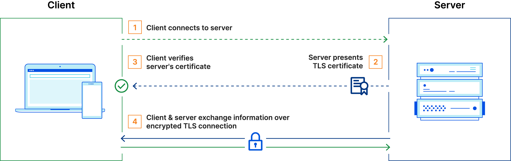

## Secure Sockets Layer (SSL)
SSL refers to a protocol for encrypting and securing communications that take place on the internet. It was first developed in 1995 but since has been deprecated in favor of TLS (Transport Layer Security).

Why is it called an SSL certificate if it is deprecated? Most major certificate providers still refer to certificates as SSL certificates, which is why the naming convention persists.

Originally, data on the web was transmitted in plaintext that anyone could read if they intercepted the message. SSL was created to correct this problem and protect user privacy. By encrypting any data that goes between the user and a web server, SSL also stops certain kinds of cyber attacks by preventing attackers from tampering with data in transit.

## TLS (Transport Layer Security)
TLS, is a widely adopted security protocol designed to facilitate privacy and data security for communications over the internet. TLS evolved from a previous encryption protocol called Secure Sockets Layer (SSL). A primary use case of TLS is encrypting the communication between web applications and servers.

There are three important things to understand about how TLS works:
1. Public key and private key

    TLS works using a technique called public key cryptography, which relies on a pair of keys — a public key and a private key. Anything encrypted with the public key can be decrypted only with the private key.

    Therefore, a server that decrypts a message that was encrypted with the public key proves that it possesses the private key. Anyone can view the public key by looking at the domain's or server's TLS certificate.

2. TLS certificate

    A TLS certificate is a data file that contains important information for verifying a server's or device's identity, including the public key, a statement of who issued the certificate (TLS certificates are issued by a certificate authority), and the certificate's expiration date.

3. TLS handshake

    The TLS handshake is the process for verifying the TLS certificate and the server's possession of the private key. The TLS handshake also establishes how encryption will take place once the handshake is finished.

### How does it work
The typical TLS process works like this:
1. Client connects to server
2. Server presents its TLS certificate
3. Client verifies the server's certificate
4. Client and server exchange information over encrypted TLS connection

There are three main components to what the TLS protocol accomplishes:
* __Encryption:__ hides the data being transferred from third parties.
* __Authentication:__ ensures that the parties exchanging information are who they claim to be.
* __Integrity:__ verifies that the data has not been forged or tampered with.

For everyday purposes, one-way authentication provides sufficient protection. The goals of TLS on the public Internet are:
1. To ensure that people do not visit spoofed websites
2. To keep private data secure and encrypted as it crosses the various networks that comprise the Internet, and
3. To make sure that data is not altered in transit.

## Mutual TLS (mTLS)
Mutual TLS, or mTLS for short, is a method for mutual authentication. mTLS ensures that the parties at each end of a network connection are who they claim to be by verifying that they both have the correct private key. The information within their respective TLS certificates provides additional verification.

mTLS is often used in a Zero Trust security framework* to verify users, devices, and servers within an organization. It can also help keep APIs secure.

Unlike TLS, In mTLS, both the client and server have a certificate, and both sides authenticate using their public/private key pair. Compared to regular TLS, there are additional steps in mTLS to verify both parties (additional steps in bold):
1. Client connects to server
2. Server presents its TLS certificate
3. Client verifies the server's certificate
4. __Client presents its TLS certificate__
5. __Server verifies the client's certificate__
6. __Server grants access__
7. Client and server exchange information over encrypted TLS connection

mTLS helps ensure that traffic is secure and trusted in both directions between a client and server. This provides an additional layer of security for users who log in to an organization's network or applications. It also verifies connections with client devices that do not follow a login process, such as Internet of Things (IoT) devices.

mTLS prevents various kinds of attacks, including:
* __On-path attacks:__ On-path attackers place themselves between a client and a server and intercept or modify communications between the two. When mTLS is used, on-path attackers cannot authenticate to either the client or the server, making this attack almost impossible to carry out.
* __Spoofing attacks:__ Attackers can attempt to "spoof" (imitate) a web server to a user, or vice versa. Spoofing attacks are far more difficult when both sides have to authenticate with TLS certificates.
* __Credential stuffing:__ Attackers use leaked sets of credentials from a data breach to try to log in as a legitimate user. Without a legitimately issued TLS certificate, credential stuffing attacks cannot be successful against organizations that use mTLS.
* __Brute force attacks:__ Typically carried out with bots, a brute force attack is when an attacker uses rapid trial and error to guess a user's password. mTLS ensures that a password is not enough to gain access to an organization's network. (Rate limiting is another way to deal with this type of bot attack.)
* __Phishing attacks:__ The goal of a phishing attack is often to steal user credentials, then use those credentials to compromise a network or an application. Even if a user falls for such an attack, the attacker still needs a TLS certificate and a corresponding private key in order to use those credentials.
* __Malicious API requests:__ When used for API security, mTLS ensures that API requests come from legitimate, authenticated users only. This stops attackers from sending malicious API requests that aim to exploit a vulnerability or subvert the way the API is supposed to function.

> The zero trust security model, also known as zero trust architecture (ZTA) describes an approach to the design and implementation of IT systems. The main concept behind the zero trust security model is "never trust, always verify,” which means that devices should not be trusted by default, even if they are connected to a permissioned network such as a corporate LAN and even if they were previously verified.
