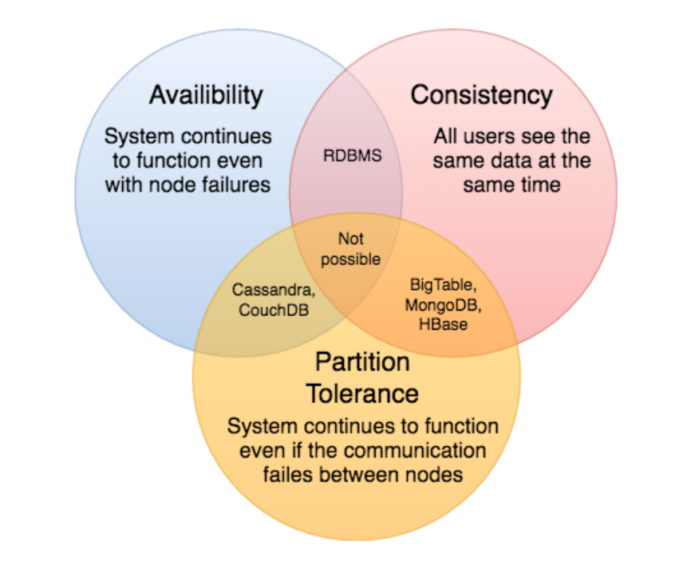

## Distributed Systems
A __distributed system__, also known as __distributed computing__, is a system with multiple components located on different machines that communicate and coordinate actions in order to appear as a single coherent system to the end-user.

Key characteristics of a distributed system include:
* #### Scalability

  __Scalability__ is the capability of a system, process, or a network to grow and manage increased demand. Any distributed system that can continuously evolve in order to support the growing amount of work is considered to be scalable.

  A system may have to scale because of many reasons like increased data volume or increased amount of work, e.g., number of transactions. A scalable system would like to achieve this scaling without performance loss.Generally, the performance of a system, although designed (or claimed) to be scalable, declines with the system size due to the management or environment cost.

  __Horizontal vs. Vertical Scaling__: Horizontal scaling means that you scale by adding more servers into your pool of resources whereas Vertical scaling means that you scale by adding more power (CPU, RAM, Storage, etc.) to an existing server.

* #### Reliability

  __Reliability__ is the probability a system will fail in a given period. In simple terms, a distributed system is considered reliable if it keeps delivering its services even when one or several of its software or hardware components fail. Reliability represents one of the main characteristics of any distributed system, since in such systems any failing machine can always be replaced by another healthy one, ensuring the completion of the requested task.

* #### Availability

  Availability is the time a system remains operational to perform its required function in a specific period. It is a simple measure of the percentage of time that a system, service, or a machine remains operational under normal conditions.

  __Reliability Vs. Availability:__ If a system is reliable, it is available. However, if it is available, it is not necessarily reliable. In other words, high reliability contributes to high availability, but it is possible to achieve a high availability even with an unreliable product by minimizing repair time and ensuring that spares are always available when they are needed.

* #### Efficiency

  Let’s assume we have an operation that runs in a distributed manner and delivers a set of items as result. Two standard measures of its efficiency are the response time (or _latency_) that denotes the delay to obtain the first item and the throughput (or _bandwidth_) which denotes the number of items delivered in a given time unit (e.g., a second). 

* #### Manageability/Serviceability

  __Serviceability__ or __manageability__ is the simplicity and speed with which a system can be repaired or maintained; if the time to fix a failed system increases, then availability will decrease. Things to consider for manageability are the ease of diagnosing and understanding problems when they occur, ease of making updates or modifications, and how simple the system is to operate (i.e., does it routinely operate without failure or exceptions?).

### CAP Theorem
CAP theorem states that it is impossible for a distributed software system to simultaneously provide more than two out of three of the following guarantees (__CAP__): __Consistency__, __Availability__, and __Partition__ tolerance.

When we design a distributed system, trading off among CAP is almost the first thing we want to consider.

CAP theorem says while designing a distributed system we can pick only two of the following three options:
1. __Consistency__: All nodes see the same data at the same time. Consistency is achieved by updating several nodes before allowing further reads.
2. __Availability__: Every request gets a response on success/failure. Availability is achieved by replicating the data across different servers.
3. __Partition tolerance__: The system continues to work despite message loss or partial failure. A system that is partition-tolerant can sustain any amount of network failure that doesn’t result in a failure of the entire network. Data is sufficiently replicated across combinations of nodes and networks to keep the system up through intermittent outages.

We cannot build a general data store that is continually available, sequentially consistent, and tolerant to any partition failures. We can only build a system that has any two of these three properties. Because, to be consistent, all nodes should see the same set of updates in the same order. But if the network suffers a partition, updates in one partition might not make it to the other partitions before a client reads from the out-of-date partition after having read from the up-to-date one. The only thing that can be done to cope with this possibility is to stop serving requests from the out-of-date partition, but then the service is no longer 100% available.
