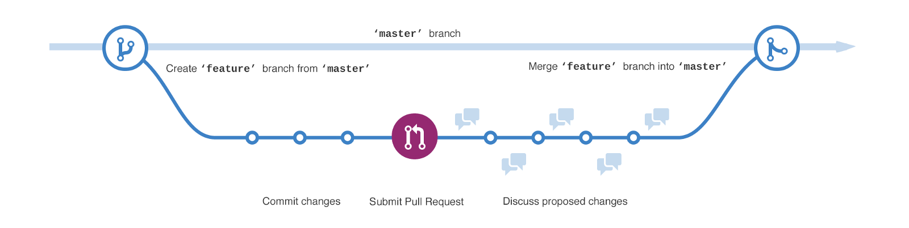

## Release and Branching Strategies
### Gitflow
GitFlow is a branching model for Git, created by Vincent Driessen. It has attracted a lot of attention because it is very well suited to collaboration and scaling the development team.

#### How it works
* __Master__ - Represent production-ready state of source code.
* __Develop__ - Represent Latest delivered development changes or also called integration branch.

    * A `develop` branch is created from `master`

* __Release__ - Represent preparation of a new production release to deploy changes on Testing server.

    * A `release` branch is created from `develop`
    * When the `release` branch is done it is merged into `develop` and `master`

* __Feature__ - Represent some app feature.

    * `feature` branches are created from `develop`
    * When a feature is complete it is merged into the `develop` branch

* __Hotfix__ - Represent the emergency fix.

    * If an issue in `master` is detected a `hotfix` branch is created from `master`
    * Once the hotfix is complete it is merged to both `develop` and `master`

> The one exception to the rule here is that, when a `release` branch currently exists, the hotfix changes need to be merged into that `release` branch, instead of `develop`. Back-merging the bug fix into the `release` branch will eventually result in the bug fix being merged into `develop` too, when the `release` branch is finished

#### Key Benefits
* __Parallel Development__

    One of the great things about GitFlow is that it makes parallel development very easy, by isolating new development from finished work. New development (such as features and non-emergency bug fixes) is done in feature branches, and is only merged back into main body of code when the developer(s) is happy that the code is ready for release.

    Although interruptions are a BadThing(tm), if you are asked to switch from one task to another, all you need to do is commit your changes and then create a new feature branch for your new task. When that task is done, just checkout your original feature branch and you can continue where you left off.

* __Collaboration__

    Feature branches also make it easier for two or more developers to collaborate on the same feature.

* __Release Staging Area__

    As new development is completed, it gets merged back into the develop branch, which is a staging area for all completed features that haven’t yet been released. So when the next release is branched off of develop, it will automatically contain all of the new stuff that has been finished.

* __Support For Emergency Fixes__

    GitFlow supports hotfix branches — branches made from a tagged release. You can use these to make an emergency change, safe in the knowledge that the hotfix will only contain your emergency fix.

#### Pros:
* Ensures a clean state of branches at any given moment in the life cycle of project
* It has extensions and support on most used git tools
* It is ideal when there it needs to be multiple version in production

#### Cons:
* The Git history becomes unreadable
* The `master`/`develop` split is considered redundant and makes the Continuous Delivery and the Continuos Integration harder
* It isn’t recommended when it need to maintain single version in production

#### [Read More about GitFlow](https://nvie.com/posts/a-successful-git-branching-model/)

___

### GitHub Flow
The GitHub Flow is a lightweight workflow. It was created by GitHub in 2011 and respects the following 6 principles:
* Anything in the `master` branch is deployable
* To work on something new, create a branch off from `master` and given a descriptively name(ie: `new-oauth2-scopes`)
* Commit to that branch locally and regularly push your work to the same named branch on the server
* When you need feedback or help, or you think the branch is ready for merging, open a _pull request_
* After someone else has reviewed and signed off on the feature, you can merge it into `master`
* Once it is merged and pushed to `master`, you can and should deploy immediately

#### Pros
* It is friendly for the Continuous Delivery and Continuous Integration
* A simpler alternative to _Git Flow_
* It is ideal when it needs to maintain single version in production

#### Cons
* The production code can become unstable most easily
* Are not adequate when it needs the release plans
* It doesn’t resolve anything about deploy, environments, releases, and issues
* It isn’t recommended when multiple versions in production are needed

___

### GitLab Flow
The GitLab Flow is a workflow created by GitLab in 2014. It combine feature-driven development and feature branches with issue tracking.

The most difference between GitLab Flow and GitHub Flow are the environment branches having in GitLab Flow (e.g. `staging` and `production`) because there will be a project that isn’t able to deploy to production every time you merge a feature branch (e.g. SaaS applications and Mobile Apps)

`staging` branch represents code that is ready to be deployed to production.

The GitLab Flow is based on 11 rules:
1. Use `feature` branches, no direct commits on `master`
2. Test all commits, not only ones on `master`
3. Run all the tests on all commits (if your tests run longer than 5 minutes have them run in parallel).
4. Perform code reviews before merges into `master`, not afterwards.
5. Deployments are automatic, based on branches or tags.
6. Tags are set by the user, not by CI.
7. Releases are based on tags.
8. Pushed commits are never rebased.
9. Everyone starts from `master`, and targets `master`.
10. Fix bugs in `master` first and release branches second.
11. Commit messages should reflect intent.

#### Pros
* It defines how to make the Continuous Integration and Continuous Delivery
* The git history will be cleaner, less messy and more readable
* It is ideal when it needs to single version in production

#### Cons
* It is more complex that the GitHub Flow
* It can become complex as Git Flow when it needs to maintain multiple version in production

___

### One Flow
The main condition that needs to be satisfied in order to use OneFlow is that every new production release is based on the previous release. The most difference between One Flow and Git Flow that it not has `develop` branch.

#### Pros
* The git history will be cleaner, less messy and more readable
* It is flexible according to team decisions
* It is ideal when it needs to single version in production

#### Cons
* It isn’t recommended for projects with Continuous Delivery or Continuous Deploy.
* The feature branches make it harder the Continuos Integration
* It isn’t recommended when it needs to maintain single version in production
