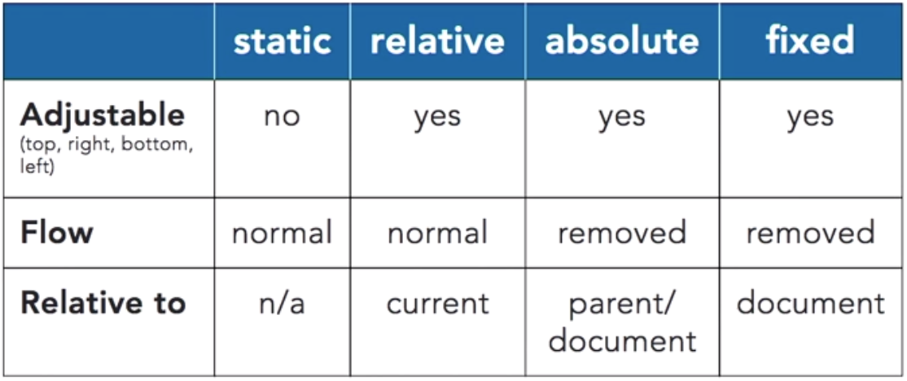
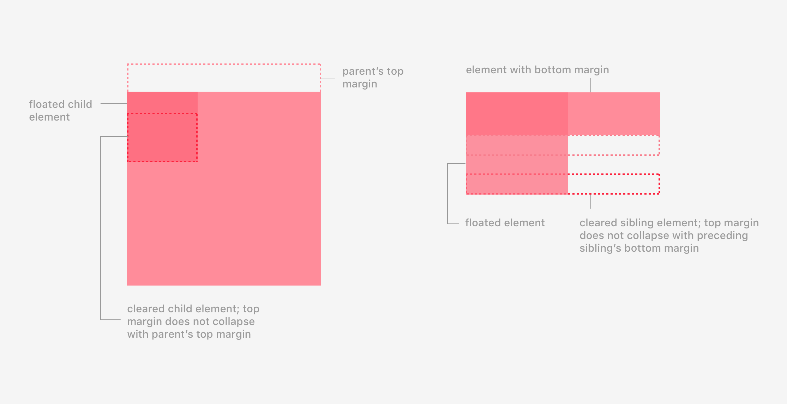
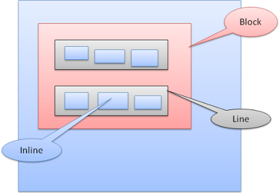
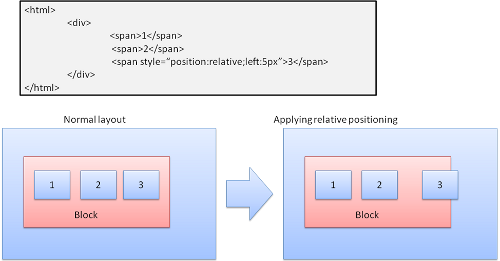
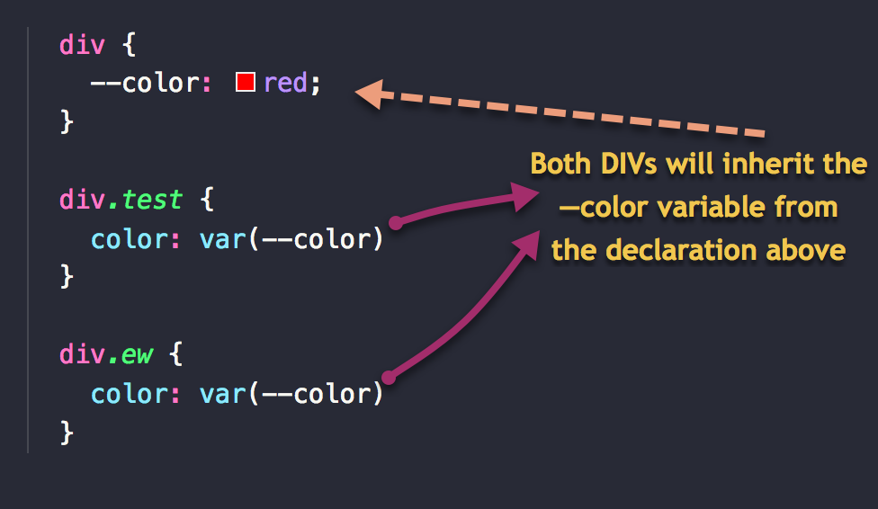
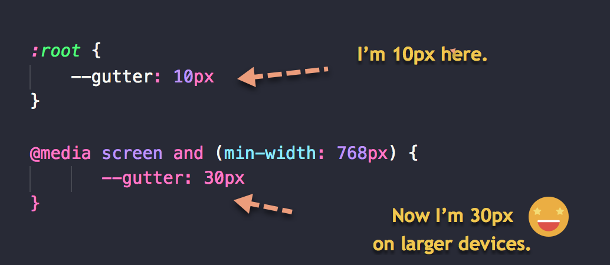
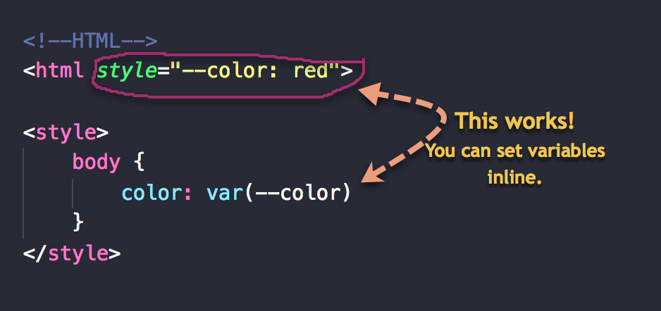
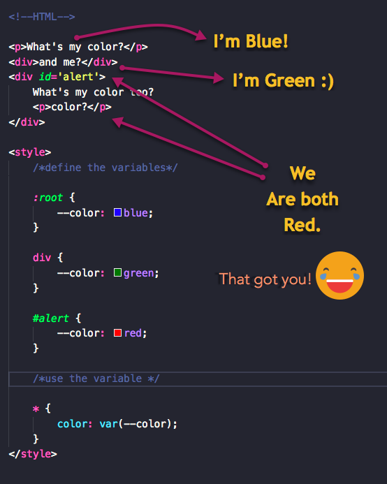

# CSS
CSS is an acronym for Cascading Style Sheets, which indicates that the notion of the cascade is important. At its most basic level it indicates that the order of CSS rules matter, but it's more complex than that. What selectors win out in the cascade depends on three factors (these are listed in order of weight — earlier ones will overrule later ones):

1. ### Importance (`!important`)

    > The only way to override this `!important` declaration would be to include another `!important` declaration of the same specificity later in the source order, or one with a higher specificity.

2. ### Specificity - is basically a measure of how specific a selector is.

    The amount of specificity a selector has is measured using four different values (or components), which can be thought of as thousands, hundreds, tens and ones — four single digits in four columns:
    * __Thousands__: Score one in this column if the declaration is inside a style attribute (such declarations don't have selectors, so their specificity is always simply `1000`.) Otherwise `0`.
    * __Hundreds__: Score one in this column for each ID selector contained inside the overall selector.
    * __Tens__: Score one in this column for each _class selector_, _attribute selector_, or _pseudo-class_ contained inside the overall selector.
    * __Ones__: Score one in this column for each _element selector_ or _pseudo-element_ contained inside the overall selector.

    Example:
    ```css
    *             {}  /* a=0 b=0 c=0 d=0 -> specificity = 0,0,0,0 */
    li            {}  /* a=0 b=0 c=0 d=1 -> specificity = 0,0,0,1 */
    li:first-line {}  /* a=0 b=0 c=0 d=2 -> specificity = 0,0,0,2 */
    ul li         {}  /* a=0 b=0 c=0 d=2 -> specificity = 0,0,0,2 */
    ul ol+li      {}  /* a=0 b=0 c=0 d=3 -> specificity = 0,0,0,3 */
    h1 + *[rel=up]{}  /* a=0 b=0 c=1 d=1 -> specificity = 0,0,1,1 */
    ul ol li.red  {}  /* a=0 b=0 c=1 d=3 -> specificity = 0,0,1,3 */
    li.red.level  {}  /* a=0 b=0 c=2 d=1 -> specificity = 0,0,2,1 */
    #x34y         {}  /* a=0 b=1 c=0 d=0 -> specificity = 0,1,0,0 */
    style=""          /* a=1 b=0 c=0 d=0 -> specificity = 1,0,0,0 */
    ```

    > Universal selector (`*`), combinators (`+`, `>`, `~`, `' '`) and negation pseudo-class (`:not`) have no effect on specificity.

    > If multiple selectors have the same importance and specificity, which selector wins is decided by which comes later in the _Source Order_.

3. ### Source order -later rules will win over earlier rules.

## Inheritance
Some property values applied to an element will be inherited by that element's children (`fonst-size`, `color` ...), and some won't (`margin`, `padding`, `border` ...).

CSS provides four special universal property values for specifying inheritance:
* __`inherit`__ - sets the property value applied to a selected element to be the same as that of its parent element.
* __`initial`__ - sets the property value applied to a selected element to be the same as the value set for that element in the browser's default style sheet. If no value is set by the browser's default style sheet and the property is naturally inherited, then the property value is set to `inherit` instead.
* __`unset`__ - resets the property to its natural value, which means that if the property is naturally inherited it acts like inherit, otherwise it acts like `initial`.
* __`revert`__ - resets the property to the default value established by the user-agent stylesheet.

    The `revert` keyword is useful for isolating embedded widgets or components from the styles of the page that contains them, particularly when used with the `all` property.
    ```css
    .widget {
        all: revert;
    }
    ```

    > __`all`__ CSS property refers to all properties of the element.


## CSS Box model
The CSS box model - each element is represented as a rectangular box, with the box's content, padding, border, and margin.

> 

By default `background-color`/`background-image` extend to the edge of the border. This behaviour can be changed using the [background-clip](https://developer.mozilla.org/en-US/docs/Web/CSS/background-clip) property. `background-clip` can be set to one of:
* `border-box` - backgound applies to content + padding + border
* `padding-box` - backgound applies to content + padding
* `content-box` - background applies to content only
* `text` - background applies to text inside content only. Set `color: transparent;`

Total width of a box is the sum of its `width`, `padding-right`, `padding-left`, `border-right`, and `border-left` properties. In some cases it is annoying, to avoid such problems, it's possible to tweak the box model with the property [box-sizing](https://developer.mozilla.org/en-US/docs/Web/CSS/box-sizing). `box-sizing` can be set to one of:
* `content-box` gives you the default CSS box-sizing behavior. If you set an element's width to `100` pixels, then the element's content box will be `100` pixels wide, and the width of any border or padding will be added to the final rendered width.
* `border-box` tells the browser to account for any border and padding in the values you specify for an element's width and height. If you set an element's width to `100` pixels, that `100` pixels will include any border or padding you added, and the content box will shrink to absorb that extra width. This typically makes it much easier to size elements.



### Margin collapse
The top and bottom margins of blocks are sometimes combined (collapsed) into a single margin whose size is the largest of the individual margins (or just one of them, if they are equal), a behavior known as margin collapsing.

> The margins of _floating_ and _absolutely positioned_ elements never collapse.

Margin collapsing occurs in three basic cases:
* Adjacent siblings

    The margins of adjacent siblings are collapsed (except when the latter sibling needs to be cleared past floats).

    > 

* Parent and first/last child

    If there is no `border`, `padding`, _inline part_ or _clearance_ to separate the `margin-top` of a block from the `margin-top` of its first child block.

    > 

    Or no `border`, `padding`, _inline content_, `height`, `min-height`, or `max-height` to separate the `margin-bottom` of a block from the `margin-bottom` of its last child, then those margins collapse.

    > 

    Then the margins of parent and children collapse.

* Empty blocks

    If there is no `border`, `padding`, _inline content_, `height`, or `min-height` to separate a block's `margin-top` from its `margin-bottom`, then its top and bottom margins collapse.

    > 

When margins don't collapse:

> 

> 

> 

> 

> 


## Selectors
https://www.adtrak.co.uk/blog/the-ultimate-css-selectors-cheatsheet/

https://www.w3schools.com/css/css_pseudo_elements.asp

### Pseude-class selector vs Pseudo-element selector
__Pseudo-element selector (`::`)__ - selects virtual elements.
* `::after` - Insert something after the content of each element
* `::before` - Insert something before the content of each element
* `::first-letter` - Selects the first letter of each element
* `::first-line` - Selects the first line of each element
* `::selection` - Selects the portion of an element that is selected by a user

__Pseude-class selector (`:`)__ - selects an element, state or property.

`:active`, `:checked`, `:disabled`, `:empty`, `:enabled`, `:first-child`, `:first-of-type`, `:focus`, `:hover`, `:in-range`, `:invalid`, `:lang`, `:last-child`, `:last-of-type`, `:link`, `:not(selector)`, `:nth-child(n)`, `:nth-last-child(n)`, `:nth-last-of-type(n)`, `:nth-of-type(n)`, `:only-of-type`, `:only-child`, `:optional`, `:out-of-range`, `:read-only`, `:read-write`, `:required`, `:root`, `:target`, `:valid`, `:visited`


## Background
* `background-color`
* `background-image`

    > Since background images are set using CSS and appear in the background of content, they will be invisible to assistive technologies like screen readers. They are not content images — they are just for decoration — if you want to include an image on your page that is part of the content, then you should do so with an `` element.

* `background-repeat`

    Values:
    * `no-repeat`: The image will not repeat at all: it will only be shown once.
    * `repeat-x`: The image will repeat horizontally all the way across the background.
    * `repeat-y`: The image will repeat vertically all the way down the background.
    * `repeat`: The image will repeat both vertically and horizontally.

* `background-position`

    Allows you to position your background image wherever you want inside the background. Generally the property will take two values separated by a space, which specify the horizontal (`x`) and vertical (`y`) coordinates of the image. The top left corner of the image is the origin — `(0,0)`.

* `background-attachment`

    Values:
    * `scroll`: The background is fixed relative to the element itself and does not scroll with its contents.
    * `fixed`: The background is fixed relative to the viewport. Even if an element has a scrolling mechanism, the background doesn't move with the element.
    * `local`: The background is fixed relative to the element's contents. If the element has a scrolling mechanism, the background scrolls with the element's contents, and the background painting area and background positioning area are relative to the scrollable area of the element rather than to the border framing them.

    > The `background-attachment` property only has an effect when there is content to scroll.

* `background-size`

    Specifies the size of the element's background image.

    [More about `background-size`](https://developer.mozilla.org/en-US/docs/Web/CSS/background-size)

* `background`

    A shorthand that sets the following properties in a single declaration: `background-clip`, `background-color`, `background-image`, `background-origin`, `background-position`, `background-repeat`, `background-size`, and `background-attachment`.

    You can attach multiple backgrounds to a single element by comma.


## Border
* `border-radius`
* `border-image` - shorthand property for setting all the `border-image-*` properties
* `border-image-source` -
* `border-image-slice` - specifies how to slice the border image into regions and apply styles for each one. [More](https://developer.mozilla.org/en-US/docs/Web/CSS/border-image-slice)
* `border-image-width`
* `border-image-outset` - specifies the distance by which the border image area extends beyond the border box
* `border-image-repeat = stretch | repeat | round | space` - specifies whether the border image should be repeated, rounded or stretched


## Advanced Box Effects
### `filter`
CSS Filters lets you apply graphical effects like blurring or color shifting to an element.

[More about `filter`](https://developer.mozilla.org/en-US/docs/Web/CSS/filter)

### `background-blend-mode`
Property determines how an element's background images should blend with each other and with the element's background color.

[More about `background-blend-mode`](https://developer.mozilla.org/en-US/docs/Web/CSS/background-blend-mode)

### `mix-blend-mode`
Property describes how an element's content should blend with the content of the element's direct parent and the element's background.

[More about `mix-blend-mode`](https://developer.mozilla.org/en-US/docs/Web/CSS/mix-blend-mode)


## Layout
CSS page layout techniques allow us to take elements contained in a web page and control where they are positioned relative to their default position in normal layout flow, the other elements around them, their parent container, or the main viewport/window.

### Normal Flow
Normal flow is how the browser lays out HTML pages by default when you do nothing to control page layout. Everything in normal flow has `display` property.

The elements which appear one below the other are described as `block` elements, in contrast to `inline` elements such as a word which appear one beside the other.

The default is `inline` but the browser style sheet may set other defaults. For example: the default display for the `<div>` element is block. Default style sheet example can be found [here](http://www.w3.org/TR/CSS2/sample.html).

### Table layout
HTML tables are fine for displaying tabular data, but many years ago — before even basic CSS was supported reliably across browsers — web developers used to also use tables for entire web page layouts.

### Multi-column Layout
The multi-column layout module gives us a way to layout content in columns, similar to how text flows in a newspaper.

To turn a block into a multicol container we use either the `column-count` property, which tells the browser how many columns we would like to have, or the `column-width` property, which tells the browser to fill the container with as many columns of at least that width.

When the viewport can't contain all columns, it start merging columns one by one. So you can end up event to single column at the end.

### Float, Grid, Flex

### Positioning scheme
The way the box is laid out is determined by:
* ### Box type

    * `block`: forms a block–has its own rectangle in the browser window. Blocks are formatted vertically one after the other.
    * `inline-block`: does not have its own block, but is inside a containing block. Inlines are formatted horizontally.

    Inline boxes are put inside lines or "line boxes". The lines are at least as tall as the tallest box but can be taller, when the boxes are aligned "baseline"–meaning the bottom part of an element is aligned at a point of another box other then the bottom. If the container width is not enough, the inlines will be put on several lines. This is usually what happens in a paragraph.

    > 

* ### Box dimensions
* ### Positioning scheme

    * `relative`: Relative positioning–positioned like usual and then moved by the required delta.

        > 

    * `float`: A float box is shifted to the left or right of a line. The interesting feature is that the other boxes flow around it.

    * `absolute` and `fixed`: The layout is defined exactly regardless of the normal flow. The element does not participate in the normal flow. The dimensions are relative to the container. In fixed, the container is the viewport. Note: the fixed box will not move even when the document is scrolled!

        > 


* ### External information such as image size and the size of the screen

### Layered representation
This is specified by the `z-index` CSS property. It represents the third dimension of the box: its position along the "z axis".

> The __stacking context__ is a three-dimensional conceptualization of HTML elements along an imaginary z-axis relative to the user.

The boxes are divided into stacks (called __stacking contexts__). An element with a larger `z-index` generally covers an element with a lower one.

Values:
* `auto`

    The box does not establish a new local _stacking context_. The stack level of the generated box in the current _stacking context_ is the same as its parent's box.

* `<integer>`

    This `<integer>` is the stack level of the generated box in the current _stacking context_. The box also establishes a local _stacking context_ in which its stack level is `0`. This means that the z-indexes of descendants are not compared to the z-indexes of elements outside this element.

Within a _stacking context_, child elements are stacked according to the same rules previously explained. Importantly, the z-index values of its child _stacking contexts_ only have meaning in this parent. _Stacking contexts_ are treated atomically as a single unit in the parent _stacking context_.

[More about _Stacking Context_](https://developer.mozilla.org/en-US/docs/Web/CSS/CSS_Positioning/Understanding_z_index/The_stacking_context)

[What No One Told You About Z-Index](https://philipwalton.com/articles/what-no-one-told-you-about-z-index/)


## Custom data attributes
The `data-*` global attributes form a class of attributes called __custom data attributes__, that allow proprietary information to be exchanged between the HTML and its DOM representation by scripts.

All such custom data are available via the `HTMLElement` interface of the element the attribute is set on. The `HTMLElement.dataset` property gives access to them.

In `CSS` you can access them using `attr()` function. The `attr()` CSS function is used to retrieve the value of an attribute of the selected element and use it in the style sheet.
```css
p::before {
  content: attr(data-foo);
}
```

## CSS Variables
Let's define variable with name `main-color` in global and local scope:
```css
:root {
    // global scope
    --main-color: red;
}

.block {
    // local scope
    --color: green;
}
```

Use variable with `var` keyword. The secont argument is _default value_. The default value is applies if no valiable is found (first argument):
```css
.test {
  font-size: var(--main-color, black)
}
```

> CSS variables are case-sensitive.

* You can't do math when declaring variable, use `calc()` instead.
    ```css
    :root {
        --fontSize: 1rem;
    }

    h1 {
        font-size: calc(var(--fontSize) * 2);
    }
    ```

* CSS variables are resolved with the normal inheritance and cascade rules

    > 

* CSS variables can be made conditional with `@media` and other conditional rules

    > 

* CSS variables can be used in HTML’s style attribute.

    > 

* Multiple declarations are resolved with the standard cascade.

    > 

* Syntax errors are discarded, but invalid `var()` substitutions default to either the _initial_ or _inherited_ value of the property in question.

* CSS variable provide Javascript API.
    ```javascript
    const root = document.documentElement;

    // setting CSS variable value from JS
    root.style.setProperty('--bg', 'black');
    root.style.setProperty('--bg-text', 'white');
    ```

__[More detailed about CSS Variales](https://medium.freecodecamp.org/everything-you-need-to-know-about-css-variables-c74d922ea855)__

`@apply` allows you to store a set of properties in a named custom property, then reference them in other style rules.
```css
:root {
  --danger-theme: {
    color: white;
    background-color: red;
  }
}

.danger {
  @apply --danger-theme;
}
```

`@custom-media` allows to define custom media queries.
```css
@custom-media --small-viewport (max-width: 30em);
/* check out media queries ranges for a better syntax !*/

@media (--small-viewport) {
  /* styles for small viewport */
}
```

__Media Queries Ranges__ allows to replace `min-`/`max-` with `<=` & `>=`.
```css
@media (width >= 500px) and (width <= 1200px) {
  /* your styles */
}

/* or coupled with custom media queries */
@custom-media --only-medium-screen (width >= 500px) and (width <= 1200px);

@media (--only-medium-screen) {
  /* your styles */
}
```

`@custom-selector` allows you to create your own selectors.
```css
@custom-selector :--button button, .button;
@custom-selector :--enter :hover, :focus;

:--button {
  /* styles for your buttons */
}
:--button:--enter {
  /* hover/focus styles for your button */
  /* Read more about :enter proposal */
  /* http://discourse.specifiction.org/t/a-common-pseudo-class-for-hover-and-focus/877 */
}
```

Nesting selectors
```css
a {
  /* direct nesting (& MUST be the first part of selector)*/
  & span {
    color: white;
  }

  /* @nest rule (for complex nesting) */
  @nest span & {
    color: blue;
  }

  /* media query automatic nesting */
  @media (min-width: 30em) {
    color: yellow;
  }
}
```

`image-set()` function allows you to set different images for each kind of resolution of user device.
```css
.foo {
  background-image: image-set(
    url(img/test.png) 1x,
    url(img/test-2x.png) 2x,
    url(my-img-print.png) 600dpi
  );
}
```

__[More new features](http://cssnext.io/features/)__


## Others
### Unit of measurement
* `in` - inches
* `mm` - millimeters
* `cm` - centimeters
* `em` - size of letter '`M`'.
* `rem` - size of root `em` (which is in the `html`/`body` tag).
* `pc` - picas (1 pc = 12 pt = 1/6th of an inch)
* `pt` - points (1 pt = 1/72nd of an inch)
* `px` - pixels (1 px = 1/96th of an inch)

### `white-space`
The `white-space` CSS property determines how whitespace inside an element is handled.
```css
/* Keyword values */
white-space: normal | nowrap | pre | pre-wrap | pre-line;

/* Global values */
white-space: inherit | initial | unset;
```

Values:
* `normal`

    Sequences of whitespace are collapsed. Newline characters in the source are handled the same as other whitespace. Lines are broken as necessary to fill line boxes.

* `nowrap`

    Collapses whitespace as for `normal`, but suppresses (запрещать) line breaks (text wrapping) within the source.

* `pre`

    Sequences of whitespace are preserved. Lines are only broken at newline characters in the source and at `<br>` elements.

* `pre-wrap`

    Sequences of whitespace are preserved. Lines are broken at newline characters, at `<br>`, and as necessary to fill line boxes.

* `pre-line`

    Sequences of whitespace are collapsed. Lines are broken at newline characters, at `<br>`, and as necessary to fill line boxes.

__[More about `white-space`](https://developer.mozilla.org/en-US/docs/Web/CSS/white-space)__
