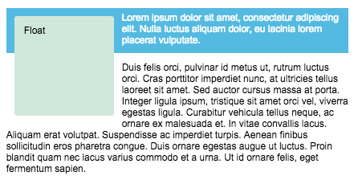

## Floats
The element with the float set on it is taken out of the normal layout flow of the document and stuck to the left hand side of its parent container. Any content that comes below the floated element in the normal layout flow will now wrap around it, filling up the space to the right hand side of it as far up as the top of the floated element. There, it will stop. Actually the boxes of following text is placed under the float.



If we want to stop a following element from moving up we need to clear it with `clear` property. There are three potential ways to deal with this, two which work in all browsers - yet are slightly hacky - and a third which is a new way to deal with this situation properly.
* The clearfix hack

    ```css
    .wrapper::after {
        content: "";
        clear: both;
        display: block;
    }
    ```

* Using overflow

    ```css
    .wrapper {
        overflow: auto; 
    }
    ```

* `display: flow-root`

    ```css
    .wrapper {
        display: flow-root; 
    }
    ```
